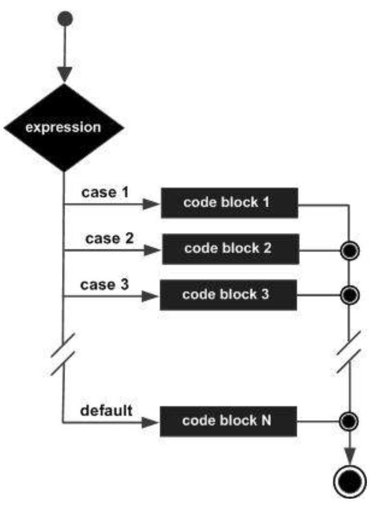
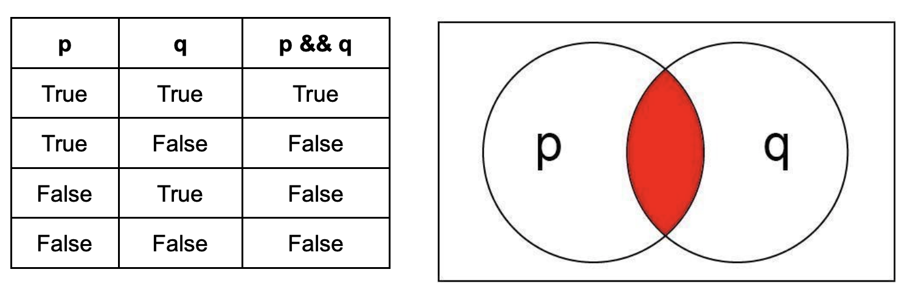
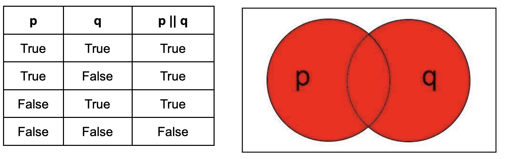
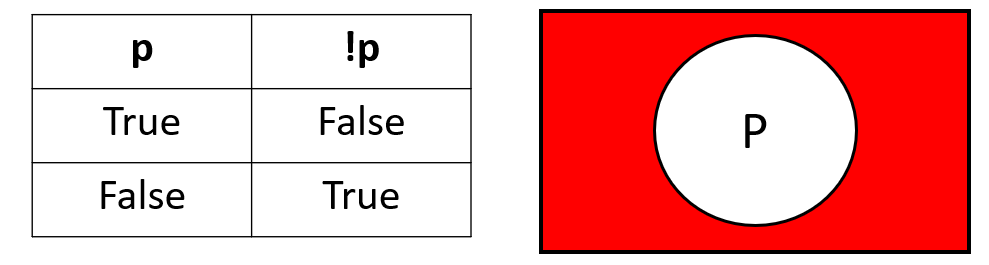
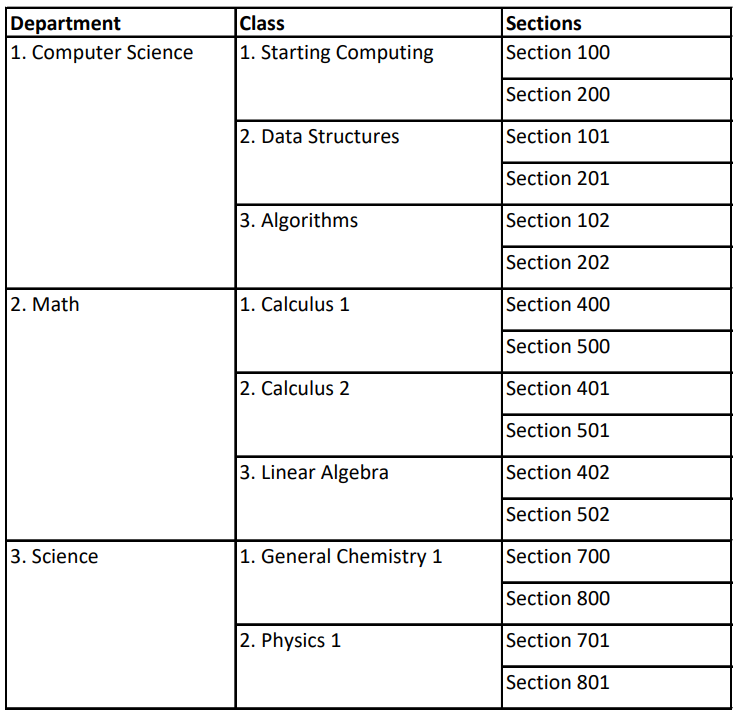
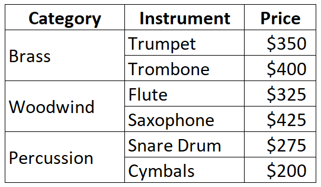

#### **CSCI 1300 CS1: Starting Computing: Homework 3**
#### **Godley/Hoefer - Spring 2023**
#### **Due: Friday, February 10th by 6:00pm MST**
#### **(2 extra-credit points if Coderunner(Start Early) is submitted by 11:59pm Wednesday, February 8th)**

<br/>

# Table of contents
1. [Objectives](#objectives)
2. [Background](#background)
4. [Questions](#questions)
    1. [Question 1](#question1)
    2. [Question 2](#question2)
    3. [Question 3](#question3)
    4. [Question 4](#question4)
    5. [Question 5](#question5)
    6. [Question 6](#question6)
5. [Submission Instructions](#submissions)
   1. [Checklist](#checklist)
6. [Grading rubric](#grading)

# Objectives <a name="objectives"></a>

* Compile and run C++ code 
* Understand how to implement decisions using if statements in C++


# Background <a name="background"></a>
## Conditional Statements
Conditional statements, also known as decision statements or branching statements, are used to make a decision based on condition. A condition is an expression that evaluates to a boolean value, either true or false. [Conditional Execution in C++](https://cal-linux.com/tutorials/conditionals.html) is a good online resource for learning about conditionals in C++.

**IF Statements:** An if statement in C++ is composed of a condition and a body. The body is executed only if the condition is true. The condition appears inside a set of parentheses following the keyword “if” and the body appears within a set of curly brackets after the condition:

The general format for **if statements** is:
```
if ( <CONDITION> )
{
	<BODY>
}
```

It is good practice to vertically align the open ( **{** ) and closed ( **}** ) curly brackets and to indent the body.

The condition is interpreted as a boolean value, either true or false. Be careful, most expressions in C++ have a boolean interpretation. For instance, non-zero numeric values are true. Assignment operations (single equal sign) are interpreted as true as well. A common mistake is to use a single equals sign inside a condition when a double equals sign is intended.

Unintended behavior when accidentally using assignment operation (= instead of ==) in conditional:
```cpp
// INCORRECT CODE
int x = 5;
if (x = 1) // one equal sign: changes value of x, will always evaluate to true
{
	cout << “The condition is true.” << endl;
}
cout << "x is equal to " << x << endl;
```
Example output:
<pre>
The condition is true.
x is equal to 1
</pre>

What you **actually** mean to do:
```cpp
// CORRECT CODE
int x = 5;
if (x == 1) // two equal signs, performs comparison
{
	cout << “The condition is true.” << endl;
}
cout << "x is equal to " << x << endl;
```
Example output:
<pre>
x is equal to 5
</pre>

Remember, “=” is for assignment and “==” is for checking equality.

**IF-ELSE Statements:** If statements may be paired with else statements in C++. If the condition associated with the if statement is false, the body associated with the else statement is executed. The else statement body is enclosed in a set of curly brackets:
```cpp
if ( <CONDITION> )
{
	<BODY>
    // executed when CONDITION is true
}
else
{
	<BODY>
    // executed when CONDITION is false
}
```
An if statement does not need an else statement, but there must be an if statement before every else statement.

**ELSE-IF Statements:** Finally, an if statement may also be associated with any number of else-if statements. These statements each have an associated condition and an associated body. The body is executed if the condition is true and the conditions for all preceding if- and else-if statements in the same group are false. An else statement may be included at the end of the group but is not required. The else statement will be executed if all the previous conditions are false. 

```cpp
if ( <CONDITION> )
{
	<BODY>
}
else if ( <CONDITION> )
{
	<BODY>
}
else if ( <CONDITION> )
{
	<BODY>
}
else
{
	<BODY>
}
```

**Some examples:**

- If the int `num` is negative, print “Changing sign” and make it positive.
```cpp
if (num < 0)
{
	cout << “Changing sign” << endl;
	num = -1 * num;
}
```
- If the int `num` is 0, print “Can’t divide by 0!”. Otherwise, set num to 1000 divided by num.
```cpp
if (num == 0) //notice the double equals!
{
	cout << “Can’t divide by 0!” << endl;
}
else
{
	num = 1000 / num; //integer arithmetic
}
```
- If the int `num` is greater than 0 and less than 10, set num to 5 times itself. Otherwise, if num is greater than 100, set num to itself divided by 10.
```cpp
if (num > 0 && num < 10)
{
	num = 5 * num;
}
else if (num > 100)
{
	num = num / 10;
}
```
- Print “Positive” if the int num is positive, “Zero” if it is 0, and “Negative” if it is negative. Both of the approaches below work. Why? Can you think of other ways to achieve the same result?

Approach 1:
``` cpp
if ( num > 0 )
{
	cout << “Positive” << endl;
}
else if ( num == 0 )
{
	cout << “Zero” << endl;
}
else if ( num < 0 )
{
	cout << “Negative” << endl;
}
```
Approach 2:
```cpp
if ( num > 0 )
{
	cout << “Positive” << endl;
}
else if ( num == 0 )
{
	cout << “Zero” << endl;
}
else
{
	cout << “Negative” << endl;
}
```
- Let score be an int between 0 and 100. Print the letter grade associated with score (A: 90-100, B: 80-89, C: 70-79, D: 60-69, F: 0-59). Both of the approaches below work.

Approach 1:
```cpp
if (score >= 90 && score <= 100)
{
	cout << “A” << endl;
}
else if (score >= 80 && score <= 89)
{
	cout << “B” << endl;
}
else if (score >= 70 && score <= 79)
{
	cout << “C” << endl;
}
else if (score >= 60 && score <= 69)
{
	cout << “D” << endl;
}
else if (score >= 0 && score <= 59)
{
	cout << “F” << endl;
}
```

Approach 2:
```cpp
if (score >= 90 && score <= 100)
{
	cout << “A” << endl;
}
else if (score >= 80)  // this condition is checked only if the first condition fails, so score must be less 90
{
	cout << “B” << endl;
}
else if (score >= 70) 
{
	cout << “C” << endl;
}
else if (score >= 60)  // this condition is check only if all the above conditions fail, so the score must be less than 70
{
	cout << “D” << endl;
}
else if (score >= 0)
{
	cout << “F” << endl;
}
```

## Switch Statements

Switch case statements are a substitute for long if statements that compare a variable to several values.



### Syntax
With the switch statement, the variable name is used once in the opening line. A case keyword is used to provide the possible values of the variable, which is followed by a colon and a set of statements to run if the variable is equal to a corresponding value.

An example of a simple switch statement:
```cpp
switch (n){
     case 1:
          // code to be executed if n == 1;
          break;
     case 2:
          // code to be executed if n == 2;
          break;
     default:
          // code to be executed if n doesn’t match any cases
}
```

**Important notes to keep in mind when using switch statements :**
- The expression provided in the switch should result in a constant value otherwise it would not be valid.
    - switch(num)
        - allowed (num is an integer variable)
    - switch(‘a’)
        - allowed (takes the ASCII Value)
    - switch(a+b)
        - allowed,where a and b are int variable, which are defined earlier
- The **break** statement is used inside the switch to terminate a statement sequence. When a break statement is reached, the switch terminates, and the flow of control jumps to the next line following the switch statement.
- The break statement is optional. If omitted, execution will continue on into the next case. The flow of control will fall through to subsequent cases until a break is reached.
- The **default** statement is optional. Even if the switch case statement does not have a default statement, it would run without any problem.

## Relational Operators

A relational operator is a feature of a programming language that tests or defines some kind of relation between two entities. These include numerical equality (e.g., 5 == 5) and inequalities (e.g., 4 ≥ 3). Relational operators will evaluate to either True or False based on whether the relation between the two operands holds or not. When two variables or values are compared using a relational operator, the resulting expression is an example of a boolean condition that can be used to create branches in the execution of the program. Below is a table with each relational operator’s C++ symbol, definition, and an example of its execution.

||||
|-----|-----|-----|
| >  | greater than | 5 > 4 is TRUE | 
| <  | less than | 4 < 5 is TRUE | 
| >= | greater than or equal | 4 >= 4 is TRUE | 
| <= | less than or equal | 3 <= 4 is TRUE | 
| == | equal to | 5 == 5 is TRUE | 

## Logical Operators

Logical operators are used to compare the results of two or more conditional statements, allowing you to combine relational operators to create more complex comparisons. Similar to relational operators, logical operators will evaluate to True or False based on whether the given rule holds for the operands. Below are some examples of logical operators and their definitions.

||||
|----|----|----|
| && | AND | returns true if and only if both operands are true
| \|\| | OR | returns true if one or both operands are true
| ! | NOT | returns true if the operand is false and false if the operand is true

### Truth tables

Every logical operator will have a corresponding truth table, which specifies the output that will be produced by that operator on any given set of valid inputs. Below are truth tables for each of the logical operators specified above.

**AND ( && ):**
These operators return true if and only if both operands are True. This can be visualized as a venn diagram where the circles are overlapping.



**OR ( || ):**
These operators return True if one or both of the operands are True. This can be visualized as the region of a venn diagram encapsulated by both circles.



**NOT ( ! ):**
This operator returns the opposite of the operand. This can be visualized as the region of a venn diagram outside the circle. Unlike AND and OR, the NOT operator has only one operand.



## Coding Style

### Whitespace and Indentation

**Whitespaces:** Whitespace can set things off and reduce the strain on the reader's eyes. Because the compiler ignores whitespace, you're free to place things anywhere you want and format it however you want. Whitespace can come in several forms, including indentation.

**Indenting:** Increase your indentation by one increment of each brace {, and decrease it once on each closing brace }. Place a line break after every {. Use Tab to increase indent and Shift+Tab to decrease indentation.

**Bad Example:** There is no indentation and it is difficult to see where different portions of the code start and stop.
```cpp
int main(){
int number = 0;
while(number < 10){
if(number < 5){
cout << "Less than 5" << endl;
}else{
cout << "Greater than 5" << endl;
}
number++;
}
}
```
Good Example: There is proper indentation and the code is easier to read.
```cpp
int main() 
{
    int number = 0;
    while(number < 10) 
    {
        if(number < 5) 
        {
            cout << "Less than 5" << endl;
        }
        else 
        {
            cout << "Greater than 5" << endl;
        }
        number++;
    }
}
```

### Naming and variables
**Names:** Give variables descriptive names, such as firstName or homeworkScore. Avoid one-letter names like a or x, except for loop counter variables such as i.

Bad Example:
```cpp
int thing = 16;
double a = 2.2;
string x = "Michael";
```

Good Example:
```cpp
int cups_per_gallon = 16;
double lbs_per_kilo = 2.2;
string first_name = "Michael";
```
**Capitalization:** Name variables with “snake-casing”, where all letters lowercase and words are separated by underscores '_'.

Bad Example:
```cpp
int numberbananas = 10;
double NumberFish = 7;
string NAMEOFPERSON = "Michael";
char middleInitial = 'C';
```
Good Example:
```cpp
int number_bananas = 10;
double num_fish = 7;
string name_of_person = "Michael";
char middle_initial = 'C'
```
### Comments
* Your code should be well-commented. Use comments to explain what you are doing and why, especially if you have a complex section of code. These comments are intended to help other developers understand how your code works. These comments should begin with two backslashes (//) or the multi-line comments (/* … comments here… */) .

* Examples:
    *  Single-line:
    ```cpp
    // CSCI 1300 Spring 2023
    ```
    * Multi-line:
    ```cpp
    /*
    Algorithm:
    Input: two numbers
    Output: sum of input numbers

    1. Ask the user to enter a number
       Save in variable number_1
    2. Ask the user to enter a number
       Save in variable number_2
    3. Compute sum 
       sum = number_1 + number_2
    4. Display sum to user
    */
   ```

# Questions <a name="questions"></a>

## **Question 1 (1 point): River Tubing** <a name="question1"></a>

Write a C++ program that will determine if it is safe to go tubing in Boulder Creek. The maximum flowrate to go tubing is 250 cfs (cubic feet per second).

The program should take an integer input from the user and display one of the two phrases to the user (unless input is invalid).

Sample run:
<pre>
What is the flowrate of Boulder Creek?
<b>109</b>
It is safe to go tubing. Have fun!
</pre>
<pre>
What is the flowrate of Boulder Creek?
<b>461</b>
The river is flowing too fast to go tubing.
</pre>
<pre>
What is the flowrate of Boulder Creek?
<b>-453</b>
Please enter a valid input.
</pre>
Make sure your program does basic input validation. The flowrate must be greater than zero. If the user inputs a non-positive value, print `Please enter a valid input.` and exit the program.

The answer-box on CodeRunner is pre-loaded with the following solution template for this question
```cpp
#include <iostream>

using namespace std;

int main() 
{
    // declare all the variables
    int flowrate;

    // prompt the user & get their input
    cout << "What is the flowrate of Boulder Creek?" << endl;
    cin >> flowrate;

    // input validation: flowrate must be positive
    if (  ) // EDIT THIS LINE
    {
        cout << "Please enter a valid input." << endl;
        return 0;
    }

    // decide if it's safe based on flowrate
    if (  ) // EDIT THIS LINE
    {
        cout << "It is safe to go tubing. Have fun!" << endl;
    }
    else
    {
        cout << "The river is flowing too fast to go tubing." << endl;
    }

    return 0;
}
```

Make sure to submit your code on Canvas as well as the final Zip file submission.

The file should be named _tubing.cpp_


## **Question 2 (2 points): Vacation** <a name="question2"></a>
You want to take a vacation to visit Los Angeles. To get there, you can take the bus, the train, or an airplane, but you're not sure which modes of transportation are within your budget. Create a program that will take the desired mode of transportation and a budget, and then tell the user if they can afford it.

The program should take a non-negative number (_double_) and character input(_B, T, or A_) from the user and display one of the two phrases to the user (unless input is invalid).

|Transportation | Cost|
|----|----|
| Bus | $175.25 |
| Train | $240.66 |
| Airplane | $350.93 |

Sample run:
<pre>
What is your budget?
<b>500</b>
What mode of transportation would you like to take (B, T, or A)?
<b>A</b>
Yes, this vacation is within your budget!
</pre>
<pre>
What is your budget?
<b>40.5</b>
What mode of transportation would you like to take (B, T, or A)?
<b>B</b>
Sorry, this vacation is outside your budget.
</pre>

Ensure that you do input validation. For example, the budget the user puts in should be a non-negative number. The user should also only input either B, T, or A. Whenever the user inputs something that is not allowed, print ` Please enter a valid input. ` and then exit the program.

Make sure to submit your code on Canvas as well as the final Zip file submission.

The file should be named _vacation.cpp_

## **Question 3 (3 points): Ordering a Pizza** <a name="question3"></a>

You've decided to order a pizza for dinner. The restaurant you're ordering from has three sizes of pizza: S, M, and L. Each size has a different base price and price per topping. The prices are indicated in the table below. Create a program to calculate the total cost of your pizza. The program should prompt you for the size of pizza and the number of toppings, then output the cost.

| **Size** | Base Price | Price per Toppings |
| -------- | ------     | -------- |
|    S     |  $4.99     |  $0.75   |
|    M     |  $5.99     |  $1.50   |
|    L     |  $6.99     |  $2.25   |

The input should be a character (for size) and non-negative integer (for number of toppings) and the output should be a double.

Sample run:
<pre>
What size pizza would you like to order?
<b>S</b>
How many toppings do you want?
<b>3</b>
Your total is $7.24
</pre>

**Note:** The total cost should be formatted with a two-digit precision. You can use the setprecision() function with the fixed manipulator from `<iomanip>` library to do so.

Bad formatting: `10.8`

Good formatting: `$10.80`

Ensure you are doing input validation similar to the last question. If the user inputs something they cannot, output ` Please enter a valid input. ` and exit.

Make sure to submit your code on Canvas as well as the final Zip file submission.

The file should be named _pizza.cpp_

## **Question 4 (4 points):  Wifi Speeds** <a name="question4"></a>

You've decided to test the wifi speed in the classroom at the beginning of every lecture. Create a program that will tell you if the wifi speed over the past 3 classes has increased, decreased, or neither. If the wifi speeds are sorted and increasing, then print out "The wifi is getting faster!". If the wifi speeds are sorted and decreasing, then print out "The wifi is getting slower!". If the wifi speeds are unsorted or if two or more speeds are the same, then print "The wifi speed is changing unpredictably."  

The user should input 3 non-negative numbers (_double_) separated by spaces. 

Sample runs:
<pre>
Enter wifi speeds over the last 3 classes:
<b>162 180 225</b>
The wifi is getting faster!
</pre>

<pre>
Enter wifi speeds over the last 3 classes:
<b>37.5 21.2 19.9</b>
The wifi is getting slower!
</pre>

<pre>
Enter wifi speeds over the last 3 classes:
<b>162 135.3 225</b>
The wifi speed is changing unpredictably.
</pre>

Ensure you are doing basic input validation, output ` Please enter a valid input. ` if the user inputs a negative wifi speed.

Make sure to submit your code on Canvas as well as the final Zip file submission.

The file should be named as _wifiSpeeds.cpp_ 

## **Question 5 (5 points): Class Registration** <a name="question5"></a>

You want to create a program to enroll in classes. You've narrowed the class list down to just a few classes that computer science students might need. 

In your program, first the user will select a department and the program will tell them what classes are available from that department. Then the user picks a class, and the program will tell them what sections are available. After the user picks a section, the program will print a success message.

The departments, classes and sections are as follows:



Sample run:
<pre>
Select a department: (1)Computer Science (2)Math (3)Science
<b>1</b>
Select a class: (1)Starting Computing (2)Data Structures (3)Algorithms
<b>3</b>
Select a section: (1)Section 102 (2)Section 202
<b>1</b>
You've been enrolled in Section 102 of Algorithms!
</pre>

The user should input an integer in the range of the choices you give them. For example, a user cannot input 3 if you only present 2 choices.Ensure you are doing input validation. Your program should output ` Please enter a valid input. ` if the user inputs something they cannot and exit the program.

Example of input validation:
<pre>
Select a department: (1)Computer Science (2)Math (3)Science
<b>5</b>
Please enter a valid input. 
</pre>

Make sure to submit your code on Canvas as well as the final Zip file submission.

The file should be named as _classRegistration.cpp_. 


## **Question 6 (5 points): Buying an Instrument - switch statements only** <a name="question6"></a>

**You must use switch statements instead of if-else statements. If-else statements will not be accepted for this problem.**

You want to learn to play an instrument, but you need to know how much it's going to cost to buy it. The music store has the following table on their website:



Write a menu-driven program that asks the user to input an instrument category and then an instrument. The program should give the user the price. 

The user should input an integer in the range of the choices you give them (for example, a user cannot input 3 if you only have 2 choices) and in response should be prompted to for the next set of choices. Once they make the final selection, the total should be printed to them as an _integer_ with proper formatting as shown in the sample run.

Sample run:
<pre>
Select a category: (1)Brass (2)Woodwind (3)Percussion
<b>2</b>
Select an instrument: (1)Flute (2)Saxophone
<b>2</b>
Your instrument will be $425.
</pre>

Ensure you are doing input validation, output ` Please enter a valid input. ` if the user inputs something they cannot and terminate the program.

Make sure to submit your code on Canvas as well as the final Zip file submission.

The file should be named as _instrument.cpp_. 


# Submission Instructions <a name="submissions"></a>

## Coderunner

The correctness of your program will be graded by Coderunner. You can modify your code and re-submit (press “Check” again) as many times as you need to, until the assignment due date. You can find Coderunner on the page titled Homework 3 - Coderunner in the Week 4 Module. 

## Canvas zip file
* **C++ files**. All files should be named as specified in each question, and they should compile and run on VSCode to earn full points. TAs will be grading the style of your code and comments. Please see the coding style under the [background](#background) section. At the top of each file, write your name with the following format:</br>
```cpp
// CSCI 1300 Spring 2023
// Author: Punith Sandhu
// Recitation: 123 – TA name
// Homework 3 - Problem ##
```
Example submission:
```cpp
// example_1.cpp

// CSCI 1300 Spring 2023
// Author: Punith Sandhu
// Recitation: 123 – TA name
// Homework 3 - Problem # ...

#include <iostream>

using namespace std;

int main() 
{
    int num = 10;
    cout << num << endl;

    return 0;
}
```
When you are finished with all the questions, zip all files. Submit the zip file under the assignment Homework 3 on Canvas.

## Checklist <a name="checklist"></a>
Here is a checklist for submitting the assignment:
1. Use your solutions in VS Code to complete the **Homework 3 - Coderunner** assignment on Canvas (Modules → Week 4). 
    * Remember that submitting **Homework 3 - Coderunner** (Start Early) by Wednesday, February 8 at 11:59pm will give extra credit! That assignment is the first 2 questions of **Homework 3 - Coderunner**.
2. Submit one zip file to the **Homework 3** assignment on Canvas. The zip file should be named, **hmwk3_lastname.zip**. It should have the following 6 files: 
    * tubing.cpp
    * vacation.cpp
    * pizza.cpp
    * wifiSpeeds.cpp
    * classRegistration.cpp
    * instrument.cpp

# Grading Rubric <a name="grading"></a>


| **Criteria**                                | Points |
| ------------------------------------------- | ------ |
| Question 1                  | 1     |
| Question 2                  | 2     |
| Question 3                  | 3     |
| Question 4                  | 4     |
| Question 5                  | 5     |
| Question 6                  | 5     |
| C++ files zip submission (compiles and runs, style and comments)| 5 |
| Recitation attendance (Week 4)*          | -6    |
| Total                                    | 25    |
| Extra Credit - Start Early               | 2     |

\* If your attendance is not recorded, you will lose points. Make sure your attendance is recorded on Canvas.
