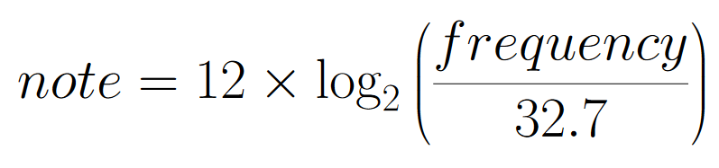

#### **CSCI 1300 CS1: Starting Computing: Homework 4**
#### **Godley/Hoefer - Spring 2023**
#### **Due: Friday, Feb 17, by 6pm MST**
#### **(2 extra-credit points if Coderunner (Start Early) is completed by Wednesday, Feb 15 11:59pm)**

<br/>

# Table of contents

1. [Objectives](#objectives)
2. [Background](#background)
4. [Questions](#questions)
    1. [Question 1](#question1)
    2. [Question 2](#question2)
    3. [Question 3](#question3)
    4. [Question 4](#question4)
    5. [Question 5](#question5)
    6. [Extra Credit 1](#ec1)
5. [Submission Instructions](#submissions)
    1. [Checklist](#checklist)
6. [Grading rubric](#grading)

# Objectives <a name="objectives"></a>

* Understand loops 
* Understand C++ loops: while loops, for loops, do-while loops

# Background <a name="background"></a>
## Looooooooop

**Tip:** To stop an infinite loop, click on your terminal and hit the ctrl + c keys on your keyboard at the same time.
 
**While Loops**

*Loops* allow us to run a section of code multiple times. They will repeat execution of a single statement or 
group of statements as long as a specified condition continues to be satisfied. If the condition is not true, 
then the statement will not be executed. 

*Syntax of a while loop*
```cpp
while (condition)
{
	//statement(s) to do something;
}
```
Here, `while` is a C++ reserved word, *condition* should be a Boolean expression that will evaluate to either **true** or **false**, and *statement(s) to do something* is a set of instructions enclosed by curly brackets. If the condition is **true**, then the specified statement(s) within the loop are executed. After running once, the Boolean expression is re-evaluated. If the condition is still **true**, the specified statement(s) are executed again. This process of evaluation and execution is repeated until the condition becomes **false**.

**Example 1**
```cpp
int user_choice = 1;
while (user_choice != 0)
{
   cout << "Do you want to see the question again?" << endl; 
   cout << "Press 0 if no, any other number if yes." << endl;
   cin >> user_choice;
}
```

Entering 0 will terminate the loop, but any other number will cause the loop to execute again.  **Note how we must initialize the condition before the loop starts.** Setting `user_choice = 1` ensures that the while loop will run at least once.

**Example 2** <a name="whileExample2"></a>
```cpp
int i = 0; 
while (i < 5)
{
	cout << i << endl;
	i = i + 2;
}
```
Notice how you must manually initialize `i=0` and then manually increment `i` by 2. 
Inserting `cout` statements into your loops is a quick way to debug your code if something isn’t working, to make sure the loop is iterating over the values you want to be using. A common error is to forget to update `i` within the loop, causing it to run forever.

**For loop**

Sometimes you know the exact number of iterations that a loop has to perform. In these cases a `for` loop comes into use. It has three elements: 
* *Initialization*: It must initialize a counter variable to a starting value. 
* *Condition*: If it is true, then the body of the loop is executed. If it is false, the body of the loop does not execute and jumps to the next statement(s) just after the loop.
* *Update*: Updates the counter variable during each iteration  

*Syntax of a for loop*
```cpp
for (initialization; condition; update)
{
	//statement(s) to do something;
}
```

**Example 1:**  
```cpp
for (int count = 0; count < 5; count++)
{
	cout << "hello" << endl;
}
```
Notice the following three parts of the `for` loop:
 * `count` is initialized to `0`, 
 * the test expression is `count < 5` 
 * `count++` to increment the count value by one

**Example 2:**
```cpp
for (int i = 0; i < 5; i = i + 2)
{
	cout << i << endl;
}
```
Notice that this example behaves in the same way as the [example 2](#whileExample2) in the `while` loop section above.  


**Strings**

In C++, `string` is a data type just like `int` or `float`. Strings, however, represent sequences of characters instead of a numeric value. A string literal can be defined using double quotes (" "). So *"Hello, world!"*, *"3.1415"*, and *"int i"* are all strings. We can access the character at a particular location within a string by using square brackets, which enclose an *index* which you can think of as the *address* of the character within the string. Indexing a string using square brackets will produce a `char` data type. Importantly, strings in C++ are indexed starting from zero. This means that the first character in a string is located at index 0, the second character has index 1, and so on. For example:
```cpp
string s = "Hello, world!";
cout << s[0] << endl;  //prints the character 'H' to the screen
cout << s[5] << endl;  //prints the character ',' to the screen
cout << s[7] << endl;  //prints the character 'w' to the screen
cout << s[12] << endl; //prints the character '!' to the screen
```

There are many useful functions available in C++ to manipulate strings. One of the simplest is `length()`.
The syntax for using the `length()` function is:
<pre><code>s.length()</code></pre>

*Example 1*
```cpp
string s ="Hello, world!";
int s_length = s.length();
cout << s_length << endl;			//This will print 13
for (int i = 0; i < s_length; i++)
{
	cout << s[i] << endl;
}
```

The above example will print each character in the string "Hello, world!" to the screen one per line. Notice how the `length()` function is used to determine the number of characters in a string. This allows us to loop over a string character by character (*i.e. traverse the string*).


*Common mistakes in using length() function:*
<pre><code>length(s)
s.length
</code></pre>
This is a special kind of function associated with objects, usually called a *method*, which we will discuss later in the course.

**Let's think about:**
What happens in the above code snippet if we try to print characters beyond the length of the string? In particular, what happens when we replace `s.length()` with `s.length()+3` in the above `for` loop?


# Questions <a name="questions"></a>

## Question 1 (2 points): Sum perfect squares <a name="question1"></a>

Below is an outline of a program that asks the user for a **non-negative integer** (0 or higher) as an input and computes the sum of all perfect squares between zero and the value entered (inclusive). Fill in the blanks to get the code to run, and **find and fix the one syntax error**.

If the user enters a negative number as input, print "Invalid input."

```cpp
#include <iostream>
#include <cmath>

using namespace std;

int main()
{
    // declare all variables
    int number;
    int sum = 0;
    int max_val;
    
    // prompt the user and get their input
    cout << "Enter a non-negative integer:" << endl;
    cin >> number;
    
    // input validation
    if (_______________) //EDIT THIS LINE
    { 
        cout << "Invalid input." << endl;
    }
    else
    {
        // compute square root
	max_val = sqrt(number)
	
	// loop to compute sum of perfect squares
        for (int i = 0; i <= ________; i++) //EDIT THIS LINE
        {
            sum += __________;//EDIT THIS LINE
        }
        cout << "Sum: " << sum << endl;
    }
    return 0;
}
```

A few sample runs are shown below:

*Sample run 1:*
<pre><code>Enter a positive number:
<b>25</b> 
Sum: 55
</code></pre>

*Sample run 2:*
<pre><code>Enter a positive number:
<b>-4</b> 
Invalid input.
</code></pre>

The file should be named as **perfectSquares.cpp**. Don’t forget to head over to Coderunner on Canvas and paste your solution in the answer box! 

If you are confused about the above code, here is a brief explanation: by using the square root function, we find the largest perfect square below our value. For example, if x=40, then the square root of 40 is 6.32455532; this tells us that 6^2 is the largest perfect square below 40. Thus, we can sum up the squares of all numbers between 1 and 6 to find the sum of perfect squares less than 40.

## Question 2 (3 points): Print Collatz Sequence<a name="question2"></a>

For this question, you will write a program that prompts the user to enter an integer value between 1 and 1000 (exclusive). Your program should then print out a sequence of numbers between the given value and 1 (inclusive) following the pattern below: <br />
For a given number a<sub>i</sub>,
* If a<sub>i</sub> is even, then a<sub>i+1</sub> = floor(a<sub>i</sub> / 2)
* If a<sub>i</sub> is odd, then a<sub>i+1</sub> = 3a<sub>i</sub> + 1


Your program should stop printing numbers once the sequence reaches the value of 1.
<br />

If the user enters a number that is not between 1 and 1000 (exclusive), print "Invalid input." and prompt the user for a number again.
<br />

This sequence is referred to as the Collatz sequence. The [Collatz Conjecture](https://en.wikipedia.org/wiki/Collatz_conjecture) states that this sequence will eventually reach the value of 1 for any starting number, a fact that has not yet been proven by modern mathematics!

**Note:** floor(x) means that x should be rounded **down** to the nearest integer.

*Sample run 1:*
<pre><code>
Enter a value between 1 and 1000:
<strong>10</strong>
10
5
16
8
4
2
1
</code></pre>

*Sample run 2:*
<pre><code>
Enter a value between 1 and 1000:
<strong>-5</strong>
Invalid input.
Enter a value between 1 and 1000:
<strong>17</strong>
17
52
26
13
40
20
10
5
16
8
4
2
1
</code></pre>

The file should be named as **printSequence.cpp**. Don’t forget to head over to Coderunner on Canvas and paste your solution in the answer box!  


## Question 3 (3 points): Potion crafting<a name="question3"></a>

You are creating a simple RPG video game, and you need to work out some details for your crafting menu. Your characters can craft two potions with simple ingredients: Minor Mana, and Minor Healing. The two potions have similar ingredients with some slight differences shown below. 


You ask the user if they would like to prioritize Healing or Mana potions (users should enter the number '1' or '2' to select). It will then tell you how many you can produce of your priority potion, and then with the leftovers it will craft the other type of potion if it is possible. First ask for the priority potion, and then the quantities of the ingredients as an input. Then output how many of the priority potion you can make, and how many of the other potion. If the user provides an invalid input, ask them again.

*Sample run 1:*
<pre><code>Select a potion crafting priority:
1. Minor Mana
2. Minor Healing
<b>1</b>
How many Honeycombs do you have?
<b>14</b>
How many Dandelions do you have?
<b>8</b>
How many Coal do you have?
<b>4</b>
How many Toadstools do you have?
<b>6</b>
You can make 2 Mana potion(s) and 0 Healing potion(s).
</code></pre>


*Sample run 2:*
<pre><code>Select a potion crafting priority:
1. Minor Mana
2. Minor Healing
<b>4</b>
Invalid input.
Select a potion crafting priority:
1. Minor Mana
2. Minor Healing
<b>2</b>
How many Honeycombs do you have?
<b>16</b>
How many Dandelions do you have?
<b>3</b>
How many Coal do you have?
<b>5</b>
How many Toadstools do you have?
<b>18</b>
You can make 2 Healing potion(s) and 1 Mana potion(s).
</code></pre>

The file should be named as **potionCrafting.cpp**. Don’t forget to head over to Coderunner on Canvas and paste your solution in the answer box!  


## Question 4 (6 points): DNA Searching<a name="question4"></a>

DNA sequences are strings made of combinations of four letters: A, C, G, and T. A substring refers to a string that is a continuous segment of a larger string; in the context of DNA, this would be a fragment of our DNA sequence. 

Write a program that asks the user for two input strings: 
1. a complete DNA sequence
2. a DNA fragment whose occurrence is to be found in our complete DNA sequence.

The program must display the number of matches as the output. Make sure to validate that the given sequence and fragment are valid DNA sequences -- i.e., that they contains no letters aside from A, C, G, and T.

*Sample run 1:*
<pre><code>Enter the DNA sequence: 
<b>ACGTGCGT</b>
Enter the DNA fragment to be searched:
<b>GT</b>
Number of occurrences: 2
</code></pre>


*Sample run 2:*
<pre><code>Enter the search string: 
<b>ACGTGCGT</b>
Enter the substring to be searched:
<b>AC</b>
Number of occurrences: 1
</code></pre>

*Sample run 3:*
<pre><code>Enter the search string: 
<b>ACGTGuCGT</b>
This is not a valid DNA sequence.
</code></pre>

The file should be named as **dnaSearch.cpp**. Don’t forget to head over to Coderunner on Canvas and paste your solution in the answer box!  


## Question 5 (6 points): Alphabetical Triangle <a name="question5"></a>

Write a program that takes a positive integer as the height of the triangle and prints an alphabetical triangle, using lowercase English letters as shown below. Each subsequent row of the triangle should increase in length by two letters.

Make sure your program validates the user input. If the user does not input a positive integer, print "Invalid input."

*Sample run 1:*
<pre><code>Enter the height:
<b>4</b>
a
bcd
efghi
jklmnop
</code></pre>

*Sample run 2:*
<pre><code>Enter the height:
<b>-1</b>
Invalid input.
</code></pre>

*Sample run 3:*
<pre><code>Enter the height:
<b>6</b>
a
bcd
efghi
jklmnop
qrstuvwxy
zabcdefghij
</code></pre>

The file should be named as **alphabeticalTriangle.cpp**. Don’t forget to head over to Coderunner on Canvas and paste your solution in the answer box! 


## Extra Credit Question (4 points): Find a musical note, and print a scale. <a name="ec1"></a>
Musical notes are really just particular sound frequencies. These notes in western music are organized in groups of 12, referred to as "octaves". Octaves increase with frequency/higher pitch notes, read going left to right on a piano. One octave on a piano is shown below:


The pattern that music notes follows is a great real-life example of instances where you would use integer division and the modulus function. Each note is given as shown on the piano keys above, but this is then paired with a number to tell you which octave the note is in. For example, you might see C3 which would refer to the C note in the 3rd octave. The order of the notes in the octave are C, Db, D, Eb, E, F, Gb, G, Ab, A, Bb, and B. You can write the black keys, or flat notes, using just the lower case letter, which would make this C, d, D, e, E, F, g, G, a, A, b, and B -- all individual characters, which you may find easier in your program.

Your job is to write a piano tuner, which will take in the sound frequency and print the nearest piano note. The equation to convert a frequency to a note is given by:



Hint: You may find the <code>log2()</code> function from the `cmath` library helpful here. This equation will convert a sound frequency to a note, which is an integer. We want to only accept frequencies in a reasonable range -- say 32.7, which is C1, and 4186, which is the highest note on the piano. We can choose the nearest note with the round() function, to get an integer value for our note. The note 0=C1, note 1=d1, and so on, with note 11=B1. At 12 we reach the second octave, so note 12=C2, and so on. 

After you find the nearest note , you will then print a short melody. The rules for the melody are: 
1. If the note is a flat note (one of the lower case notes: d, e, g, a, or b), we will go up 4 notes.
2. If the note is one of the other notes (C, D, E, F, G, A, or B) we will go down seven notes. 
The melody ends when the note would go below C1, which is the starting note of our scale (the note you get when you find note 0 with the above equation).

*Sample run 1:*
<pre><code>What is your frequency?
<b>660</b> 
Your note is: <b>E5</b>.
Your melody is: E5, A4, D4, G3, C3, F2, b1, D2, G1, C1,
</code></pre>

*Sample run 2:*
<pre><code>What is your frequency?
<b>26</b> 
Your note is not on a piano.
</code></pre>

*Sample run 3:*
<pre><code>What is your frequency?
<b>36</b> 
Your note is: <b>D1</b>.
Your melody is: D1,
</code></pre>

The file should be named as **printMelody.cpp**. Don’t forget to head over to Coderunner on Canvas and paste your solution in the answer box! 


# Submission Instructions <a name="submissions"></a>
## Code runner

The correctness of your program will be graded by Coderunner. You can modify your code and re-submit (press "Check" again) as many times as you need to, until the assignment due date. You can find Coderunner on the page titled Homework 4 - Coderunner in the Week 5 Module.

## Canvas zip file
* **C++ files**. All files should be named as specified in each question, and they should compile and run on VSCode to earn full points. TAs will be grading the style of your code and comments. Please see the coding style under the [background](#background) section. At the top of each file, write your name with the following format:</br>
```cpp
// CSCI 1300 Spring 2023
// Author: Punith Sandhu
// Recitation: 123 – TA name
// Homework 4 - Problem # …
```
Example submission:
```cpp
// example_1.cpp
// CSCI 1300 Spring 2023
// Author: Punith Sandhu
// Recitation: 123 – TA name
// Homework 4 - Problem # ...
#include <iostream>
using namespace std;
int main() {
    int num = 10;
    while(num > 0)
    {
        cout << num << endl;
        num = num - 1;
    }
    return 0;
}
```
When you are finished with all the questions, create a zip file for all the solution files. Submit the zip file under the assignment Homework 4 on Canvas.
## Checklist <a name="checklist"></a>
Here is a checklist for submitting the assignment:
1. Use your solutions in VS Code to complete the **Homework 4 - Coderunner** assignment on Canvas (Modules → Week 5). 
    * Remember that submitting **Homework 4 - Coderunner(Start Early)** by Wednesday, February 15th at 11:59pm will give extra credit! That assignment is the first 2 questions of **Homework 4 - Coderunner**.
    * For additional extra credit, submit the extra credit question to **Homework 4 - Coderunner(Extra Credit)**.

2. Submit one zip file to the **Homework 4** assignment on Canvas. The zip file should be named **hmwk4_lastname.zip**. It should have the following 5 files (6 if attempting the extra-credit question): 
    * perfectSquares.cpp
    * printSequence.cpp
    * potionCrafting.cpp
    * dnaSearch.cpp
    * alphabeticalTriangle.cpp
    * Extra credit: printMelody.cpp (if you have attempted it)

---


# Grading Rubric <a name="grading"></a>

| **Criteria**                                | Points |
| ------------------------------------------- | ------ |
| Question 1                  | 2     |
| Question 2                  | 3     |
| Question 3                  | 3     |
| Question 4                  | 6     |
| Question 5                  | 6     |
| C++ files zip submission (compiles and runs, style and comments)| 5 |
| Recitation attendance (Week 5)*             | -3    |
| Total                                       | 20     |
| Extra Credit - Start Early                | 2    |
| Extra Credit - printMelody.cpp                | 4    |

**Note:** If your attendance is not recorded, you will lose points. Make sure
your attendance is recorded on Canvas.