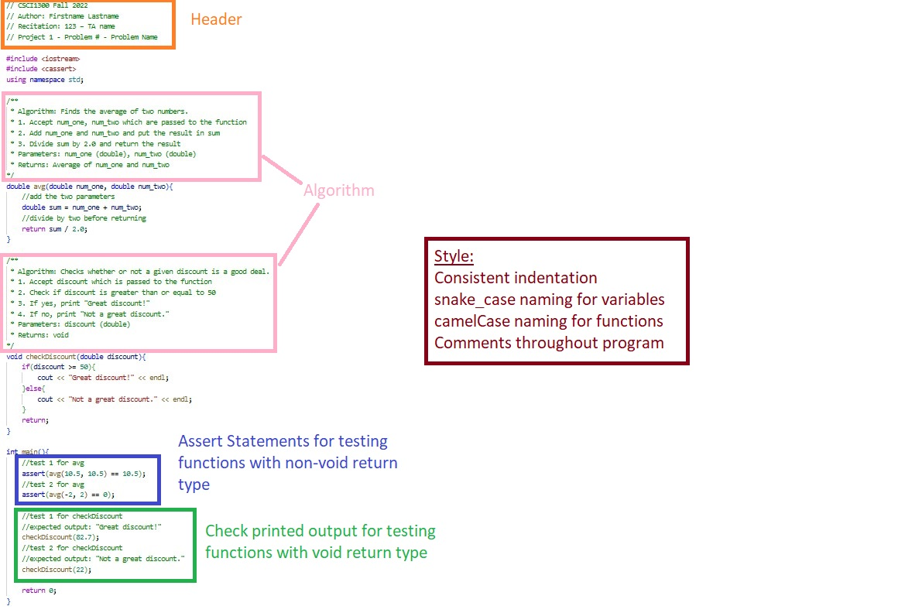

#### **CSCI 1300 CS1: Starting Computing: Homework 6**
#### **Godley/Hoefer - Spring 2023**
#### **Due: Friday, March 10th by 6:00pm MST**
#### **(2 extra-credit points if Coderunner(Start Early) is submitted by 11:59pm Wednesday, March 8th)**

<br/>

# Table of contents

1. [Objectives](#objectives)
2. [Background](#background)
3. [Testing Functions](#tests)
    1. [Void functions with printed output](#void)
    2. [Non-void functions returning bool or int](#non-void-bool-int)
    3. [Non-void functions returning double](#non-void-double)
    4. [Functions manipulating arrays](#test-function-array)
4. [Questions](#questions)
    1. [Question 1](#question1)
    2. [Question 2](#question2)
    3. [Question 3](#question3)
    4. [Question 4a](#question4a)
    5. [Question 4b](#question4b)
5. [Submission Instructions](#submissions)
    1. [Checklist](#checklist)
    2. [Grading rubric](#grading)

# Objectives <a name="objectives"></a>

* Understand how to read and process data from files

# Background <a name="background"></a>
## File Input
So far in class, we've been using the `iostream` standard library. This library has provided us with methods like `cin` and `cout`. `cin` is the method that reads from standard input (i.e. in the terminal via the keyboard) and `cout` is for writing to standard output.

In this background section we'll cover file input, which will allow you to read information from a file. To do this, we'll need to include C++'s `fstream` library, which is short for "file stream".

**Reading Lines From A File**

**Step 1. Make a stream object.** <br/>
Create an object (a variable) of file stream type. If you want to open a file for reading only, then the `ifstream` object should be used (short for “input file stream”).

*Example*
```cpp
// create an input file stream object
ifstream file_input;
```

**Step 2. Open a file.** <br/>
 Once you have a file stream object, you need to open the file. To do this, use the `ifstream` object's `open()` method (function), which takes only one parameter: the file name as a string (surrounded by " " if the file name is given directly).

*Example*
```cpp
// open myTextFile.txt with the file stream object
file_input.open("myTextFile.txt");  
```

**Step 3. Checking for open files.** <br/>
It is always good practice to check if the file has been opened properly and take an appropriate action if not. To check if a file was successfully opened, you may use the `fail()` **or** `is_open()` methods. 

`fail()`: This method will return a boolean value `true` if the file failed to open and `false` otherwise.

*Example*
```cpp
if (file_input.fail()) // true when file fails to open
{
    cout << "Could not open file." << endl; 
    return -1; // return to terminate the program; -1 to indicate that the program didn't function as expected
}
// do things with the file
```

`is_open()`: This method will return a boolean value `true` if the file has successfully opened and `false` otherwise.

*Example*
```cpp
if (file_input.is_open()) // true when file opens sucessfully
{
    // do things with the file
}
else
{
    cout << "Could not open file." << endl;        
}
```

**Step 4. Read lines from the file.** <br/>
To read a line from the file, you can use `getline(file_input, line)` which returns true as long as an additional line has been successfully assigned to the variable line. Once no more lines can be read in, getline returns false. So we can set up a while loop where the condition is the call to getline.
`.eof()`: This method will return a boolean value `true` if all the data in the file was processed and `false` otherwise.

*Example*
```cpp
string line = "";
int line_idx = 0;
// read each line from the file
while (!file_input.eof()) // continue looping as long as there is data to be processed in the file
{
    // get the next line from the file and store in 'line' variable
    getline(fin, line);

    // print each line read from the file
    cout << line_idx << ": " << line << endl;

    // increment index(count of lines in the file)
    line_idx++;   
}
```

**Step 5. Closing a file.** <br/>
When you are finished processing your files, it is recommended to close all the opened files before the program is terminated. You can do this by using the `.close()` function on your file stream object.

*Example*
```cpp
// closing the file
file_input.close();
```

**Step 6. Putting it all together.** <br/>
If we put all the previous steps together, this is the final piece of code we get.

*Example*
```cpp
// create an input file stream object
ifstream file_input;

// open myTextFile.txt with the file stream object
file_input.open("myTextFile.txt"); 

// check if file opened successfully
if (file_input.fail())
{
    cout << "Could not open file." << endl;
    return -1;
}
else
{
    // do things with the file
    string line = "";
    int line_idx = 0;

    // read each line from the file
    while (!file_input.eof())
    {
        // gets line of text from file_input, stores it in line
        getline(file_input, line);

        // print each line read from the file
        cout << line_idx << ": " << line << endl;

        // increment index (count of lines in the file)
        line_idx++;   
    }
}

// closing the file
myTextFile.close();
```


# Testing functions <a name="tests"></a>

Every C++ program you write should include a main function that tests the function you wrote.
There will be 3 different types of test cases you are expected to write depending on the return type of the function.
Listed below is how we expect you to test different types of functions. The process will be different
if you are testing a `void` function, a non-void function that return an `int` or `bool`, or a non-void function
that returns a `double`.

#### 1. Void Functions with printed output <a name="void"></a>

For **void** functions that have printed output (i.e. functions that use `cout` to print to the terminal), call the testing function in the main function. Your tests should include the expected output in comments.

See the sample code below:
```c++
void checkDiscount(double discount) 
{
    if (discount >= 50) 
    {
        cout << "Great discount!" << endl;
    } 
    else 
    {
        cout << "Not a great discount." << endl;
    }
    return;
}
int main() 
{
    // test 1 for checkDiscount
    // expected output: "Great discount!"
    checkDiscount(82.7);

    // test 2 for checkDiscount
    // expected output: "Not a great discount."
    checkDiscount(22);

    return 0;
}
```
_* For the purpose of this test code snippet, algorithm comments were not included, but they are still expected in your C++ files._


<br>


#### 2. Non-Void Functions returning bool or int <a name="non-void-bool-int"></a>

For functions that return a **bool, char or int**, use **assert statements** 
from the **cassert** library (`#include <cassert>`) with a conditional expression.

Assert statements contain a conditional expression which will evaluate to `true` if the function's actual output matches what's expected. If the conditional expression evaluates to `false`, then your program will stop running after printing an error message.

For the purpose of this project, functions that return a `bool`, `char` or `int` can be compared to a specific value using the equality operator `==`.

Your test will look something like this:

`assert(<function call> == <value to compare to>);`

* `<function call>` is where you will call the function you want to test with its function parameters.
* `<value to compare to>` is the value you expect the function to return.
* `==` is the equality operator, and it compares the equality of both sides of itself.

See the sample code below:
```c++
#include <iostream>
#include <cassert>
using namespace std;

int addInts(int num1, int num2)
{
    // add num1 and num2 before returning
    return num1 + num2;
}

// isDrivingAge() returns true if the given age passed as a parameter
// is greater than or equal to 16, otherwise it returns false.
bool isDrivingAge(int age)
{
    return age >= 16;
}

int main()
{
    // test 1 for addInts
    assert(addInts(5, 6) == 11);

    // test 2 for addInts
    assert(addInts(10, 10) == 20);

    // test 3 for drivingAge
    assert(isDrivingAge(17) == true);

    // test 4 for drivingAge
    assert(isDrivingAge(14) == false);
}
```
_* For the purpose of this test code snippet, algorithm comments were not included, but they are still expected in your C++ files._

<br>


#### 3. Non-Void Functions returning double <a name="non-void-double"></a>

For functions that return a **double**, you should use an **assert statement** from the **cassert** header (`#include <cassert>`) with a conditional expression like above. The difference is that you will also need to include the following function in your program:
```c++
/**
 * doublesEqual will test if two doubles are equal to each other within two decimal places.
 */
bool doublesEqual(double a, double b, const double epsilon = 1e-2)
{
    double c = a - b;
    return c < epsilon && -c < epsilon;
}
```
Because the `double` type holds so much precision, it will be hard to compare the equality of a function that returns a 
double with another double value. To overcome this challenge, we can compare `double` values within a certain range 
of precision or decimal places. The function above compares the equality of two variables `a` and `b` up to two decimal places, and returns `true` if the values of `a` and `b` are equal with each other up to two decimal places.

You will be expected to use this function in conjunction with `assert` statements to test functions that return 
the type double.

Your test will look something like this: 

`assert(doubles_equal(<function call>, <value to compare to>));`

 * `<function call>` is where you will call the function you want to test with its function parameters 
 * `<value to compare to>` is the `double` value you expect the function to return.


See the sample code below:
```c++
#include <iostream>
#include <cassert>
using namespace std;
/**
 * doublesEqual will test if two doubles are equal to each other within two decimal places.
 */
bool doublesEqual(double a, double b, const double epsilon = 1e-2)
{
    double c = a - b;
    return c < epsilon && -c < epsilon;
}
/**
 * reciprocal returns the value of 1 divided by the number passed into the function.
 */
double reciprocal(int num)
{
    return 1.0 / num;
}
int main()
{
    // test 1 for reciprocal
    assert(doublesEqual(reciprocal(6), 0.16));
    // test 2 for reciprocal
    assert(doublesEqual(reciprocal(12), 0.083));
}
```
For test 1, `reciprocal(6)` is being called, and we expect the function to return the value `0.16`.
The return value of `reciprocal(6)` and `0.16` is passed in as parameters to the `doublesEquals` function,
which will then return `true` if these two values are equal or `false` if they are not.

_* For the purpose of this test code snippet, algorithm comments were not included, but they are still expected in your C++ files._
<br>

#### 4. Functions manipulating arrays <a name="test-function-array"></a>

Functions which manipulate arrays passed as arguments can be tested by asserting on individual elements of the array after calling the function. This works even for `void` functions because arrays are passed by reference; even if the function doesn't return anything, the array in the function is the same array in memory as the one outside the scope of your function.

Note that if the array is an array of `float` or `double`, the `doubles_equal` function described [here](#non-void-double) should be used to assert on individual array elements.

See the sample code below:
```cpp
#include<iostream>
#include<cassert>
using namespace std;

/**
 * Add one to each element of the array.
 */
void addOneToArrayElements(int arr[], int size) 
{
    for (int i = 0; i < size; i++) 
    {
        arr[i] = arr[i] + 1;
    }
}

/**
 * doublesEqual will test if two doubles are equal to each other within two decimal places.
 */
bool doublesEqual(double a, double b, const double epsilon = 1e-2)
{
    double c = a - b;
    return c < epsilon && -c < epsilon;
}

/**
 * Add one to each element of the array.
 */
void addOneToArrayElementsDouble(double arr[], int size)
{
    for (int i = 0; i < size; i++) 
    {
        arr[i] = arr[i] + 1.0;
    }
}

int main() 
{
    // test 1 for addOneToArrayElements
    int test1Arr[3] = {1, 2, 3};
    addOneToArrayElements(test1Arr, 3);
    assert(test1Arr[0] == 2);
    assert(test1Arr[1] == 3);
    assert(test1Arr[2] == 4);

    // test 2 for addOneToArrayElements
    int test2Arr[3] = {8, 10};
    addOneToArrayElements(test2Arr, 2);
    assert(test2Arr[0] == 9);
    assert(test2Arr[1] == 11);

    // test 1 for addOneToArrayElementsDouble
    double test3Arr[4] = {1.5, 4.6, 9.7, 16.8};
    addOneToArrayElementsDouble(testArr3, 4);
    assert(doublesEqual(testArr3[0], 2.5));
    assert(doublesEqual(testArr3[1], 5.6));
    assert(doublesEqual(testArr3[2], 10.7));
    assert(doublesEqual(testArr3[3], 17.8));
}
```
_* For the purpose of this test code snippet, algorithm comments were not included, but they are still expected in your C++ files._


<br>

# Questions <a name="questions"></a>

### For this homework, you are not allowed to use:
* stringstream objects
* pointers
* references
* vectors
* global variables

## Question 1 (4 points): Testing Functions <a name="question1"></a>

For this question, you're given two complete functions. You need to fill in the main function to test the other functions as outlined in the [Testing Functions](#tests) section.  Write at least six test cases using assertions for each function in the program below.  You should test at least 2 boundary/edge cases for each function.

You may use the provided ([shakespeare_sonnet.txt](data-files/shakespeare_sonnet.txt)) for your tests. You may need to create additional files for testing boundary/edge conditions. 

```cpp
#include <iostream>
#include <string>
#include <fstream>
#include <cassert>

using namespace std;

/*
    Counts the number of a given word
    found in the given input string. 
    Returns 0 if word's length is 0.
*/
int countWord(string input, string word)
{
    int count = 0;
    int input_length = input.length();
    int word_length = word.length();
    
    // special case for words of length 0
    if (word_length == 0)
    {
        return 0;
    }

    // loop through the input string to check every possible match
    for (int i = 0; i < input_length - word_length + 1; i++)
    {
        if (input.substr(i, word_length) == word) // add one to total count if it matches desired word
            count += 1;
    }

    return count;
}

/*
    Takes a given file name and reads the contents. 
    Counts the occurences of a specific word on each line.
    Prints the line number and the number of occurences for each line.
    At the end, prints the total number of occurences.
    Returns true if the total number of occurences was greater than 3.
*/
bool readFile(string file_name, string word)
{
    bool result = false;  // final result to return at end
    int total_count = 0;  // counts total occurrences of letter
    int line_count = 0;   // count of occurrences of letter for a single line

    string line;    // variable for storing each line as we read it
    ifstream fin;   // file input stream

    fin.open(file_name); // Open input file
    
    if (fin.fail())
    {
        cout << "File couldn't be opened!" << endl;
        result = false;
    }
    else
    {
        // read every line of file, count number of matches on each line
        int line_number = 0;
        while (!fin.eof()) // continue looping as long as there is data to be processed in the file
        {
            line_number += 1;
            getline(fin, line);

            line_count = countWord(line, word);
            total_count += line_count;

            cout << "Line: " << line_number << ", Occurences: " << line_count << endl;
        } 
    
        // print the total count to user
        cout << "Total occurences: " << total_count << endl;

        // update result of function -- is true if total count greater than 3
        result = total_count > 3;

        // close files
        fin.close();
    }

    return result;
}

int main()
{
    // write at least 6 additional test cases to test countWord()

    // write at least 6 additional test cases to test readFile()
 
    assert(readFile("shakespeare_sonnet.txt", "to") == true);

    return 0;
}
```
Your file should be named **writingTests.cpp** and should include all of your tests. There is no CodeRunner for this question.

## Question 2 (4 points): Reading Emails <a name="question3"></a>

We'll be using this question to give you a good start on Project 2. To make things easier, we'll reuse the **split** function you created in Homework 5 Question 2. In the specifications we mentioned that **split** should return an integer based on one of the following conditions:
* Returns the number of splits found
* Returns 1 if the delimiter was not found in the string
* Returns -1 if the number of splits is larger than the size of the array
* Returns 0 if string provided is empty
 
For this question, you'll be using the **emails.txt** file. Each line in this file has information about an email sent including the sender of the email, the subject, the body, and the time it was sent. Information like this is often used to help teach computers to label emails as spam or not spam.

Just like in Homework 5, you can assume that no line will have delimiters at the beginning or end of the string and that there are no delimiters added consecutively. Your **split** function should not need to be modified.

From the sample file ([emails.txt](data-files/emails.txt)):
```
abcd1234@colorado.edu~Hello!~Have you checked out this Ed question?~Feb_26_2023_6:40:42_PM
scam@spam.xyz~Got a favorite password?~How about a fav 4 digit pin?~Feb_23_2023_3:44:12_PM
myfriend@gmail.com~Let's play basketball~How about this friday?~Feb_25_2023_9:31:16_AM
```

Create a function called **readEmails** which will take the filename as an input parameter, proceed to open the file and read lines from it. **readEmails** should then pass each line into **split** for parsing. Based on the return value from **split**, the number of emails found should **only** be incremented if the four attributes are found: email sender, subject, body, and timestamp. Other lines that don't match this criteria should be ignored. More details on the function specifications are listed below.

*Function specifications*

* **Name:** readEmails()
* **Parameters (Your function should accept these parameters IN THIS ORDER):**
    * `string` **filename**: the name of the file to be read
* **Return Value:** `int`:
    * Return the number of emails with all four required attributes found in the file
    * It returns -1 if the file couldn't be opened
* The function should ignore empty lines

**Sample run 1**

Function call:
```cpp
string filename = "emails.txt";
int num_emails = readEmails(filename);
if (num_emails == -1)
{
    cout << "Could not open file." << endl;
}
else
{
    cout << "Number of emails: " << num_emails << "." << endl;
}
```
Output:
```
Number of emails: 3.
```

**Sample run 2**

Function call:
```cpp
string filename = "does-not-exist.txt";
int num_emails = readEmails(filename);
if (num_emails == -1)
{
    cout << "Could not open file." << endl;
}
else
{
    cout << "Number of emails: " << num_emails << "." << endl;
}
```
Output:
```
Could not open file.
```

Your file should be named **readEmails.cpp**. The cpp file should include your split() and readEmails() functions, and a main() function to test readEmails(). Once you have finished developing and testing your solution in VSCode you should head over to the CodeRunner on Canvas and paste your **split()**(if you've called it in readEmails()) and **readEmails()** functions into the answer box for question 2.

## Question 3 (4 points): Comparing Long Hikes <a name="question2"></a>

Today is your first day as a software engineering intern with the National Park Service. You've started on a busy day and for a meeting later your boss asked you to develop a function to print some statistics about some of the long hikes around the world. You've been given **long_hikes.txt**, a file which contains a list of different hikes. Each line contains the name of a long hike, its length (as a whole number) in miles, and its elevation gain (as a whole number) in feet, each separated by a "|" delimeter.

*Function Specifications:*
* **Name:** printHikeStats()
* **Parameters (Your function should accept these parameters IN THIS ORDER):** 
    * `string` **filename**: the name of the file to be read
* **Return Value:** No Return Value.
* **Output:**
    * Print the number of non-empty lines read from the file
    * Print the name and length of the longest hike
    * Print the name and length of the shortest hike
    * Print the name and elevation gain per mile of the steepest hike. This number should be rounded to the nearest decimal place (use `setprecision`).
    * If any ties are found, keep the hike that is first in the list.
    * Print an error message and exit the program if the file couldn't be opened
* The function should **only** keep count of non-empty lines

*Hint:* you may use the `split()` function Homework 5 as a helper function to process and store the file data

Example file 1 ([long_hikes.txt](data-files/long_hikes.txt))
```
The Appalachian Trail|2180|464500
The South West Coast Path|630|115000
Continental Divide Trail|3100|457000 
Great Himalayan Trail|1056|289000
The Colorado Trail|578|89000
The Pacific Crest Trail|2650|824370
```

**Sample run 1**

Function call:
```cpp
string filename = "long_hikes.txt";
printHikeStats(filename);
```
Output:
```
Number of lines read: 6.
Longest hike: Continental Divide Trail at 3100 miles.
Shortest hike: The Colorado Trail at 578 miles.
Steepest hike: The Pacific Crest Trail at 311.1 feet gained per mile.
```

**Sample run 2**

Function call:
```cpp
string filename = "does-not-exist.txt";
printHikeStats(filename);
```
Output:
```
Could not open file.
```

**Sample run 3**

Example file 2([long_hikes2.txt](data-files/long_hikes2.txt))
```
The South West Coast Path|630|115000


Continental Divide Trail|3100|457000
Great Himalayan Trail|1056|289000


```

Function call:
```cpp
string filename = "long_hikes2.txt";
printHikeStats(filename);
```
Output:
```
Number of lines read: 3.
Longest hike: Continental Divide Trail at 3100 miles.
Shortest hike: The South West Coast Path at 630 miles.
Steepest hike: Great Himalayan Trail at 273.7 feet gained per mile.
```

Your file should be named **hikeStats.cpp**. The cpp file should your printHikeStats() function, a main() function to test printHikeStats(), and optionally your split() function if you choose to utilize it. Once you have finished developing and testing your solution in VSCode you should head over to the CodeRunner on Canvas and paste only your **printHikeStats() function** into the answer box for question 2.

## Question 4a (6 points): Hike Ratings<a name="question4a"></a>
The National Park Service was so happy with the stats you were able to generate for them! In an effort to get more people to hike, they ask you to create a hike ratings app that people can use to rate different long hikes along 3 categories: epic views (0-10), hike difficulty (0-100), and how overall pleasant the weather was (0-7). After collecting all of this data, you have a file called **hike_ratings.txt** that stores all of the user reviews. Each line contains the hike name followed by that user's ratings, separated by `','` delimeters. **Importantly the reviews are ordered alphabetically so all reviews for the same hikes are next to each other**. 

Sample file ([hike_ratings.txt](data-files/hike_ratings.txt)):
```
Continental Divide Trail,3,13,0
Continental Divide Trail,8,55,7
Great Himalayan Trail,7,83,2
The Appalachian Trail,3,99,2
The Appalachian Trail,5,35,3
The Appalachian Trail,8,89,5
The South West Coast Path,8,20,5
```

It's not guaranteed that each line contains the exact information we want, so you should design **readHikeReviews()** to account for this. If a line has more or less information than expected, ignore it. A line with only two ratings or an extra rating should not count. Note that one trail can have multiple user reviews.

*Function specifications*
* **Name:** readHikeReviews()
* The function parameters in this order:
    * `string` **filename**: the name of the file to be read
    * `string` **hikes[]**: an array of strings to store the hike names
    * `int` **ratings[][4]**: a 2D array of ints to store the (1) total number of user reviews for that hike, as well as (2) the total sum of user view ratings, (3) the total sum of user difficulty ratings, and (4) the total sum of user weather ratings. This should have the same number of rows as your hikes array. You should assume there are only 4 columns.
    * `int` **arrSize**: the number of elements that can be stored in hikes and ratings arrays
* **Return Value:** `int`:
    * It returns the number of hikes stored in the `hikes[]` array if the function can open and read the file
    * It returns -1 if the file couldn't be opened

**Note:** If the file contains more data than what can be stored in these arrays, hikes and ratings should be filled up with as many elements that can be stored in them. 

**Note:** Coderunner will provide hidden implementations of the functions **printNames** and **printRatings**. If you would like to test in vscode, you should implement some way to print out the value of the `hikes` and `ratings` arrays.

**Sample run 1**
```cpp
string filename = "hike_ratings.txt";

// max number of unique hikes to read
int max_hikes = 3;

// make arrays to store data
string hikes[max_hikes];
int ratings[max_hikes][4];

// call read data function
int num_hikes = readHikeReviews(filename, hikes, ratings, max_hikes);

// output results, if any
if (num_hikes == -1)
{
    cout << "Could not open file." << endl;
}
else
{
    cout << "Number of hikes: " << num_hikes << "." << endl;
    // printNames will be provided for the Coderunner tests
    printNames(hikes, num_hikes);
    // printRatings will also be provided for the Coderunner tests
    printRatings(ratings, num_hikes);
}
```
Output:
```
Number of hikes: 3.
names[0] = Continental Divide Trail
names[1] = Great Himalayan Trail
names[2] = The Appalachian Trail
num reviews: 2, avg view: 5.50 / 10, avg dif: 34.00 / 100, avg weather: 3.50 / 7, 
num reviews: 1, avg view: 7.00 / 10, avg dif: 83.00 / 100, avg weather: 2.00 / 7, 
num reviews: 3, avg view: 5.33 / 10, avg dif: 74.33 / 100, avg weather: 3.33 / 7,
```

**Sample run 2**
```cpp
string filename = "does-not-exist.txt";

// max number of hikes to read
int max_hikes = 3;

// make arrays to store data
string hikes[max_hikes];
int ratings[max_hikes][4];

// call read data function
int num_hikes = readHikeReviews(filename, hikes, ratings, max_hikes);

// output results, if any
if (num_hikes == -1)
{
    cout << "Could not open file." << endl;
}
else
{
    cout << "Number of hikes: " << num_hikes << "." << endl;
    // printNames will be provided for the Coderunner tests
    printNames(hikes, num_hikes);
    // printRatings will also be provided for the Coderunner tests
    printRatings(ratings, num_hikes);
}
```
Output:
```
Could not open file.
```

Your file should be named **hikeReviews.cpp**. The cpp file should your split() and readHikeReviews() functions, and a main() function to test readHikeReviews(). Once you have finished developing and testing your solution in VSCode you should head over to the CodeRunner on Canvas and paste both your **split()** and **readHikeReviews()** functions into the answer box for question 3.

## Question 4b (2 points): Computing Score <a name="question4b"></a>

Once you've successfully implemented and tested **readHikeReviews**, write a function named **calcOverallScore**. To calculate an overall score for each hike, using the following formula: 
<br>
`score = (7.3 * Avg View Rating) + (-.22 * Avg Difficulty Rating) + (3.4 * Avg Weather Rating)`
<br> 
<br>
You will read the ratings from a file into a 2D array using the **readHikeReviews** function from Question 4a. You must then calculate the average rating for each category by using the number of reviews (`ratings[][0]`) the total sum ratings for each category returned in 4a (`ratings[][1]`, `ratings[][2]`, `ratings[][3]`). For example, the overall score for The Appalachian Trail from the [hike_ratings.txt](data-files/hike_ratings.txt) file would be:

```
// 7.3 * 5.33 + (-.22) * 74.33 + 3.4 * 3.33 = 33.8784
The Appalachian Trail overall score: 33.9
```


*Function specifications*
* **Name:** calcOverallScore()
* **Parameters (Your function should accept these parameters IN THIS ORDER):**
    * `string` **hikes[]**: the array of strings containing the names of the hikes
    * `int` **ratings[][4]**: the 2D array of integers containing the hike ratings. You should assume there are only 4 columns
    * `int` **num_hikes**: the number of hikes in the array
* **Return Value:** No Return Value.
* **Output:**
    * The function should print the overall score for each of the hikes found in the `hikes[]` array to 1 decimal place (use `setprecision`).

**Sample run 1**

Function call:
```cpp
string filename = "hike_ratings.txt";

// max number of hikes to read
int max_hikes = 3;

// make arrays to store data
string hikes[max_hikes];
int ratings[max_hikes][4];

// call read data function
int num_hikes = readHikeReviews(filename, hikes, ratings, max_hikes);

if (num_hikes == -1)
{
    cout << "Could not open file." << endl;
}
else
{
    calcOverallScore(hikes, ratings, num_hikes);
}
```
Output:
```
Continental Divide Trail overall score: 44.6
Great Himalayan Trail overall score: 39.6
The Appalachian Trail overall score: 33.9
```
Your file should be named **computeScore.cpp**. The cpp file should include split(), readHikeReviews(), calcOverallScore(), and a main function that tests your calcOverallScore() function. Once you have finished developing and testing your solution in VSCode you should head over to the CodeRunner on Canvas and paste your **split()**, **readHikeReviews()**  and **calcOverallScore()** functions into the answer box for question 4.


# Submission Instructions <a name="submissions"></a>

### Checklist <a name="checklist"></a>

Here is a checklist for submitting the assignment:

1.  **CodeRunner**. The correctness of your program will be graded by Coderunner. You can modify your code and re-submit (press “Check” again) as many times as you need to, until the assignment due date. Use the solutions you created in VSCode to complete the assignment **Homework 6 - CodeRunner** on Canvas (modules -> week 8)
    * Remember that submitting **Homework 6 - Coderunner(Start Early)** by Wednesday, March 8th at 11:59pm will give extra credit! 

2.  **C++ files**. When you are finished with all the questions, zip all of your .cpp files together. Submit the single zip file under the assignment **"Homework 6"** on Canvas.
    * All files should be named as specified in each question, and they should compile and run on Coderunner (pass all test cases) and in VSCode to earn full points.
    * Our TAs will be grading the style of your code and comments. Please see the style guide on Canvas for more details.
    * At the top of each file, write your name in the format shown below.
    * Your C++ program for each question should also contain a main that tests the function you wrote, like below. **You should include at least 4 test cases for each function.** In general, we recommend you try to include as many test cases as you believe are necessary to ensure that your code works properly. Deciding on how many test cases to include is an important skill to learn, since the number of necessary test cases can change between programs. See [testing functions](#tests) for examples demonstrating testing arrays.
    * You may need to create external data files to test your functions.
    * Please be sure to also include function headers that contain the algorithm implemented within the function, expressed in pseudocode. You can refer to the example below for more details.

    * **Style Example:** <br/>

    * The zip file should be named, **hmwk6_lastname.zip**. It should have the following 5 files:
        * writingTests.cpp   
        * emails.cpp 
        * hikeStats.cpp
        * hikeReviews.cpp
        * computeScore.cpp
    * **Add any external files that are required for your assertions to pass to the zip submission.**

---

# Grading Rubric <a name="grading"></a>

| **Criteria**                                | Points |
| ------------------------------------------- | ------ |
| Question 1                  | 4    |
| Question 2                  | 4     |
| Question 3                  | 4     |
| Question 4a                 | 6    |
| Question 4b                 | 2     |
| C++ files zip submission (compiles and runs, style and comments)| 5 |
| Recitation attendance (Week 8)*             | -3    |
|Extra Credit - Start Early | +2 |
| Total                                       | 20     |

**Note:** If your attendance is not recorded, you will lose points. Make sure your attendance is recorded on Canvas.
