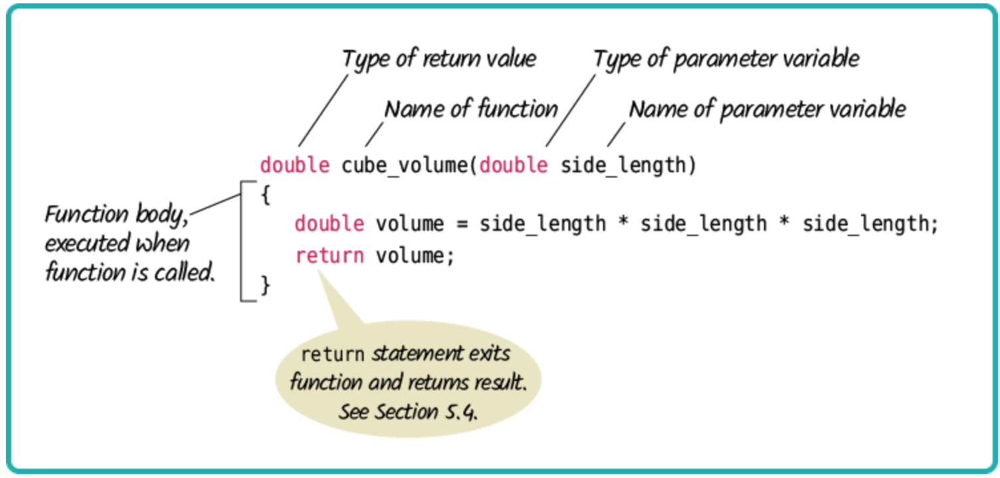
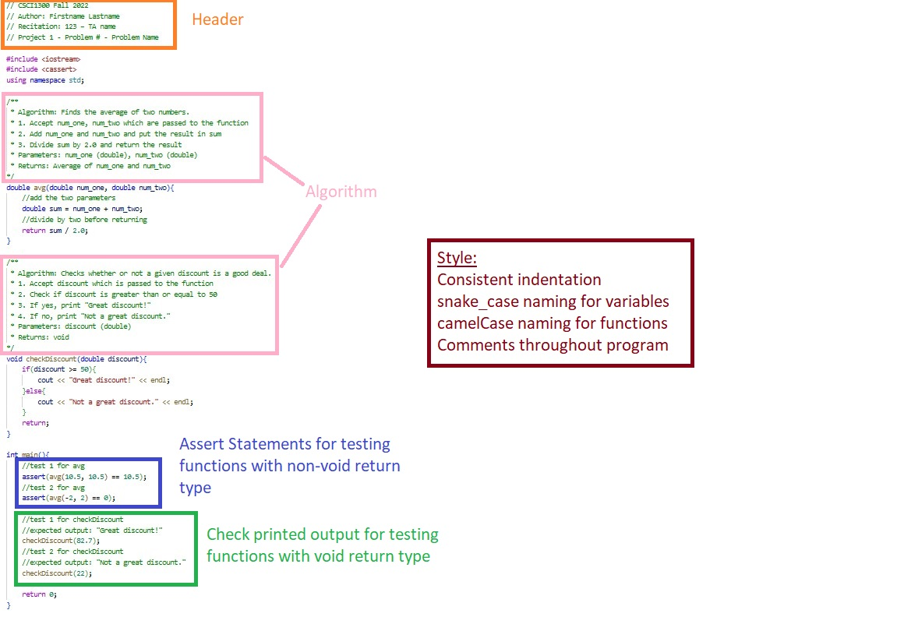
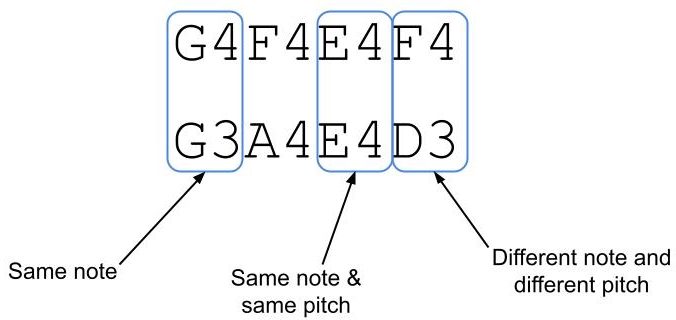

#### **CSCI 1300 CS1: Starting Computing: Project 1**
#### **Godley/Hoefer - Spring 2023**
#### **Due: Friday, February 24th, by 6:00pm MST**

<br />

# Table of contents
1. [Objectives](#objectives)
2. [Background](#background)
    1. [Functions](#functions)
    2. [Strings](#strings)
3. [Submission Instructions](#submissions)
    1. [Test Cases Instructions](#tests)
    1. [Void functions](#void)
    2. [Functions that return a bool or int](#non-void-bool-int)
    3. [Functions that return a double](#non-void-double)
4. [Interview Grading](#interview)
5. [Questions](#questions)
    1. [Question 1](#question1)
    2. [Question 2](#question2)
    3. [Question 3](#question3)
    4. [Question 4](#question4)
    5. [Question 5](#question5)
    6. [Question 6](#question6)
    7. [Question 7](#question7)
6. [Overview](#overview)
    1. [Checklist](#checklist)
    2. [Grading Rubric](#grading)

# Objectives <a name="objectives"></a>
* Understand and work with functions and strings
* Be able to test functions

# Background <a name="background"></a>

## Functions<a name="functions"></a>

A function is a named block of code which is used to perform a particular task. The power of functions lies in the capability to perform that task anywhere in the program without requiring the programmer to repeat that code many times.  This also allows us to group portions of our code around concepts, making programs more organized.  You can think of a function as a mini-program.

There are two types of functions:
1. Library functions
2. User-defined functions

Library functions refer to pre-existing functions that you can use but did not write yourself. In order to use a library function, you must include the library that contains the function. For example, the C++ math library provides a ```sqrt()``` function to calculate the square root of a number. To use the `sqrt()` function, you must include the cmath library at the top of your program, e.g. `#include<cmath>`. Libraries other than the built-in C++ libraries can be found online.

C++ allows programmers to define their own functions. These are called user-defined functions. Every valid C++ program has at least one function, the ```main()``` function.

We pass values to functions via **parameters**. In general, the parameters should be all the information needed for the function to do its work.  When that work is complete, we would like to use the result in other code.  The function can **return** *one value* of the specified **return type**. A function may also return nothing, in which case its return type is **void**.



Here is the syntax for a function definition:

```cpp
return_type functionName(parameter_list)
{
    //function body
}
```

* The ```return_type``` is the data type that the function returns
* ```functionName``` is the actual name of the function
* ```parameter_list``` refers to the type, order, and number of the parameters of a function. A parameter is like a placeholder. When a function is invoked, you pass a value to the parameter. This value is referred to as an actual parameter or argument.
* ```//function body``` contains a collection of statements that define what the function does. The statements inside the function body are executed when a function is called.

When we want a function to run, we **call** it like this:

```cpp
return_variable = functionName(parameter_values);
```

Note that in the above example, `parameter_values` refers to a comma-separated list of values for each parameter your function accepts, in the order they are listed in the function definition. These parameter values can either be pre-existing variables or literal values, e.g.
```
sqrt(4);
```
and
```
int x = 4;
sqrt(x);
```

A function has its own **scope**. That means that the parameters of the function, as well as local variables declared within the function body, are not accessible outside the function. This is useful because it allows us to solve a small problem in a self-contained way. Parameter values and local variables disappear from memory when the function completes its execution.

When we call a function, the **flow of execution** changes. Let’s follow in the example below:

When the program below is run, it will begin by executing the first line of code in the body of the `main()` function. When the program execution reaches the line `int sum_result = sum(parameter_var, 99);`, the main function will pause, and the first line in the body of the `sum()` function will begin running. After the line `return result;` is reached, `sum()` will stop running, and the main program will resume execution where it left off. In this case, when `main()` resumes execution, the return value of `sum()` will be stored in `int sum_result`, and then the last two lines of the main function will run.

```cpp
#include <iostream>
using namespace std;

//funtion to add two numbers
int sum(num_one, num_two)
{
    int result = num_one + num_two;
    return result;
}

//main function
int main()
{
    //declare parameter value
    int parameter_var = 1;

    //call the function
    int sum_result = sum(parameter_var, 99);

    cout << "The sum is " << sum_result << endl;

    return 0;
}
```

## Strings <a name="strings"></a>

`Strings` are a special data type that were first discussed in the background section of [homework 4](https://github.com/CSCI1300-StartingComputing/CSCI1300-Spring2023/blob/main/homework/homework4/Homework4.md).

Another useful function available for strings is `substr()`. This function allows us to access a subset, or a small portion, of a longer string. The substring function takes two arguments:
1. The starting index of the substring you would like to capture
2. The length of the substring you would like to capture (optional)

Note that the second argument is optional. If you don't pass a second argument to subtring, then the function will print the entirety of the string, beginning with the character at the position specified in the first argument. Note that `substr()` always returns a variable of type `string`, regardless of the length of the substring.

For example, consider the code below:

```cpp
string str = "Project 1 is fun!"
cout << str.substr(0, 7) << endl;
cout << str.substr(7) << endl;
cout << str.substr(1, 1) << endl; //prints a string of length one
```

This will ouput the following:
```
Project
 1 is fun!
r
```
**Note:** The second line of output begins with a space.

Both `length()` and `substr()` are special kinds of functions associated with **objects**, usually called **methods**, which we will discuss later in the course.

# Submission Instructions <a name="submissions"></a>

<span style="font-size:20px">**DO NOT USE GLOBAL VARIABLES IN YOUR SOLUTION. USE OF GLOBAL VARIABLES WILL RESULT IN A 0 ON THE PROJECT.**</span>

* **Honor code questions** (Multiple choice quiz). There are a few questions about our Honor Code policies on Canvas.
* **CodeRunner**. Your programs will be graded in part by CodeRunner. You can modify your code and re-submit (press Check again) as many times as you need up until the assignment due date.
* **C++ files**. When you are finished with all the questions, zip all of your .cpp files together. Submit the single zip file under the assignment **"Project 1"** on Canvas.
    * All files should be named as specified in each question, and they should compile and run on Coderunner (pass all test cases) and in VSCode to earn full points.
    * Our TAs will be grading the style of your code and comments. Please see the style guide on Canvas for more details.
    * At the top of each file, write your name in the format shown below.
    * Your C++ program for each question should also contain a main function that tests the other function(s) you wrote, like below. **You should be sure to include as many test cases as you believe are necessary to ensure that your code works properly.** Deciding on how many test cases to include is an important skill to learn, since the number of necessary test cases can change between programs. Ensure that you'll be able to explain why you believe each main function contains an adequate number of tests.
    * Please be sure to also include function headers that contain the algorithm implemented within the function, expressed in pseudocode. You can refer to the example below for more details.

**Style Example:**


<br>

### Test Cases Instructions <a name="tests"></a>

Every C++ program you write should include tests in your main function that verify the correctness of your code. There are 3 different types of test cases you will write depending on the return type of the function you are testing. Listed below is an explanation of how we expect you to test different functions with varying return types, such as `void`, `double`, or `int`, `bool`, and `char`.

#### 1. Void Functions <a name="void"></a>

To test a **void** function that has printed output, call the function you are testing from your `main()` function. You should include a comment above the function call that includes the expected output.
See the sample code below:

```c++
void checkDiscount(double discount)
{
    if (discount >= 50)
    {
        cout << "Great discount!" << endl;
    }
    else
    {
        cout << "Not a great discount." << endl;
    }
    return;
}

int main()
{
    // test 1 for checkDiscount
    // expected output: "Great discount!"
    checkDiscount(82.7);

    // test 2 for checkDiscount
    // expected output: "Not a great discount."
    checkDiscount(22);

    return 0;
}
```
_* For the purpose of this test code snippet, algorithms were not included, but they are still expected in your C++ files._


<br>

#### 2. Functions that return a bool, char or int <a name="non-void-bool-int"></a>

For functions that return a **bool, char or int**, use **assert statements**
from the **cassert** library (`#include <cassert>`) with a conditional expression.

Assert statements contain a conditional expression which will evaluate to `true` if the function's actual output matches what's expected. If the conditional expression evaluates to `false`, then your program will stop running after printing an error message.

For the purpose of this project, functions that return a `bool`, `char` or `int` can be compared to a specific value using the equality operator `==`.

Your test will look something like this:

```
<data type> result = <function call>;
assert(result == <expected value>);`
```

* `<data type>` is the data type of the result variable, which stores the return value of the function.
* `<function call>` is where you will call the function you want to test with its function parameters.
* `<expected value>` is the value you expect the function to return.
* `==` is the equality operator, and it compares the equality of both sides of itself.

See the sample code below:
```c++
#include <iostream>
#include <cassert>
using namespace std;

int add_(int num1, int num2)
{
    // add num1 and num2 before returning
    return num1 + num2;
}

// isDrivingAge returns true if the given age passed as a parameter is greater than 16,
// else it returns false.
bool isDrivingAge(int age)
{
    if (age >= 16)
    {
        return true;
    }
    else
    {
        return false;
    }
}

int main()
{
    // test 1 for add_
    assert(add_(5, 6) == 11);
    // test 2 for add_
    assert(add_(10, 10) == 20);

    // test 3 for drivingAge
    assert(isDrivingAge(17) == true);
    // test 4 for drivingAge
    assert(isDrivingAge(14) == false);
}
```
_* For the purpose of this test code snippet, algorithms were not included, but they are still expected in your C++ files._

<br>

#### 3. Functions that return a double <a name="non-void-double"></a>

For functions that return a **double**, you should use an **assert statement** from the **cassert** header (`#include <cassert>`) with a conditional expression like above. The difference is that you will also need to include the following function in your program:
```c++
/**
 * doublesEqual will test if two doubles are equal to each other within two decimal places.
 */
bool doublesEqual(double a, double b, const double epsilon = 1e-2)
{
    double c = a - b;
    return c < epsilon && -c < epsilon;
}
```
Because the `double` type holds so much precision, it will be hard to compare the equality of a function that returns a
double with another double value. To overcome this challenge, we can compare `double` values within a certain range
of precision or decimal places. The function above compares the equality of two variables `a` and `b` up to two decimal places, and returns `true` if the values of `a` and `b` are equal with each other up to two decimal places.

You will be expected to use this function in conjunction with `assert` statements to test functions that return
the type double.

Your test will look something like this:

`assert(doubles_equal(<function call>, <value to compare to>));`

* `<function call>` is where you will call the function you want to test with its function parameters
* `<value to compare to>` is the `double` value you expect the function to return.


See the sample code below:
```c++
#include <iostream>
#include <cassert>
using namespace std;
/**
 * doubles_equal will test if two doubles are equal to each other within two decimal places.
 */
bool doublesEqual(double a, double b, const double epsilon = 1e-2)
{
    double c = a - b;
    return c < epsilon && -c < epsilon;
}

/**
 * reciprocal returns the value of 1 divided by the number passed into the function.
 */
double reciprocal(int num)
{
    return 1.0 / num;
}

int main()
{
    // test 1 for reciprocal
    //call reciprocal
    double reciprocal_result = reciprocal(6);
    //call doublesEqual
    bool is_equal = doubles_equal(reciprocal_result, 0.16);
    //assert statement
    assert(is_equal);

    // test 2 for reciprocal
    assert(doubles_equal(reciprocal(12), 0.083));
}
```

Notice that in the above example test 1 and test 2 are equally valid ways of testing functions that return a `double`.

For test 1, `reciprocal(6)` is being called, and we expect the function to return the value `0.16`.
The variable `reciprocal_result` and `0.16` are passed in as parameters to the `doubles_equals` function,
which will return `true` if these two values are equal and `false` if they are not. We pass the return value, which is stored int the variable `is_equal`, to our assert statement. If our `is_equal` is `true`, the assert statement will pass. If `is_equal` is false, the program will stop running and print an error message.

# Interview Grading <a name="interviews"></a>

You must also sign up for an interview grading slot on Canvas by February 24th. **If you don’t attend an interview then you will be given a 0 for both the Project 1 - zip file and Project 1 - CodeRunner assignments**. The scheduler for interview grading will be published on February 20th.

# Questions <a name="questions"></a>
## Scientific Pitch Notation <a name = "SPN"></a>
Scientific pitch notation (SPN) is a method of representing musical pitch by combining a musical note's name with a number specifying the pitch's octave. For instance, C<sub>4</sub>, C<sub>5</sub>, and C<sub>6</sub> are all C notes, each pitched higher than the last.

Thus, a valid note represented in SPN can consist of any letter corresponding to a musical note along with a number between 0 and 9 (inclusive). The seven musical notes are the letters A through G (inclusive). While accidentals can be included, we will ignore them for the purposes of our project.

If you are interested in learning more about SPN, you can refer to the [wikipedia page](https://en.wikipedia.org/wiki/Scientific_pitch_notation) on the matter. However, we will only be dealing with the simplified version of SPN described above.

The following questions have to do with SPN and will prepare you for the latter part of project 1.

## Question 1 (2 points): isValidNote() <a name="question1"></a>

Write a function called `isValidNote` that accepts a string and returns true if that string is a valid note expressed in SPN and false otherwise. See the [explanation](#SPN) above for clarity on what is and is not considered valid SPN.

* Function Specifications:
  * The function name: **isValidNote**
  * Parameters (Your function should accept these parameters IN THIS ORDER):
    * `string` note: The string to be checked
  * Return Value: True or false (bool)
    * The function should return true if the string is a valid note in SPN and false otherwise.
* The function should not print anything.
* The function should be case-sensitive, e.g. B0 is valid SPN but b0 is not.

**Hint:** Any note expressed in valid SPN will be exactly 2 characters long.

**--- Examples ---** <br/>
|**Sample function call** | **Expected return value**|
| --- | :---: |
| ```isValidNote("y")``` | False |
| ```isValidNote("D4")``` |  True |
| ```isValidNote("d4")``` |  False |
| ```isValidNote("E72")``` |  False |
| ```isValidNote("I love coding")``` |  False |

Your file should be named **isValidNote.cpp** and should also include a main function that tests your isValidNote function. Once you have finished developing your solution in VSCode you should head over to the CodeRunner on Canvas and paste **only your function isValidNote** into the answer box for question 1. You do not need to paste your main function into Coderunner, one has already been provided for you. **You will need to include your main and isValidNote functions in the isValidNote.cpp file that you submit to Canvas**.

## Question 2 (3 points): isValidTune() <a name="question2"></a>

Write a function called isValidTune that will determine whether or not a given string of arbitrary length is composed exclusively of notes written in valid SPN.

* Function Specifications:
  * The function name: **isValidTune**
  * Parameters (Your function should accept these parameters IN THIS ORDER):
    * `string` input: The string whose validity should be examined (any length)
  * Return Value: True if the input is in SPN, false otherwise (bool)
* The input string is only considered valid SPN if it consists only of notes within SPN (see examples for more details).
* The function should make use of your ```isValidNote``` function from question 1.
* If the string is empty, then it should not be considered valid SPN and your function should return false.
* The function should not print anything.

**--- Examples ---** <br/>
|**Sample function call** | **Expected return value**|
| --- | :---: |
| ```isValidTune("A2B4C7")``` | True |
| ```isValidTune("M5D2E1")``` | False |
| ```isValidTune("A5D2E11")``` | False |
| ```isValidTune("Hello1300")``` | False |

Your file should be named **isValidTune.cpp** and should also include a main function that tests your new isValidTune function. Once you have finished developing your solution in VSCode you should head over to the CodeRunner on Canvas and paste **only your isValidTune function** into the answer box for question 2. You do not need to paste your main function or your isValidNote function into Coderunner. These functions have already been provided for you. **You will need to include your main, isValidNote and isValidTune functions in the isValidTune.cpp file that you submit to Canvas**.

## Question 3 (2 points): numValidNotes() <a name="question3"></a>

Write a function named numValidNotes that takes an arbitrary string and returns the number of notes expressed in valid SPN that are present within that string.

* Function Specifications:
  * The function name: **numValidNotes**
  * Parameters (Your function should accept these parameters IN THIS ORDER):
    * `string` input: The string to be examined for the number of notes
  * Return Value: The number of valid notes in the string (int)
* This function should make use of your ```isValidNote``` function from question 1.
* The function should not print anything.

**--- Examples ---** <br/>
|**Sample function call** | **Expected return value**|
| --- | :---: |
| ```numValidNotes("I love comp sci!")``` | 0 |
| ```numValidNotes("F4E2B0")``` |  3 |
| ```numValidNotes("ADB3M7G4F")``` |  2 |
| ```numValidNotes("HC6MB1")``` |  2 |

Your file should be named **numValidNotes.cpp** and should also include a main function that tests your numValidNotes function. Once you have finished developing your solution in VSCode you should head over to the CodeRunner on Canvas and paste **only your numValidNotes function** into the answer box for question 3. You do not need to paste your main function or your isValidNote function into Coderunner. These functions have already been provided for you. **You will need to include your main, isValidNote, isValidTune and numValidNotes functions in the numValidNotes.cpp file that you submit to Canvas**.


## More on Scientific Pitch Notation <a name="similarity"><a/>

In addition to expressing single notes using SPN, we can string together multiple notes to create a sequence of letters and numbers representing a tune. For instance, "D<sub>4</sub>D<sub>4</sub>A<sub>5</sub>A<sub>5</sub>B<sub>5</sub>B<sub>5</sub>A<sub>5</sub>" represents the first seven notes of the tune "Twinkle Twinkle Little Star."

The following questions will guide you through creating several functions that allow you to identify tunes that are similar to each other. We will begin by computing how similar two tunes are using the following formula:

```
similarity = (number of matching notes / total number of notes)
            + number of matching notes with matching pitches
            - number of different notes with different pitches
```

Where:
* **matching notes** means that the musical note (i.e. A - G) is the same, but not necessarily the pitch. The notes must be in the same positoin within the string to be considered matching.
* **matching notes with matching pitches** means that both the note (i.e. A - G) and the pitch (i.e. 0 - 9) are the same, and they are in the same position within the string.
* **different notes with different pitches** means that both the note and the pitch are different, and they are in the same position within the string.

Note that for two notes to be compared they must be in the same position. In other words, if tune 1 has C6 as its first note and tune 2 has C6 as its third note, they are not considered to be matching. Also note that some notes will be neither matching nor different. For instance, the notes E4 and G4 are neither matching nor different since they have the same pitch.

As an example, consider the following two tunes:

Tune 1 = G4F4E4F4 <br />
Tune 2 = G3A4E4D3

We see that:



Thus, their similarity score would be computed as:

similarity = 2 / 4 + 1 - 1 = 1 / 2 + 1 - 1 = 1 / 2 = 0.5

Notice in the above example that the number of matching notes is 2. This is because the third notes in the tunes count as both matching notes and as matching notes with matching pitches.

Use this example to complete the following questions:

## Question 4 (6 points): tuneSimilarity() <a name="question4"></a>

Write a function called tuneSimilarity that computes the similarity score as [described above](#similarity) for two tunes of equal length.

* Function Specifications:
  * The function name: **tuneSimilarity**
  * Parameters (Your function should accept these parameters IN THIS ORDER):
    * `string` tune1: The first input tune
    * `string` tune2: The second input tune
  * Return Value: The similarity score (double)
* The parameters should be two strings of equal length. If they are not equal in length, your function should return 0.
* The function should not print anything.
* You may assume that the input to `tuneSimilarity` will always be valid SPN, i.e. you do not have to account for arbitrary strings.

**--- Examples ---** <br/>

| **Sample function call**                             | **Expected return value** |
|------------------------------------------------------|:-------------------------:|
| ```tuneSimilarity("G4E5D4", "G4F4D5")```             |         0.666667          |
| ```tuneSimilarity("A0B0C0D0", "D1C1B1A1")```         |            -4             |
| ```tuneSimilarity("E5E5G5A6G5D5", "E5G5A6G5D5D5")``` |         0.333333          |
| ```tuneSimilarity("D5G2", "F7D1E4G4")``` |         0          |

An example test case for the first sample function call would be:
`assert(doubles_equal(tuneSimilarity("G4E5D4", "G4F4D5"), 0.666667));`

Your file should be named **tuneSimilarity.cpp** and should also include a main function that tests your tuneSimilarity function. Once you have finished developing your solution in VSCode you should head over to the CodeRunner on Canvas and paste **only your function tuneSimilarity** into the answer box for question 4. You do not need to paste your main function into Coderunner. A main function has already been provided for you. **You will need to include your main, tuneSimilarity and any other helper functions in the tuneSimilarity.cpp file that you submit to Canvas**.

## Question 5 (6 points): bestSimilarity() <a name="question5"></a>

Write a function called bestSimilarity that finds the best similarity score between all subsequences of an input tune and the target tune. The input tune will always be as long as or longer than the target tune. In other words, this function will find the best possible similarity score that a tune could have. See the worked example below for a deeper explanation of how this function should work.

* Function Specifications:
  * The function name: **bestSimilarity**
  * Parameters (Your function should accept these parameters IN THIS ORDER):
    * `string` input_tune: The input tune to be checked against the target (length greater than or equal to the target tune)
    * `string` target_tune: The target tune
  * Return Value: The best possible similarity score (double)
* The length of input_tune should be greater than or equal to the length of target_tune. If input_tune is shorter than target_tune, your function should return 0.
* The function should not print anything.
* This function should make use of the ```tuneSimilarity``` function created in question 4.
* You may assume that the input to bestSimilarity will always be valid SPN, i.e. you do not have to account for arbitrary strings.

### **A worked example:**

| **Input tune**   | **Target tune** |**Similarity Calculation**| **Similarity Score** |
|------------------|:---------------:|--------------------------|----------------------|
| **A0E2D4**E5C1F0 |     D4E5C0      | 1/3 + 0 - 2              | -1.66667             |
| A0**E2D4E5**C1F0 |     D4E5C0      | 0/3 + 0 - 3              | -3                   |
| A0E2**D4E5C1**F0 |     D4E5C0      | 3/3 + 2 - 0              | **3**                |
| A0E2D4**E5C1F0** |     D4E5C0      | 0/3 + 0 - 2              | -2                   |

Thus, the highest possible similarity score out of every subsequence of our target tune is 3.00, so our function would return 3.00.

**--- Examples ---** <br/>

| **Sample function call**                         | **Expected return value** |
|--------------------------------------------------|:-------------------------:|
| ```bestSimilarity("E4D5B7G2E2", "D6G5G2")```     |         0.666667          |
| ```bestSimilarity("F1E2C2D1A7B8D3", "F2A7C3")``` |         -0.333333         |
| ```bestSimilarity("A2G7", "E9D2C4F1")```         |             0             |

An example test case for the first sample function call would be: `assert(doubles_equal(bestSimilarity("E4D5B7G2E2", "D6G5G2"), 0.666667));`

Your file should be named **bestSimilarity.cpp** and should also include your tuneSimilarity function along with a main function that tests your new bestSimilarity function. Once you have finished developing your solution in VSCode you should head over to the CodeRunner on Canvas and paste **only your bestSimilarity function** into the answer box for question 5. You do not need to paste your main function into Coderunner. A main function has already been provided for you. **You will need to include your main, bestSimilarity and any other helper functions in the bestSimilarity.cpp file that you submit to Canvas**.

## Question 6 (6 points): printTuneRankings() <a name="question6"></a>

Write a function called printTuneRankings that accepts three input tunes and one target tune, and prints the input tunes in order from most to least similar to the target. The tunes should be ranked in order of each tune's best similarity score (from question 5). It is not necessary for the three input tunes to be the same length.

* Function Specifications:
  * The function name: **printTuneRankings**
  * Parameters (Your function should accept these parameters IN THIS ORDER):
    * `string` tune1: The first input tune to be checked against the target
    * `string` tune2: The second input tune to be checked against the target
    * `string` tune3: The third input tune to be checked against the target
    * `string` target_tune: The target tune
  * Return Value: No Return Value.
* **Output:**
    * Your function should print the list of tunes based on their similarity score against the target tune.
    * The output format should match the example below exactly, with each tune preceded by its ranking and a closing parenthesis.
    * If any of the tunes are tied in similarity, your function should rank them in the order in which they were passed to the function.
* Remember that the three input tunes need not be of the same length.
* This function should make use of the ```bestSimilarity``` function created in question 5.
* You may assume that any parameters passed to your function will always be in valid SPN.

**--- Examples ---** <br/>

| **Sample function call**                                       | **Expected output** (printed to screen)|
|----------------------------------------------------------------|:--------------------------------------:|
| ```printTuneRankings("D3D4", "E3D4", "D3F4", "A7")```          |       1) Tune 1<br/>2) Tune 2<br/>3) Tune 3  |
| ```printTuneRankings("C2E7", "D4B3", "A4D1", "A4B7")```        |    1) Tune 2<br/>2) Tune 3<br/>3) Tune 1     |
| ```printTuneRankings("B8", "C8", "A7", "C8")```                |     1) Tune 2<br/>2) Tune 1<br/>3) Tune 3    |
| ```printTuneRankings("C2E7", "D4", "A4D1", "A4B7")```          |     1) Tune 3<br/>2) Tune 2<br/>3) Tune 1    |
| ```printTuneRankings("F4B2E6", "A1", "B6G2E4", "B7G4")```      |     1) Tune 3<br/>2) Tune 2<br/>3) Tune 1    |

Your file should be named **printTuneRankings.cpp** and should also include your tuneSimilarity and bestSimilarity functions along with a main function that tests your new printTuneRankings function. Once you have finished developing your solution in VSCode you should head over to the CodeRunner on Canvas and paste **only your printTuneRankings function** into the answer box for question 6. You do not need to paste your main function into Coderunner. A main function has already been provided for you. **You will need to include your main, printTuneRankings and any other helper functions in the printTuneRankings.cpp file that you submit to Canvas**.

## Question 7 (5 points): Putting it All Together <a name="question7"></a>

For this question you will be creating a main function which will allow a user to interact with your program by providing their own target and input tunes. Your main function should present the user with a menu containing the following options:

* Calculate the similarity between two tunes of the same length
* Calculate the best similarity between two tunes of either equal or unequal length
* Print three input tunes in order from most to least similar to the target tune
* Exit

Your menu should run on a loop, continually offering the user each option until they choose to exit. Be sure to use the functions you wrote in questions 1 through 6 as needed.

**Note:** Your main function **should** account for any user input that isn't in valid SPN. If user input is not in valid SPN your program should print "Invalid input. Please enter a tune in valid SPN:" until the user enters valid SPN.

**--- Sample Run 1---** (bold indicates user input)<br />
<pre><code>
--- Menu ---
1. Calculate similarity between two tunes.
2. Calculate best similarity between two tunes of potentially different lengths.
3. Print three input tunes in order from most to least similar to the target tune.
4. Exit.
Please enter your choice (1 - 4):
<strong>6</strong>
Invalid input.
--- Menu ---
1. Calculate similarity between two tunes.
2. Calculate best similarity between two tunes of potentially different lengths.
3. Print three input tunes in order from most to least similar to the target tune.
4. Exit.
Please enter your choice (1 - 4):
<strong>1</strong>
Please enter the first tune:
<strong>Hello!</strong>
Invalid input. Please enter a tune in valid SPN:
<strong>A2F5G7B8</strong>
Please enter the second tune:
<strong>F2B5G1D2</strong>
The similarity score is: -0.75
--- Menu ---
1. Calculate similarity between two tunes.
2. Calculate best similarity between two tunes of potentially different lengths.
3. Print three input tunes in order from most to least similar to the target tune.
4. Exit.
Please enter your choice (1 - 4):
<strong>4</strong>
Goodbye!
</code></pre>

**--- Sample Run 2---** <br />
<pre><code>
--- Menu ---
1. Calculate similarity between two tunes.
2. Calculate best similarity between two tunes of potentially different lengths.
3. Print three input tunes in order from most to least similar to the target tune.
4. Exit.
Please enter your choice (1 - 4):
<strong>2</strong>
Please enter the input tune:
<strong>B3E1D7G4E1</strong>
Please enter the target tune:
<strong>E3G2D7</strong>
The best similarity score is: 0.333333
--- Menu ---
1. Calculate similarity between two tunes.
2. Calculate best similarity between two tunes of potentially different lengths.
3. Print three input tunes in order from most to least similar to the target tune.
4. Exit.
Please enter your choice (1 - 4):
<strong>1</strong>
Please enter the first tune:
<strong>F4D1A0E9B6</strong>
Please enter the second tune:
<strong>E4F1D0</strong>
The similarity score is 0
--- Menu ---
1. Calculate similarity between two tunes.
2. Calculate best similarity between two tunes of potentially different lengths.
3. Print three input tunes in order from most to least similar to the target tune.
4. Exit.
Please enter your choice (1 - 4):
<strong>3</strong>
Please enter the first tune:
<strong>D2B3E2</strong>
Please enter the second tune:
<strong>F4B4C7</strong>
Please enter the third tune:
<strong>A8B1G4</strong>
Please enter the target tune:
<strong>D3B1G4</strong>
1) Tune 3, 2) Tune 1, 3) Tune 2
--- Menu ---
1. Calculate similarity between two tunes.
2. Calculate best similarity between two tunes of potentially different lengths.
3. Print three input tunes in order from most to least similar to the target tune.
4. Exit.
Please enter your choice (1 - 4):
<strong>4</strong>
Goodbye!
</code></pre>

Your file should be named **scientificPitch.cpp** and should include any of the functions you've written previously that are necessary for your solution to this question, along with the main function that you just wrote. Once you have finished developing your solution in VSCode you should head over to the CodeRunner on Canvas and paste **only your main function** into the answer box for question 7. **You will need to include your main and functions for questions 1 through 6 in the scientificPitch.cpp file that you submit to Canvas**.

Note that you do not need to include any assert statements in the main function of this cpp file. To test this file, you will have to run the program and interact with it through the terminal.


# Project 1 Overview <a name="overview"></a>

## Checklist <a name="checklist"></a>

Here is a checklist for completing the project:
1. Use the solutions you created in VSCode to complete the assignment **Project 1 - CodeRunner** on Canvas (modules -> week 6)
2. Submit one zip file to the **Project 1** assignment on Canvas. The zip file should be named **project1_lastname.zip**. The zip file should contain seven files:
    * isValidNote.cpp
    * isValidTune.cpp
    * numValidNotes.cpp
    * tuneSimilarity.cpp
    * bestSimilarity.cpp
    * printTuneRankings.cpp
    * scientificPitch.cpp
3. Sign up for a 15-minute grading interview slot on Canvas. If you don't sign up or don't attend your interview then you will receive a 0 for the entire project. The grading interview scheduler will be made available by February 20th.
    * During interview grading, the TA will ask you about your implementation and conceptual questions relating to the topics covered in this project. The TA will also inspect your Canvas submission for style, comments, and test cases.
4. Take the Honor Code quiz on Canvas by Sunday, February 26th. Note that your grade for the honor code quiz will be recorded separately from your grade for project 1.

## Grading Rubric <a name = "grading"></a>


| **Criteria**                                          | Points |
|:------------------------------------------------------|-------:|
| Question 1                                            |      2 |
| Question 2                                            |      3 |
| Question 3                                            |      2 |
| Question 4                                            |      6 |
| Question 5                                            |      6 |
| Question 6                                            |      6 |
| Question 7                                            |      5 |
| C++ files zip submission (includes grading interview) |     50 |
| Honor Code Quiz                                       |      5 |
| Recitation attendance (Week 6)*                       |     -3 |
| **Total**                                             | **85** |

*If your attendance is not recorded, you will lose points. Make sure your attendance is recorded correctly on Canvas.
