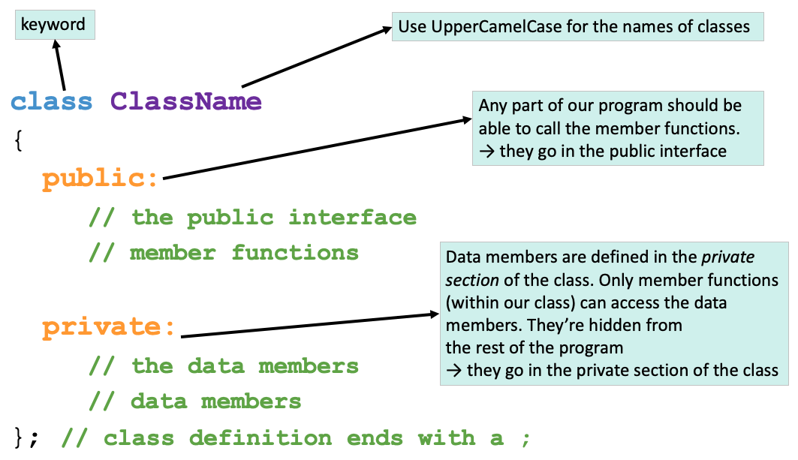
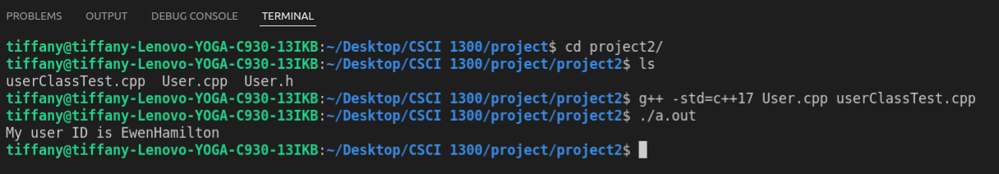
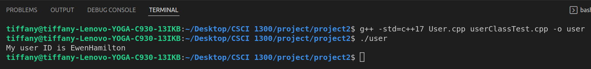
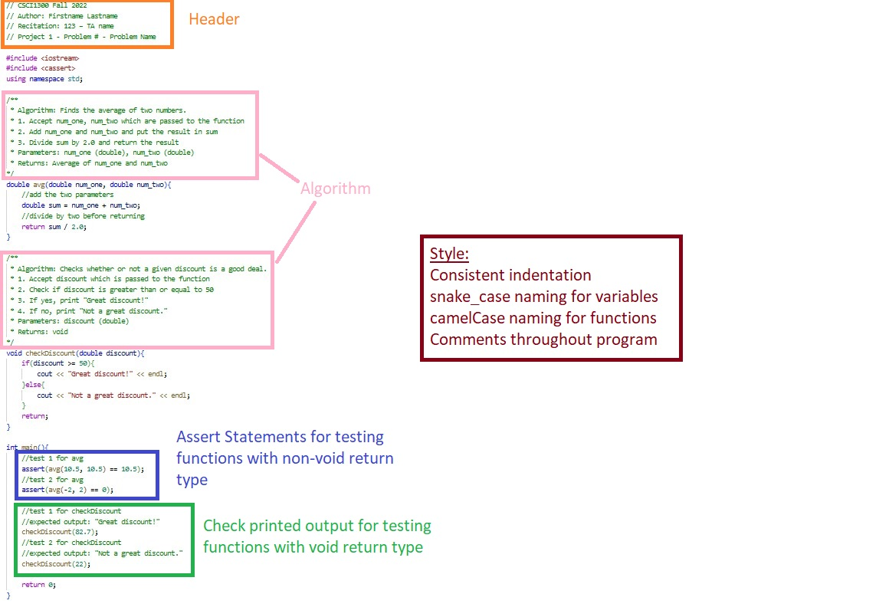
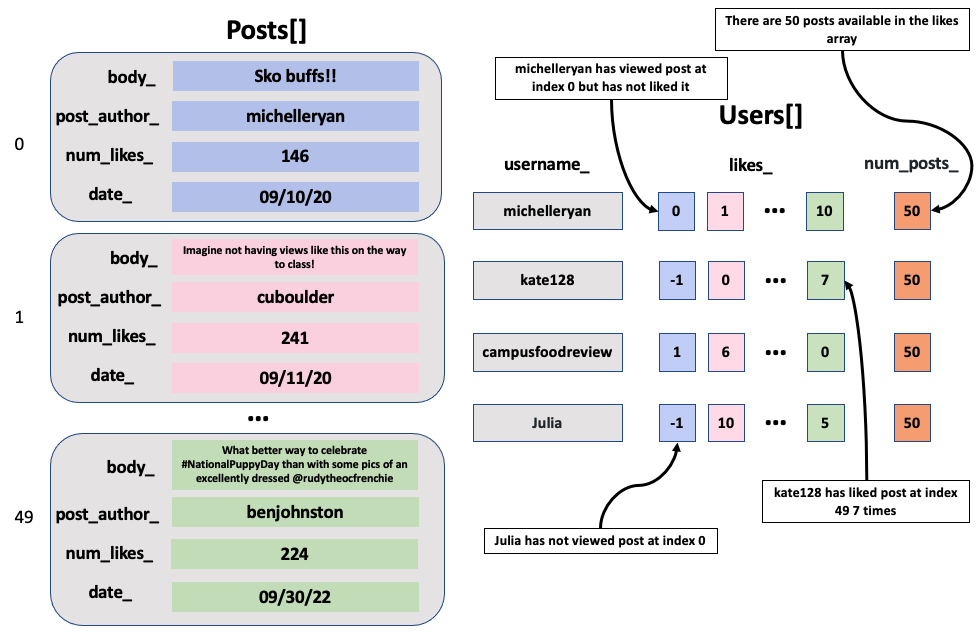

#### **CSCI 1300 CS1: Starting Computing: Project 2 part 1**
#### **Godley/Hoefer - Spring 2023**
#### **Due: Tuesday, Mar 21th, by 6:00pm MST**

# Table of contents
1. [Project Summary](#summary)
2. [Objectives](#objectives)
3. [Background](#background)
    1. [Classes](#classes)
       1. [Anatomy of a class](#anatomy)
          1. [Class Name](#className)
          2. [Access Specifiers](#accessSpecifiers)
          3. [Data Members and Member Functions](#dataMembers)
          4. [Accessing Data Members](#accessingDataMembers)
          5. [Defining Member Functions](#definingMemberFuncs)
       2. [Header and Source Files](#headerAndSourceFiles)
          1. [Header File](#headerFiles)
          2. [Source File](#sourceFiles)
          3. [How to compile multiple .cpp and .h files](#howToCompile)
4. [Submission Instructions](#submissions)
    1. [Test Cases Instructions](#tests)
        1. [Void functions](#void)
        2. [Functions that return a bool or int](#bool-int)
        3. [Functions that return a double](#double)
        4. [Functions manipulating arrays](#test-function-array)
        5. [Testing class objects](#test-objects)
5. [Questions](#questions)
    1. [Question 1](#question1)
    2. [Question 2](#question2)
    3. [Question 3](#question3)
    4. [Question 4](#question4)
    5. [Question 5](#question5)
    6. [Question 6](#question6)
    7. [Question 7](#question7)
    8. [Question 8](#question8)
6. [Overview](#overview)
    1. [Checklist](#checklist)
    2. [Grading Rubric](#grading)

# Project Summary <a name="summary"></a>
In Project 2, we will be creating an app called **BuffChat** to allow users to like posts. Based on comprehensive market research, we've determined that most social/chatting apps like Twitter, Snapchat, and WhatsApp are going out of style; customers now want a more nostalgic experience where they can only like individual posts with more restrictions than modern chatting apps. Who knows, if **BuffChat** is a success, we could even expand to have a real company!

Project 2 Part 1 (this part) will be focused on creating `Post` and `User` classes and related functions for reading and manipulating their associated data. Project 2 Part 2 will use the building blocks from Part 1 to build the overall **BuffChat** app.

# Objectives <a name="objectives"></a>
* Use filestream objects to read data from text files
* Create objects and arrays of objects
* Using array operations on objects

# Background <a name="background"></a>

## Classes <a name="classes"></a>
When writing complex programs, sometimes the built-in data types (such as `int`, `char`, `string`)
don’t offer developers enough functionality or flexibility to solve their problems.
A solution is for the developer (you - yes, you!) to create your own custom data types to use, called classes.
Classes are user-defined data types, which hold their own data members and member functions, which can be accessed and used by creating an instance of that class.
A class is like a blueprint for an object, customized for whatever particular problem the programmer is working on.

String, for example, is a class in C++ which holds data (the characters comprising the string) and supports useful member functions like `substr` which operate on this data.

Below is an example of the basic definition of a class in C++.



Let’s break down the main components of this diagram:

### Anatomy of a Class <a name="anatomy"></a>

#### Class Name <a name="className"></a>
A class is defined in C++ using the keyword `class` followed by the name of the class.
The body of the class is defined inside the curly brackets and terminated by a semicolon at the end.
This class name will be how you reference any _variables_ or _objects_ you create of that type.
For example:
`ClassName objectName;`

The above line would create a new **object** (variable) with name `objectName` and of type `ClassName`,
and this object would have all the properties that you have defined within the class ClassName.

#### Access Specifiers <a name="accessSpecifiers"></a>
Access specifiers in a class are used to set the accessibility of the class members.
That is, they restrict access by outside functions to the class members.

Consider the following analogy:

Imagine an intelligence agency like the CIA, that has 10 senior members.
Such an organization holds various sorts of information, and needs some way of determining who has access to any given piece of information.
Some information concerning classified or dangerous operations may only be accessible to the 10 senior members of the agency, and not directly accessible by any other person.
This data would be **private**.

In a class, like in our intelligence agency, these **private** data members are only accessible by a class's member functions and not directly accessible by any object or function outside the class.

Some other information may be available to anyone who wants to know about it.
This is **public** data.
Even people outside the CIA can know about it, and the agency might release this information through press releases or other means.
In terms of our class, this **public** data can be accessed by any member function of the class, as well as outside functions and objects, even other classes. The public members of a class can be accessed from anywhere in the program using the direct member access operator (**.**) with the object of that class.

#### Data Members and Member Functions <a name="dataMembers"></a>
Data members are the data variables and member functions are the functions used to manipulate these variables; together, data members and member functions define the properties and behavior of the objects in a Class.

The data members declared in any class definition can be fundamental data types (like `int`, `char`, `float`, etc.), arrays, or even other classes.

For example, for string objects, the data member is a `char array[]` that holds all of the individual letters of your string.
Some of a string’s member functions that we have used already are functions like `.substr()` and `.length()`.

#### Accessing Data Members <a name="accessingDataMembers"></a>
Keeping with our intelligence agency example, the code below defines a class that holds information for any general agency.
In the `main` function, we then create a new `IntelligenceAgency` object called `CIA`, and we set its `organization_name` to “CIA” by using the access operator (.) and the corresponding data member’s name.
However, we cannot access the `classified_intelligence` data member in the same way.
Not everyone has access to that private data.

Instead, we need to use a member function of the IntelligenceAgency class, `getClassifiedIntelligence()`, in order to see that information.
This allows us to control the release of private information by our IntelligenceAgency.

Additionally, the main function includes four different ways of creating objects with descriptions in the comments next to it.

```c++
class IntelligenceAgency
{
    public:
        IntelligenceAgency();         // Default constructor
        IntelligenceAgency(string classified_intelligence_input); // Parameterized constructor  
        string organization_name;
        string getClassifiedIntelligence();
        void setClassifiedIntelligence(string classified_intelligence_input);

    private:
        string classified_intelligence;
};

int main()
{
    IntelligenceAgency CIA;
    CIA.organization_name = "CIA";
    cout << CIA.classified_intelligence; // gives an error
    cout << CIA.getClassifiedIntelligence();

    // four types of constructor calls
    IntelligenceAgency abc; // creating an IntelligenceAgency object with the default constructor
    IntelligenceAgency xyz = IntelligenceAgency(); // creating an IntelligenceAgency object with the default constructor
    IntelligenceAgency pqr("PQR"); // creating an IntelligenceAgency object with a paramaterized constructor
    IntelligenceAgency rst = IntelligenceAgency("RST"); // creating an IntelligenceAgency object with a paramaterized constructor
}

```

#### Defining Member Functions <a name="definingMemberFuncs"></a>
You may have noticed that we declared various member functions in our class definition,
but we did not specify how they will work when called.
The body of the function still needs to be written.
The solution is to define a function, such as `getClassifiedIntelligence()`, corresponding to our class’s functions.
But how does our program know that these functions are the same as the ones we declared in our class?
You as the developer need to explicitly tell the computer that these functions you are defining are the same ones you declared earlier.

```c++
string IntelligenceAgency::getClassifiedIntelligence()
{
    return classified_intelligence;
}
void IntelligenceAgency::setClassifiedIntelligence(string classified_intelligence_input)
{
    classified_intelligence = classified_intelligence_input;
}
```

We start the definition as we do any function, with the return type.
Then, we have to add a specifier `IntelligenceAgency::` that lets our program know that this function and the one we declared inside the class are the same.
We can see that this function returns the class’ `classified_intelligence` to the user.

Functions like `getClassifiedIntelligence()` are called **accessor/getter functions**.
This is because they retrieve or ‘get’ the private data members of a class object and return it to the program so that these values may be used elsewhere.

The second function, `setClassifiedIntelligence(string classified_intelligence_input)`, is called a **mutator/setter function**.
These allow functions from other parts of our program to modify or ‘set’ the private data members of our class objects.
Getters and setters are the functions that our program uses to interact with the private data members of our class objects.

### Header and Source Files <a name="headerAndSourceFiles"></a>
Creating our own classes with various data members and functions increases the complexity of our program.
Putting all of the code for our classes as well as the main functionality of our program into one .cpp file can become confusing for you as a programmer, and we need ways of reducing the visual clutter that this creates.
This is why, as we increase the complexity of a program,
we might need to create multiple files: header and source files, which capture the *definition* and *implementation* of the class, respectively.

#### Header file <a name="headerFiles"></a>
Header files have `.h` as their filename extensions.
In a header file, we declare one or more of the complex structures (classes) we want to develop.
In a class, we define member functions and member attributes. These functions and attributes are the building blocks of the class.

**Example file 0:** ClassName.h
```c++
#include <iostream>
using namespace std;
class ClassName
{
    public:
    .
    .
    .
    private:
    .
    .
    .
};

```

**Example file 1:** IntelligenceAgency.h
```c++
#include <iostream>
using namespace std;
class IntelligenceAgency
{
    public:
        IntelligenceAgency();         // Default constructor
        IntelligenceAgency(string classified_intelligence_input); // Parameterized constructor  
        string organization_name;
        string getClassifiedIntelligence(){return classified_intelligence};
        void setClassifiedIntelligence(string classified_intelligence_input){classified_intelligence=classified_intelligence_input};

    private:
        string classified_intelligence;
};
```

#### Source file <a name="sourceFiles"></a>
Source files are recognizable by the `.cpp` extension.
In a source file, we implement the class defined in the header file.
Since we are splitting the development of actual code for the class into a definition (header file) and an implementation (source file),
we need to link the two somehow.

```c++
//IntelligenceAgency Example
#include "IntelligenceAgency.h"
```
OR
```c++
//General Example
#include "ClassName.h"
```
In the source file, we will include the header file that defines the class so that the source file is “aware” of where we can retrieve the definition of the class.
We must define the class definition in every source that wants to use our user defined data type (our class).
When implementing each member function, our source files must tell the compiler that these functions are actually the methods defined in our class definition using the syntax that we showed earlier.

#### How to compile multiple .cpp and .h files <a name="howToCompile"></a>
In this project, it will be necessary to write multiple files (.h and .cpp) and test them before submitting them.
You need to compile and execute your code using the command line.
Make sure that you start by changing directories so that you are in the folder where your solution’s files are stored.
In this example, our folder will be called `project2`. To change to this directory, use:

```
cd project2/
```

**When compiling from the command line, you need to specify every .cpp file in your project.**
This means that when you call the g++ compiler, you need to explicitly name the files you’re compiling:

```
g++ -std=c++17 file1.cpp file2.cpp main.cpp
```

The compiling command results in the creation of an executable file. **Note that header files (`.h`) are NOT included in compilation commands.**
If you did not specify a name for this executable, it will be named `a.out` by default.
To execute this file, use the command:

```
./a.out
```

You can add the `-o` flag to your compiling command to give the output file a name:

```
g++ -o myName.out -std=c++17 file1.cpp file2.cpp main.cpp
```

And then run the file with
```
./myName.out
```

**Example 1**

Compiling `User.cpp` and `userClassTest.cpp`.


**Example 2**

Here, we have named the executable `user` rather than use the default `a.out` name



# Submission Instructions <a name="submissions"></a>

* **CodeRunner**. Your programs will be graded in part by CodeRunner. You can modify your code and re-submit (press Check again) as many times as you need up until the assignment due date.
* **C++ files**. When you are finished with all the questions, zip all of your .cpp and .h files together. Submit the single zip file under the assignment **"Project 2 Part 1"** on Canvas.
   * All files should be named as specified in each question, and they should compile and run on Coderunner (pass all test cases) and in VSCode to earn full points.
   * Our TAs will be grading the style of your code and comments. Please see the style guide on Canvas for more details.
   * At the top of each file, write your name in the format shown below.
   * Your C++ program for each question should also contain a main that tests the function you wrote, like below. **You should be sure to include as many test cases as you believe are necessary to ensure that your code works properly.** Deciding on how many test cases to include is an important skill to learn, since the number of necessary test cases can change between programs. Ensure that you'll be able to explain why you believe each main function contains an adequate number of tests.
     * Refer to the [Test Cases](#tests) section for more details.
   * Please be sure to also include function headers (function comments) that contain the algorithm implemented within the function, expressed in pseudocode. You can refer to the example below for more details.

**Style Example:**




<span style="font-size:20px">**YOU ARE NOT ALLOWED TO USE ANY OF THE FOLLOWING. USAGE OF THE FOLLOWING LIST WILL RESULT IN A 0 ON THE PROJECT.**</span>

* Stringstream objects
* Vectors
* Global Variables
* Pointers
* References


### Test Cases Instructions <a name="tests"></a>

Every C++ program you write should include a main function that tests the code you wrote.
There will be 5 different types of test cases you should be expected to write depending on the return type of the function.
Listed below is how we expect you to test different types of functions. The process will be different for
if you are testing a `void` function, non-void functions that return an `int` or `bool`, and non-void functions
that return a `double`.

#### 1. Void Functions with printed output <a name="void"></a>

For **void** functions that have printed output (i.e. functions that use `cout` to print to the terminal), call the testing function in the main function. Your tests should include the expected output in comments.

See the sample code below:
```c++
void checkDiscount(double discount)
{
    if (discount >= 50) {
        cout << "Great discount!" << endl;
    } else {
        cout << "Not a great discount." << endl;
    }
    return;
}

int main()
{
    // test 1 for checkDiscount
    // expected output: "Great discount!"
    checkDiscount(82.7);

    // test 2 for checkDiscount
    // expected output: "Not a great discount."
    checkDiscount(22);

    return 0;
}
```
_* For the purpose of this test code snippet, algorithm comments were not included, but they are still expected in your C++ files._


<br>


#### 2. Functions returning bool or int <a name="bool-int"></a>

For **non-void** functions that return a **bool or int**, use an **assert statement**
from the **cassert** header (`#include <cassert>`) with a conditional expression.

Assert tests contain a conditional expression which will be true unless there is a bug in the program.
If the conditional expression evaluates to false, then your program will terminate and show an error message.

For the purpose of this project, functions that return a `bool` or `int` can be compared to a specific value using the equality operator `==`.

Your test will look something like this:

`assert(<function call> == <value to compare to>);`

* `<function call>` is where you will call the function you want to test with its function parameters.
* `<value to compare to>` is the value you expect the function to return.
* `==` is the equality operator, and it compares the equality of both sides of itself.

See the sample code below:
```c++
#include <iostream>
#include <cassert>
using namespace std;
int add_(int num1, int num2)
{
    // add num1 and num2 before returning
    return num1 + num2;
}
// isDrivingAge returns true if the given age passed as a parameter is greater than 16,
// else it returns false.
bool isDrivingAge(int age)
{
    if (age >= 16)
    {
        return true;
    }
    else
    {
        return false;
    }
}
int main()
{
    // test 1 for add_
    assert(add_(5, 6) == 11);
    // test 2 for add_
    assert(add_(10, 10) == 20);
    // test 3 for drivingAge
    assert(isDrivingAge(17) == true);
    // test 4 for drivingAge
    assert(isDrivingAge(14) == false);
}
```
_* For the purpose of this test code snippet, algorithm comments were not included, but they are still expected in your C++ files._

<br>


#### 3. Functions returning double <a name="double"></a>

For **non-void** functions that return a **double**, use an **assert statement**
from the **cassert** header (`#include <cassert>`) with a conditional expression and include the following function in your program.
```c++
/**
 * doublesEqual will test if two doubles are equal to each other within two decimal places.
 */
bool doublesEqual(double a, double b, const double epsilon = 1e-2)
{
    double c = a - b;
    return c < epsilon && -c < epsilon;
}
```
Because the `double` type holds so much precision, it will be hard to compare the equality of a function that returns a
double with another double value. To overcome this challenge, we can compare `double` values within a certain range
of precision or decimal places. The function above compares the equality of two values `a` and `b` up to two decimal places.
This function returns `true` if the values `a` and `b` are equal with each other up to two decimal places.

You will be expected to use this function in conjunction with `assert` statements to test functions that return
the type double.

Your test will look something like this:

`assert(doublesEqual(<function call>, <value to compare to>));`

* `<function call>` is where you will call the function you want to test with its function parameters
* `<value to compare to>` is the `double` value you expect the function to return.


See the sample code below:
```c++
#include <iostream>
#include <cassert>
using namespace std;
/**
 * doublesEqual will test if two doubles are equal to each other within two decimal places.
 */
bool doublesEqual(double a, double b, const double epsilon = 1e-2)
{
    double c = a - b;
    return c < epsilon && -c < epsilon;
}
/**
 * reciprocal returns the value of 1 divided by the number passed into the function.
 */
double reciprocal(int num)
{
    return 1.0 / num;
}
int main()
{
    // test 1 for reciprocal
    assert(doublesEqual(reciprocal(6), 0.16));
    // test 2 for reciprocal
    assert(doublesEqual(reciprocal(12), 0.083));
}
```
For test 1, `reciprocal(6)` is being called, and we expect the function to return the value `0.16`.
The return value of `reciprocal(6)` and `0.16` is passed in as parameters to the `doublesEqual` function,
which will then return `true` if these two values are equal or `false` if they are not.

_* For the purpose of this test code snippet, algorithm comments were not included, but they are still expected in your C++ files._

<br>

#### 4. Functions manipulating arrays <a name="test-function-array"></a>

Functions which manipulate arrays passed as arguments can be tested by asserting on individual elements of the array after calling the function. This works even for `void` functions because arrays are passed by reference; even if the function doesn't return anything, the array in the function is the same array in memory as the one outside the scope of your function.

Note that if the array is an array of `float` or `double`, the `doublesEqual` function described [here](#non-void-double) should be used to assert on individual array elements.

See the sample code below:
```cpp
#include<iostream>
#include<cassert>
using namespace std;

/**
 * Add one to each element of the array.
 */
void addOneToArrayElements(int arr[], int size)
{
    for (int i = 0; i < size; i++)
    {
        arr[i] = arr[i] + 1;
    }
}

/**
 * doublesEqual will test if two doubles are equal to each other within two decimal places.
 */
bool doublesEqual(double a, double b, const double epsilon = 1e-2)
{
    double c = a - b;
    return c < epsilon && -c < epsilon;
}

/**
 * Add one to each element of the array.
 */
void addOneToArrayElementsDouble(double arr[], int size)
{
    for (int i = 0; i < size; i++)
    {
        arr[i] = arr[i] + 1.0;
    }
}

int main()
{
    // test 1 for addOneToArrayElements
    int test1Arr[3] = {1, 2, 3};
    addOneToArrayElements(test1Arr, 3);
    assert(test1Arr[0] == 2);
    assert(test1Arr[1] == 3);
    assert(test1Arr[2] == 4);

    // test 2 for addOneToArrayElements
    int test2Arr[3] = {8, 10};
    addOneToArrayElements(test2Arr, 2);
    assert(test2Arr[0] == 9);
    assert(test2Arr[1] == 11);

    // test 1 for addOneToArrayElementsDouble
    double test3Arr[4] = {1.5, 4.6, 9.7, 16.8};
    addOneToArrayElementsDouble(testArr3, 4);
    assert(doublesEqual(testArr3[0], 2.5));
    assert(doublesEqual(testArr3[1], 5.6));
    assert(doublesEqual(testArr3[2], 10.7));
    assert(doublesEqual(testArr3[3], 17.8));
}
```


_* For the purpose of this test code snippet, algorithm comments were not included, but they are still expected in your C++ files._

<br>

#### 5. Testing class objects <a name="test-objects"></a>
When creating an instance of a class, or an object, the attributes of that object can be tested
by asserting on the individual attributes or data members.

Note that if the data attribute is a float or double, the doublesEqual function described [here](#double)
should be used to assert on the value.

Additionally, note that if the data attribute is an array, follow the ["Functions manipulating arrays" section](#test-function-array)
on how to assert on individual array elements.

See the sample code below:
```c++
class Animal
{
private:
    string sound;
    string name;
    int age;

public:
    Animal();
    Animal(string, string, int);

    string getSound();
    string getName();
    int getAge();
};

Animal::Animal()
{
    sound = "";
    name = "";
    age = 0;
}

Animal::Animal(string sound_, string name_, int age_)
{
    sound = sound_;
    name = name_;
    age = age_;
}

string Animal::getSound()
{
    return sound;
}

string Animal::getName()
{
    return name;
}

int Animal::getAge()
{
    return age;
}

int main()
{
    Animal defaultDog;
    assert(defaultDog.getSound() == "");
    assert(defaultDog.getAge() == 0);
    assert(defaultDog.getName() == "");

    Animal actualDog("Bark bark!", "Pluto", 2);
    assert(actualDog.getSound() == "Bark bark!");
    assert(actualDog.getAge() == 2);
    assert(actualDog.getName() == "Pluto");
}
```
_* For the purpose of this test code snippet, algorithm comments were not included, but they are still expected in your C++ files._


# Questions <a name="questions"></a>

## Question 1 (3.33 points): Post Class <a name="question1"></a>
Create a **Post** class, with separate interface (**Post.h**) and implementation (**Post.cpp**) files,
comprised of the following attributes:

**Data Members (private)**

| Data Members          | Description                                             |
|-----------------------|---------------------------------------------------------|
| string: `body_`        | The main body (content) of the post|
| string: `post_author_`    | Author of the post |
| int: `num_likes_`       | Number of likes the post has received.|
| string: `date_`         | Date the post was made, in `mm/dd/yy` format|

**Member Functions (public)**

| Member Functions          | Description                                                            |
|---------------------------|------------------------------------------------------------------------|
| Default: constructor       | Sets `body_`, `post_author_`, `date_` to empty string and `num_likes_` to 0 |
| Parameterized: constructor | Takes a string for `body_`, string for `post_author_`, int for `num_likes_`, and string for `date_` (in this order) for initializing the data members of a `Post` object|
| string: `getPostBody()`    | Returns the `body_` of the post|
| void `setPostBody(string post_body)`| Sets new `body_` for the post |   
| string: `getPostAuthor()`| Returns the `post_author_` of the post|
| void: `setPostAuthor(string author)`    | Sets the new `post_author_` for the post|  
| int: `getPostLikes()`| Returns `num_likes_` that the post has received|
| void `setPostLikes(int likes)`| Sets `num_likes_` data member to `likes` if `likes` is a positive integer or 0. |
| string: `getPostDate()`|Returns the `date_` of the post|
| void `setPostDate(string post_date)`| Sets new `date_` for the post |

The zip submission should have three files for this problem:
* `Post.h`
* `Post.cpp`
* A driver file called `postDriver.cpp`, with a main() function to test your member functions.
  * In your main() function, the test cases should include the creation of class objects with both the default and parameterized constructors. You must also test each of the getter and setter member functions by creating and manipulating class objects and using assert tests to verify that things are working properly. You will only have one main function which is in this driver file. Here is an example of calling some Post member functions in your main method in your postDriver.cpp file.

```c++
int main()
{
    Post my_post_1 = Post(); // default constructor
    cout << "Post author " << my_post_1.getPostAuthor() << endl;
    cout << "Post body " << my_post_1.getPostBody() << endl;
    cout << "Post date " << my_post_1.getPostDate() << endl;
    cout << "Post likes " << my_post_1.getPostLikes() << endl;

    Post my_post_2 = Post("new post","Raegan", 10, "10/02/22"); // parameterized constructor
    cout << "Post author " << my_post_2.getPostAuthor() << endl;
    cout << "Post body " << my_post_2.getPostBody() << endl;
    cout << "Post date " << my_post_2.getPostDate() << endl;
    cout << "Post likes " << my_post_2.getPostLikes() << endl;

    return 0;
}
```
For Coderunner, paste your **Post** class and its implementation (the contents of **Post.h** and **Post.cpp**). Do not include the main() function in Coderunner.

## Question 2 (4 points): readPosts <a name="question2"></a>
The `readPosts` function will fill an array of **Post** objects. Note this is a standalone function rather than a class member function.

This function should:
* Have four parameters in this order:
  * `string` **file_name**: the name of the file to be read.
  * `Post` **posts[]**: array of `Post` objects.
  * `int` **num_posts_stored**: the number of posts currently stored in the array. You should assume this is the correct number of actual elements in the array.
  * `int` **posts_arr_size**: capacity of the `posts` array. The default value for this is 50.
* Use `ifstream` and `getline` to read data from the file, creating a new `Post` object for each line, and placing the object into the posts array.  
* Empty lines should not be added to the array. Assume that Post content can have spaces in them.
* **Hint**: You can use the `split()` function from Homework 5 and the `readPosts()` function from Homework 6.
* The function behavior should match the following scenarios:
  * If `num_posts_stored` is equal to `posts_arr_size`, return -2.
  * If the file is not opened successfully, return -1.
    * The priority of the return code -2 is higher than -1, i.e., in cases when `num_posts_stored` is equal to `posts_arr_size` and the file cannot be opened, the function should return -2.
  * While `num_posts_stored` is smaller than `posts_arr_size`, keep the existing elements in the `posts` array, then read data from the file and add (append) the data to the array. The number of posts stored in the array cannot exceed the size of the array.
  * Returns the total number of posts in the system, as an integer.

The `posts.txt` may, for example, look as follows:
```
Sko buffs!!|michelleryan|100|09/10/20
Imagine not having views like this on the way to class!|cuboulder|28|09/11/20

Psst… calling all Buffs again. We missed you over spring break! CU on campus again soon|caseymac|29|10/10/18
What better way to celebrate #NationalPuppyDay than with some pics of an excellently dressed @rudytheocfrenchie|benjohnston|12|09/30/22
```
Download the text file [here](data_files/posts.txt). Note that each line in the file consists of the post content followed by user_name, number of likes that the post has received and the date(MM/DD/YY)


*Example 1*: The `posts` array is initially empty, so for this example `num_posts_stored` is zero to start with.
<table>
<tr>
</tr>
<tr>
    <td> posts.txt </td>
    <td>

    Test body|user1|10|10/10/20
    Test body 1|user2|2|02/11/19
    Test body 2|user3|30|01/04/21

</tr>
<tr>
    <td> Function Call </td>
    <td>

```cpp
Post posts[10];
readPosts("posts_test.txt", posts, 0, 10);

```
</tr>
<tr>
    <td> Return Value </td>
    <td>3</td>
</tr>
<tr>
    <td>

Accessing the data member `post_author_`

</td>
    <td>

```c++
// Code to print the values
cout << posts[0].getPostAuthor() << endl;
cout << posts[1].getPostAuthor() << endl;
cout << posts[2].getPostAuthor() << endl;

// Expected Output
user1
user2
user3
```
</tr>
<tr>
    <td>

Accessing the data member `date_`

</td>
    <td>

```c++
// Code to print the values  
cout << posts[0].getPostDate() << endl;
cout << posts[1].getPostDate() << endl;
cout << posts[2].getPostDate() << endl;

// Expected Output
10/10/20
02/11/19
01/04/21
```
</tr>
</table>

*Example 2*: Suppose there’s already one post in the `posts` array, so `num_posts_stored` is one.
Since there is room for 9 more posts, all the data read from the new file will be added to the array.
<table>
<tr>
</tr>
<tr>
    <td>posts_test2.txt </td>
    <td>

    Test body again|user10|20|11/10/21
    More text|user11|3|05/12/20
    Hello!|user12|39|01/04/19


</tr>
<tr>
    <td> Function Call </td>
    <td>

```cpp
Post posts[10];
Post my_post_1 = Post("new post","Xuefei", 10, "10/02/22");   
posts[0] = my_post_1;
readPosts("posts_test2.txt",posts,1,10);
```

</tr>
<tr>
    <td> Return Value </td>
    <td>4</td>
</tr>
<tr>
    <td>

Accessing the data member `post_author_`

</td>
    <td>

```c++
// Code to print the values
cout << posts[0].getPostAuthor() << endl;
cout << posts[1].getPostAuthor() << endl;
cout << posts[2].getPostAuthor() << endl;
cout << posts[3].getPostAuthor() << endl;

// Expected Output
Xuefei
user10
user11
user12
```
</tr>
<tr>
    <td>

Accessing the data member `date_`

</td>
    <td>

```c++
// Code to print the values  
cout << posts[0].getPostDate() << endl;
cout << posts[1].getPostDate() << endl;
cout << posts[2].getPostDate() << endl;
cout << posts[3].getPostDate() << endl;

// Expected Output
10/02/22
11/10/21
05/12/20
01/04/19
```
</tr>
</table>

*Example 3*: Suppose there’s already one post in the `posts` array, so `num_posts_stored` is one.
However, the array size is only three, so only the first two lines of the new file are stored.
<table>
<tr>
</tr>
<tr>
    <td>posts_test2.txt </td>
    <td>

    Test body again|user10|20|11/10/21
    More text|user11|3|05/12/20
    Hello!|user12|39|01/04/19


</tr>
<tr>
    <td> Function Call </td>
    <td>

```cpp
Post posts[3];
Post my_post_1 = Post("new post","Xuefei", 10, "10/02/22");
posts[0] = my_post_1;
readPosts("posts_test2.txt",posts,1,3);
```

</tr>
<tr>
    <td> Return Value </td>
    <td>3</td>
</tr>
<tr>
    <td>

Accessing the data member `post_author_`

</td>
    <td>

```c++
// Code to print the values
cout << posts[0].getPostAuthor() << endl;
cout << posts[1].getPostAuthor() << endl;
cout << posts[2].getPostAuthor() << endl;

// Expected Output
Xuefei
user10
user11
```
</tr>
<tr>
    <td>

Accessing the data member `date_`

</td>
    <td>

```c++
// Code to print the values  
cout << posts[0].getPostDate() << endl;
cout << posts[1].getPostDate() << endl;
cout << posts[2].getPostDate() << endl;

// Expected Output
10/02/22
11/10/21
05/12/20
```
</tr>
</table>

*Example 4*: `num_posts_stored` equals `posts_arr_size`, meaning the `posts` array is already full.
<table>
<tr>
</tr>
<tr>
    <td>posts_test2.txt </td>
    <td>

    Test body again|user10|20|11/10/21
    More text|user11|3|05/12/20
    Hello!|user12|39|01/04/19


</tr>
<tr>
    <td> Function Call </td>
    <td>

```cpp
Post posts[2];
Post my_post_1 = Post("new post","Xuefei", 10, "10/02/22");
posts[0] = my_post_1;
Post my_post_2 = Post("Hello!","Morgan", 9, "10/04/22");
posts[1] = my_post_2;
readPosts("posts_test2.txt",posts,2,2);
```

</tr>
<tr>
    <td> Return Value </td>
    <td>-2</td>
</tr>
<tr>
    <td>

Accessing the data member `post_author_`

</td>
    <td>

```c++
// Code to print the values
cout << posts[0].getPostAuthor() << endl;
cout << posts[1].getPostAuthor() << endl;

// Expected Output
Xuefei
Morgan
```
</tr>
<tr>
    <td>

Accessing the data member `date_`

</td>
    <td>

```c++
// Code to print the values  
cout << posts[0].getPostDate() << endl;
cout << posts[1].getPostDate() << endl;

// Expected Output
10/02/22
10/03/22
```
</tr>
</table>

*Example 5*: The data file does not exist

<table>
<tr>
</tr>
<tr>
    <td>posts_test.txt </td>
    <td>

    Test body|user1|10|10/10/20
    Test body 1|user2|2|02/11/19
    Test body 2|user3|30|01/04/21

</tr>
<tr>
    <td> Function Call </td>
    <td>

```cpp
Post posts[50];
readPosts("nonexistentfile.txt", posts, 0, 50);
```


</tr>
<tr>
    <td> Return Value </td>
    <td>-1</td>
</tr>
</table>


*Example 6*: Empty line included in the file
<table>
<tr>
</tr>
<tr>
    <td>posts_test3.txt </td>
    <td>

    Test body again|user10|20|11/10/20


    More text|user11|3|05/12/20

    Hello!|user12|39|01/04/19


</tr>
<tr>
    <td> Function Call </td>
    <td>

```cpp
Post posts[50];
readPosts("posts_test3.txt",posts,0,50);
```

</tr>
<tr>
    <td> Return Value </td>
    <td>3</td>
</tr>
</table>

The zip submission should have three files for this problem:
* `Post.h`
* `Post.cpp`
* A driver file called `readPostsDriver.cpp`, with a main() function and any helper functions that your program needs to test your member functions and `readPosts` function.
  * In your main() function, the test cases should include the creation of an array of class objects that is passed into the readPosts function as a parameter.
  * You must test the various values that readPosts can return using assert tests.
    * Some conditions in the list below are examples of things you can test. You can refer back to the examples for different things to test.
      * Verify the total number of posts that readPosts returns.
      * Test that readPosts returns -1 when given a text file string that does not exist.
      * Test that the individual Post objects in the array are storing attributes that are read in from a text file.

For Coderunner, paste your **Post** class and its implementation (the contents of **Post.h** and **Post.cpp**), along with your `readPosts` function  into the answer box for question 2. Do not include the main() function in Coderunner.


## Question 3 (2 points): printPostsByYear <a name="question3"></a>
The `printPostsByYear` function will print all posts in the given array of posts that were posted during a given `year`. Note this is a standalone function rather than a class member function.

This function specification looks like this:
* Have 3 parameters in this order:
  * `Post` **posts**[]: array of Post objects.
  * `string` **year**: string in format "YY" indicating the year a post was made.
  * `int` **num_posts_stored**: the number of posts currently stored in the array.
* The function should match the following behavior:
  * If the number of posts stored in the array is 0 (or less than 0), print `"No posts are stored"`
  * If there are one or more posts matching the given year, print `"Here is a list of posts for year <year input>` followed by each post's content on a new line
  * If there is no post matching the given year, print `"No posts stored for year <year>"`
* You do not need to sort posts by year, and all you need to do is check the year for each post and determine whether it is a match.
* The function should not return anything (i.e. the function is **void**)
* To develop and test in VSCode, use the `readPosts()` function to populate the `posts[]` array before calling the above function.

*Example 1*: There are two posts that are posted in year 22.

<table>
<tr>
</tr>
<tr>
    <td> Function Call </td>
    <td>

```cpp
// two posts that are posted in year 22.
Post p_1 = Post("new post1","Lisa1", 10, "10/02/22");
Post p_2 = Post("new post2","Lisa2", 11, "10/02/22");
Post p_3 = Post("new post3","Lisa3", 8, "10/02/19");

Post list_of_posts[] = {p_1, p_2, p_3};
int number_of_posts = 3;
string year = "22";
printPostsByYear(list_of_posts, year, number_of_posts);
```

</tr>
<tr>
    <td> Expected output

</td>
<td>

```
Here is a list of posts for year 22
new post1
new post2
```
</tr>
</table>

*Example 2*: Posts array is empty and `number_of_posts` is 0.

<table>
<tr>
</tr>
<tr>
    <td> Function Call </td>
    <td>

```cpp
// no posts stored with numberOfPosts 0
Post list_of_posts[] = {};
int number_of_posts = 0;
string year = "20";
printPostsByYear(list_of_posts, year, number_of_posts);
```

</tr>
<tr>
    <td> Expected output

</td>
<td>

```
No posts are stored
```
</tr>
</table>

*Example 3*: There are no posts posted in 21.

<table>
<tr>
</tr>
<tr>
    <td> Function Call </td>
    <td>

```cpp
//no posts posted in year 21
Post p_1 = Post("new post1","Lisa1", 10, "10/02/22");
Post p_2 = Post("new post2","Lisa2", 11, "10/02/22");
Post p_3 = Post("new post3","Lisa3", 17, "10/02/22");
Post list_of_posts[] = {p_1, p_2, p_3};
int number_of_posts = 3;
string year = "21";
printPostsByYear(list_of_posts, year, number_of_posts);
```

</tr>
<tr>
    <td> Expected output

</td>
<td>

```
No posts stored for year 21
```
</tr>
</table>

The zip submission should have three files for this problem:
* `Post.h`
* `Post.cpp`
* A driver called `printPostsByYear.cpp`, with a main() function and any helper functions that your program needs to test your member functions and `printPostsByYear` function.
  * In your main() function, the test cases should include the creation of an array of class objects that is passed into the printPostsByYear function as a parameter.
  * Because this is a void function, call the printPostsByYear function with the expected output in comments. Refer to the [Void Functions with printed output](#void) section on how to write test cases for this function.

For Coderunner, paste your Post class and its implementation (the contents of Post.h and Post.cpp), along with your `printPostsByYear` function. Do not include the main() function in Coderunner.

## Question 4 (4 points): User Class <a name="question4"></a>
Create a **User** class, with separate interface (**User.h**) and implementation (**User.cpp**), comprised of the following attributes:

**Data Members (private)**

| Data Members            | Description                                                 |
|-------------------------|-------------------------------------------------------------|
| string: `username_`    | A string value that uniquely identifies a user |
| int array: `likes_`      | This is an array containing the number of times a user has liked a post. Each user can like the same post a maximum of 10 times. An element of value of -1 indicates that the user has not viewed the post, a value of 0 indicates that the user has viewed the post bit not liked it and a value of 1 through 10 (inclusive) represents the number of likes.  The number of elements should be `size_`|
| int: `num_posts_` | The number of posts that are available to the user. This is not the `size_` of the array, but rather the number of elements that should be considered valid (i.e. values between -1 and 10)  |
| static const int: `size_` | The capacity of the `likes_` array (50). static constant       |

**Member Functions (public)**

| Member Functions           | Description                                                                                      |
|----------------------------|--------------------------------------------------------------------------------------------------|
| Default constructor        | Sets `username_` to an empty string, all elements of `likes_` to -1, and  `num_posts_` to 0 |
| Parameterized constructor  | Takes a string, an array of integers, and one integer for initializing `username_`, `likes_`, and `num_posts_` respectively. Assume the value passed into the constructor for `num_posts_` does not exceed the value of the data member `size_`<ul><li>If size of array passed into the constructor is less than `size_`, initialize all values from the array into `likes_` and initialize the remaining elements to -1.</li><li>If size of array passed into the constructor is equal to `size_`, initialize all values from the array into `likes_`</li><li>See example 2 below</li></ul>|
| string：`getUsername()`     | Returns `username_` data member as a string|
| void：`setUsername(string username)`| Assigns `username_` the value of the input string|
| int：`getLikesAt(int post_id)`| Returns the number of likes stored at the specified index (`post_id`). If `post_id` is larger than the size of the `likes_` array, or less than 0, returns -2  |
| bool：`setLikesAt(int post_id, int num_likes)`| Sets the number of likes to `num_likes` at the specified `post_id`, if `post_id` is within the valid bounds of the `likes_` array(`num_posts_`) and `num_likes` is between -1 and 10 (inclusive). Returns a boolean value, `true` if number of likes is successfully updated and `false` otherwise.|
| int：`getNumPosts()`      | Return `num_posts_` data member as an integer. |
| void：`setNumPosts(int posts)`| Sets `num_posts_` data member to `posts` if it is between 0 and `size_` |
| int: `getSize()`       | Returns `size_` as an integer                        |


The zip submission should have three files for this problem:
* `User.h`
* `User.cpp`
* A driver file called `userDriver.cpp`, with a main() function to test your member functions.
    * In your main() function, the test cases should include the creation of class objects with both the default and parameterized constructors. You must also test each of the getter and setter member functions by creating and manipulating class objects and using assert tests to verify that things are working properly.

*Example*: Default constructor

<table>
<tr>
</tr>
<tr>
    <td> Create object and test values though getter functions </td>
    <td>

```cpp
User u1 = User();
cout << u1.getUsername() << endl;
cout << u1.getNumPosts() << endl;
for(int i = 0; i < getSize(); i++)
{
     cout << u1.getLikesAt(i) << endl;
}

// Expected Output
0
-1
-1
-1
.
.
```
</tr>
</table>

*Example 2*: Parameterized constructor

<table>
<tr>
</tr>
<tr>
    <td> Parameterized constructor - likes array for 50 posts</td>
    <td>

```c++
int testLikes[] = {-1,1,-1,8,8,3,-1,5,10,2,6,-1,6,7,8,4,1,7,1,8,-1,7,8,7,7,4,4,9,10,5,5,5,-1,8,-1,2,9,8,-1,-1,2,0,7,4,10,5,8,3,0,6};
User u2 = User("bookworm43", testLikes, 50);

cout << u2.getUsername() << endl;
cout << u2.getNumPosts() << endl;

// test values in likes_array at random indices
cout << u2.getLikesAt(0) << endl;
cout << u2.getLikesAt(10) << endl;
cout << u2.getLikesAt(50) << endl;
// Expected Output
bookworm43
50
-1
6
-2
```

</tr>

<tr>
    <td> Parameterized constructor - likes array for 10 posts</td>
    <td>

```c++
int testLikes[] = {7,1,8,-1,10,5,5,5,-1,8};
User u3 = User("roboticscu", testLikes, 10);

cout << u3.getUsername() << endl;
cout << u3.getNumPosts() << endl;

// test values in likes_array at random indices
cout << u3.getLikesAt(0) << endl;
cout << u3.getLikesAt(10) << endl;
cout << u3.getLikesAt(50) << endl;
// Expected Output
roboticscu
10
7
-1
-2
```

</tr>
</table>

For Coderunner, paste your **User** class and its implementation (the contents of **User.h** and **User.cpp**). Do not include the main() function in Coderunner.

## Question 5 (4 points): readLikes <a name="question5"></a>
The `readLikes` function will fill an array of User objects and their likes for Posts. Each line in the file used to fill the array consists of a `username` followed by a sequence of likes; as such, each line corresponds to a single User object. Note this is a standalone function rather than a class member function.

This function should:
* Accept four parameters in this order:
  * `string` **file_name**: the name of the file to be read
  * `User` **users[]**: array of User objects
  * `int` **num_users_stored**: the number of users currently stored in the `users` array. You can always assume this is the correct number of actual elements in the array
  * `int` **users_arr_size**: capacity of the users array
  *  `int` **max_posts**: maximum number of likes stored on each line in the file; i.e., number of posts available to the user. **Note** the number of likes on a given line can be _less_ than `max_posts`. If fewer than `max_posts` likes are found on a given line, ensure the `User` data member `num_posts_` is set to the actual number of likes found. Assume `max_posts` will be less than or equal to the maximum size of the `likes_` array (50)

* Use `ifstream` and `getline` to read data from the file, creating a new `User` object for each line, and placing the object into the `users` array.
* **Hint**: You can use the `split` function from Homework 5 with a vertical bar (`|`) as the delimiter.
* **Hint**: You can use `stoi` to convert each like value (a string, as read from the text file) into an integer value.
* Empty lines should not be added to the arrays.
* The function behavior should match the following scenarios:
  * Before opening the file, if `num_users_stored` is equal to `users_arr_size`, return -2.
  * If the file is not opened successfully, return -1.
    * The priority of the return code -2 is higher than -1, i.e., in cases when `num_users_stored` is equal to `users_arr_size` and the file cannot be opened, the function should return -2.
  * While `num_users_stored` is smaller than `users_arr_size`, keep the existing elements in users, then read data from the file and add (append) the data to the array. The number of users stored in the array cannot exceed the size of the array.
  * Return the total number of users in the system, as an integer.

The `users.txt` may, for example, look as follows:
```
cuisthebest|4|6|7|3|-1|5|2|3|3|8|8|4|5|7|8|1|3|2|9|9|1|1|10|0|3|8|1|3|4|4|0|2|4|2|7|8|6|3|-1|9|5|4|6|-1|-1|-1|7|1|3|7
lovesickSardines|9|9|4|9|-1|4|-1|7|1|8|0|-1|-1|7|7|1|4|2|2|4|9|2|5|4|7|5|1|7|9|3|3|8|2|4|10|3|2|-1|0|5|9|8|2|1|1|5|6|0|3|6
grizzledChowder|8|3|7|2|2|-1|4|7|10|8|7|4|0|4|8|9|2|5|7|4|1|6|9|2|8|1|7|6|9|-1|5|4|6|1|-1|5|2|2|1|2|7|5|6|5|10|4|9|7|8|1
grumpyRat1|1|3|4|-1|1|10|3|-1|9|6|0|3|4|5|7|-1|-1|8|5|-1|1|8|3|2|8|1|2|3|8|2|-1|5|6|6|1|8|4|1|2|2|-1|8|6|1|6|9|6|3|-1|0
```
Download the text file [here](data_files/users.txt). Note that each line in the file starts with the username, followed by the sequence of likes that the user gives for each post.


*Example 1*: The users array is empty, so for this example `num_users_stored` is zero.

<table>
<tr>
</tr>
<tr>
    <td> users_test.txt </td>
    <td>

    michelleryan|-1|1|8
    cuboulder|10|2|-1

</tr>
<tr>
    <td> Function Call </td>
    <td>

```cpp
User users[10];
int num_users_stored = 0;
int users_arr_size = 10;
int max_posts = 3;
readLikes(“users_test.txt”, users, num_users_stored, users_arr_size, max_posts);
```
</tr>
<tr>
    <td> Return Value </td>
    <td>2</td>
</tr>
<tr>
    <td>

Accessing the data member `username_`

</td>
    <td>

```c++
// Code to print the values
cout << users[0].getUsername() << endl;
cout << users[1].getUsername() << endl;
 // Expected Output
michelleryan
cuboulder
```

</tr>

<tr>
    <td>

Accessing the data member `likes_`

</td>
    <td>

```c++
// Code to print the values
cout << users[0].getLikesAt(0) << endl;
cout << users[0].getLikesAt(1) << endl;
cout << users[0].getLikesAt(2) << endl;
cout << users[1].getLikesAt(0) << endl;
cout << users[1].getLikesAt(1) << endl;
cout << users[1].getLikesAt(2) << endl;

// Expected Output
-1
1
8
10
2
-1
```

</tr>
</table>


*Example 2*: A bad file is given when the `users` array is empty.

<table>
<tr>
</tr>
<tr>
    <td> Function Call </td>
    <td>

```cpp
User users[10];
int num_users_stored = 0;
int users_arr_size = 10;
int max_posts = 10;
readLikes(“nonexist.txt”, users, num_users_stored, users_arr_size, max_posts);
```

</tr>
<tr>
    <td> Return Value </td>
    <td>-1</td>
</tr>
<tr>
    <td>

Accessing the data member `username_`

</td>
    <td>

```c++
// Code to print the values
cout << users[0].getUsername() << endl;
cout << users[1].getUsername() << endl;
.
.
 // Expected Output
""
""
""
.
.
```

</tr>

<tr>
    <td>

Accessing the data member `likes_`

</td>
    <td>

```c++
// Code to print the values
cout << users[0].getLikesAt(0) << endl;
cout << users[0].getLikesAt(1) << endl;
cout << users[0].getLikesAt(2) << endl;
cout << users[0].getLikesAt(3) << endl;
.
.
.
// Expected Output
-1
-1
-1
-1
.
.
```

</tr>
</table>

*Example 3*: The `users` array is already full, so `readLikes` returns -2.

<table>
<tr>
</tr>
<tr>
    <td> users_test2.txt </td>
    <td>

    michelleryan|-1|1|8
    cuboulder|10|2|-1
    Chloe|6|3|1|
    kate128|-1|0|3|
    Julia|0|4|7|
    cubuffnews|0|3|0


</tr>
<tr>
    <td> Function Call </td>
    <td>

```cpp
User users[2];
int likes1[3] = {1, 3, 0};
User u1 = User("bookworm43", likes1, 3);
users[0] = u1; // insert first object at index 0
// use setters to update the object at index 1 in the users array
users[1].setUsername("roboticscu");
users[1].setLikesAt(0,-1);
users[1].setLikesAt(1,2);
users[1].setLikesAt(2,4);
int num_users_stored = 2;
int users_arr_size = 2;
int max_posts = 3;
readLikes(“users_test2.txt”, users,num_users_stored, users_arr_size, max_posts);
```

</tr>
<tr>
    <td> Return Value </td>
    <td>-2</td>
</tr>
<tr>
    <td>

Accessing the data member `username_`

</td>
    <td>

```c++
// Code to print the values
cout << users[0].getUsername() << endl;
cout << users[1].getUsername() << endl;
 // Expected Output
bookworm43
roboticscu
```

</tr>

<tr>
    <td>

Accessing the data member `likes_`

</td>
    <td>

```c++
// Code to print the values
cout << users[0].getLikesAt(0) << endl;
cout << users[0].getLikesAt(1) << endl;
cout << users[0].getLikesAt(2) << endl;
cout << users[1].getLikesAt(0) << endl;
cout << users[1].getLikesAt(1) << endl;
cout << users[1].getLikesAt(2) << endl;

// Expected Output
1
3
0
-1
2
4
```

</tr>
</table>


*Example 3*: There is already 1 user in the `users` array, so the value of `num_users_stored` is 1. However, `users_arr_size` is three, so only the first two lines of the file are stored and the function returns the `size` of the array.

<table>
<tr>
</tr>
<tr>
    <td> users_test2.txt </td>
    <td>

    Chloe|6|3|1|
    kate128|-1|0|3|
    Julia|0|4|7|
    cubuffnews|0|3|0


</tr>
<tr>
    <td> Function Call </td>
    <td>

```cpp
User users[3];
int likes1[3] = {1, 3, 0};
User u1 = User("bookworm43", likes1, 3);
users[0] = u1; // insert first object at index 0
int num_users_stored = 1;
int users_arr_size = 3;
int max_posts = 3;
readLikes(“users_test2.txt”, users,num_users_stored, users_arr_size, max_posts);
```

</tr>
<tr>
    <td> Return Value </td>
    <td>3</td>
</tr>
<tr>
    <td>

Accessing the data member `username_`

</td>
    <td>

```c++
// Code to print the values
cout << users[0].getUsername() << endl;
cout << users[1].getUsername() << endl;
cout << users[2].getUsername() << endl;
 // Expected Output
bookworm43
Chloe
kate128
```

</tr>

<tr>
    <td>

Accessing the data member `likes_`

</td>
    <td>

```c++
// Code to print the values
cout << users[0].getLikesAt(0) << endl;
cout << users[0].getLikesAt(1) << endl;
cout << users[0].getLikesAt(2) << endl;
cout << users[1].getLikesAt(0) << endl;
cout << users[1].getLikesAt(1) << endl;
cout << users[1].getLikesAt(2) << endl;
cout << users[2].getLikesAt(0) << endl;
cout << users[2].getLikesAt(1) << endl;
cout << users[2].getLikesAt(2) << endl;
// Expected Output
1
3
0
6
3
1
-1
0
3
```

</tr>
</table>

*Example 5*: Skip empty line.

<table>
<tr>
</tr>
<tr>
    <td> users_blank1.txt </td>
    <td>

        Julia|0|4|7|-1|2


        cubuffnews|0|3|0|8|3


</tr>
<tr>
    <td> Function Call </td>
    <td>

```cpp
User users[10];
int num_users_stored=0;
int users_arr_size = 10;
int max_posts = 5;
readLikes(“users_blank1.txt”, users,num_users_stored, users_arr_size, max_posts);
```

</tr>
<tr>
    <td> Return Value </td>
    <td>2</td>
</tr>
</table>

The zip submission should have three files for this problem:
* `User.h`
* `User.cpp`
* A driver file called `readLikesDriver.cpp`, with a main() function and any helper functions that your program needs to test your member functions and `readLikes` function.
  * You must test the various values that readLikes can return using assert tests.
    * Some conditions in the list below are examples of things you can test. You can refer back to the examples for different things to test.
        * Verify the total number of users that readLikes returns.
        * Test that readLikes returns -1 when given a text file string that does not exist.
        * Test that the individual user objects in the array are storing attributes that are read in from a text file.

For Coderunner, paste your User class and its implementation (the contents of **User.h** and **User.cpp**), along with your `readLikes` function. Do not include the main() function in Coderunner.

## Question 6 (4 points): getLikes() <a name="question6"></a>

The `getLikes()` function will, given a list of users, return the number of times a given user has liked a post by a given author. This function should find the first post in the posts array by the author . Note this is a standalone function rather than a class member function.

This function should:
* Have four parameters in this order:
  * `string` **post_author**: author of post in question
  * `Post` **posts[]**: array of Post objects
  * `int` **num_posts_stored**: the number of posts currently stored in the array
  * `string` **username**: user who liked the post in question
  * `User` **users[]**: array of User objects
  * `int` **num_users_stored**: the number of users currently stored in the array
* The username search should be case sensitive. For example, "Ben", "ben" and "BEN" all refer to the different user.
* The function behavior should match the following scenarios:
  * Return the value of likes from the user for the post posted by post_author
  * Return -3 if the user or the post_author are not found
  * Return -2 if the number of users or number of posts stored are 0 (or less than 0)

The following diagram demonstrates the relationship between the Post and User classes: 

*Sample code to generate `posts` and `users` arrays.*
<table>
<tr>
</tr>
<tr>
    <td>

**Setting the values in `posts`**
</td>
    <td>

```cpp
//Creating 3 posts
Post posts[3];
Post my_post_1 = Post("Hello!","Xuefei", 10, "10/02/22");
posts[0] = my_post_1;
Post my_post_2 = Post("new post","Morgan", 9, "10/04/22");
posts[1] = my_post_2;
Post my_post_3 = Post("Hey!","Jot", 10, "10/05/22");
posts[2] = my_post_3;
```
</tr>
<tr>
    <td>

**Printing the values in `posts`**
</td>
    <td>

```cpp
//Printing values in each post object
cout << "Posts: " << endl;        
cout << posts[0].getPostAuthor() << " posted " << posts[0]getPostBody()
        << " on " posts[0].getPostDate() << endl;
cout << posts[1].getPostAuthor() << " posted " << posts[1]getPostBody()
        << " on " posts[1].getPostDate() << endl;
cout << posts[2].getPostAuthor() << " posted " << posts[2]getPostBody()
        << " on " posts[2].getPostDate() << endl;

```
</tr>
<tr>
    <td>

Expected output
</td>
    <td>

```
Posts:
Xuefei posted Hello! on 10/02/22
Morgan posted new post on 10/04/22
Jot posted Hey! on 10/05/22
```
</tr>
<tr>
    <td>

**Setting the values in `users`**
</td>
    <td>

```cpp
//Creating 2 users
User users[2];
// user 1
int likes1[3] = {1, 3, 2};
User u1 = User("bookworm43", likes1, 3);
users[0] = u1; // insert first object at index 0
// user 2
users[1].setUsername("roboticscu");
users[1].setLikesAt(0,-1);
users[1].setLikesAt(1,2);
users[1].setLikesAt(2,4);
```
</tr>
<tr>
    <td>

**Printing the values in `users`**
</td>
    <td>

```cpp
//Values in each user object
cout<<"Users and posts they liked: "<<endl;
cout<<users[0].getUsername()<<": "<<users[0].getLikesAt(0)<<",
"<<users[0].getLikesAt(1)<<", "<<users[0].getLikesAt(2)<<endl;
cout<<users[1].getUsername()<<": "<<users[1].getLikesAt(0)<<",
"<<users[1].getLikesAt(1)<<", "<<users[1].getLikesAt(2)<<endl;
```
</tr>
<tr>
    <td>

Expected output
</td>
    <td>

```
Users and posts they liked:
bookwork43: 1, 3, 2
roboticscu: -1, 2, 4
```
</tr>
</table>


*Example 1*: Both `username` and `post_author` exist, and the value of likes for the post is non-zero

<table>
<tr>
</tr>
<tr>
    <td> Function Call </td>
    <td>

```cpp
    getLikes("Xuefei", posts, 3, "bookworm43", users, 2);
```
</tr>
<tr>
    <td> Return Value </td>
    <td>1</td>
</tr>
</table>

*Example 2*: The `username` does not exist

<table>
<tr>
</tr>
<tr>
    <td> Function Call </td>
    <td>

```cpp
    getLikes("Morgan", posts, 3, "cubikingclub", users, 2);
```
</tr>
<tr>
    <td> Return Value </td>
    <td>-3</td>
</tr>
</table>

*Example 3*: The `post_author` does not exist

<table>
<tr>
</tr>
<tr>
    <td> Function Call </td>
    <td>

```cpp
    getLikes("Raegan", posts, 3, "bookworm43", users, 2);
```
</tr>
<tr>
    <td> Return Value </td>
    <td>-3</td>
</tr>
</table>

*Example 4*: The `username` and `post_author` does not exist

<table>
<tr>
</tr>
<tr>
    <td> Function Call </td>
    <td>

```cpp
    User user_array[50];
    getLikes("Raegan", posts, 3, "cubikingclub", users, 0);
```
</tr>
<tr>
    <td> Return Value </td>
    <td>-3</td>
</tr>
</table>

*Example 5*: no users are stored in the `users` array

<table>
<tr>
</tr>
<tr>
    <td> Function Call </td>
    <td>

```cpp
    User user_array[] = {};
    getLikes("Raegan", posts, 3, "bookworm43", user_array, 0);
```
</tr>
<tr>
    <td> Return Value </td>
    <td>-2</td>
</tr>
</table>


The zip submission should have five files for this problem:
* `Post.h`
* `Post.cpp`
* `User.h`
* `User.cpp`
* A driver called `getLikesDriver.cpp`, with a main() function and any helper functions that your program needs to test your the `getLikes` function.
    * You must test the various values that getLikes can return using assert tests.
        * Some conditions in the list below are examples of things you can test. You can refer back to the examples for different things to test.
            * The username does not exist
            * The post_author does not exist
            * The post_author and username do exist, and the return of getLikes is non-zero

For Coderunner, paste your Post and User classes (the contents of **Post.h**, **Post.cpp**, **User.h** and **User.cpp** files mentioned above) and your `getLikes` function. Do not include the main() function in Coderunner.

## Question 7 (3.33 points): findTagUser <a name="question7"></a>
The function `findTagUser`, prints all users with the given tag included in their username. This is a standalone function rather than a class member function.

This function should:
* Have three parameters in this order:
  * `string` **username_tag**: the string to be searched in the usernames
  * `User` **users[]**: array of User objects
  * `int` **num_users_stored**: the number of users currently stored in the array
* The username_tag search should be case sensitive. For example, the tag "xyz" is present in the username "abxyz" but the tag "XYZ" is not present.
* The function should not return anything (i.e. the function is **void**)
* The function behavior should match the following scenarios (in this order of precedence):
  * If the number of users is 0 (or less than 0), print `"No users are stored in the database"`
  * if no user has `username_tag` included in their username, print `"No matching user found"`
  * If there are one or more users matching the given tag, print `"Here are all the usernames that contain <tag>` followed by each username on a new line


*Example 1*: Find user with tag included in their user name

<table>
<tr>
</tr>
<tr>
    <td> Function Call </td>
    <td>

```cpp
    // creating 5 users
    User user_array[5];
    int likes1[3] = {1, 0, -1};
    int likes1[3] = {4, 5, 0};
    user_array[0] = User("foliwn22", likes1, 3);
    user_array[1] = User("joh23k", likes2, 3);
    user_array[2] = User("harry02", likes2, 3);
    user_array[3] = User("luwkml1", likes2, 3);
    user_array[4] = User("fwollow3", likes1, 3);
    findTagUser("wkm", user_array, 5)
```
</tr>
<tr>
    <td> Expected Output </td>
    <td>Here are all the usernames that contain wkm<br>
        luwkml1
    </td>
</tr>
</table>

*Example 2*: No users were found with tag included in their user name
<table>
<tr>
</tr>
<tr>
    <td> Function Call </td>
    <td>

```cpp
    // creating 5 users
    User user_array[5];
    int likes1[3] = {1, 0, -1};
    int likes1[3] = {4, 5, 0};
    user_array[0] = User("foliwn22", likes1, 3);
    user_array[1] = User("joh23k", likes2, 3);
    user_array[2] = User("harry02", likes2, 3);
    user_array[3] = User("luwkml1", likes2, 3);
    user_array[4] = User("fwollow3", likes1, 3);
    findTagUser("ou", user_array, 5)
```
</tr>
<tr>
    <td> Expected Output </td>
    <td>No matching user found</td>
</tr>
</table>

*Example 3*: Number of users stored is less than 0
<table>
<tr>
</tr>
<tr>
    <td> Function Call </td>
    <td>

```cpp
    // creating 5 users
    User user_array[5];
    int likes1[3] = {1, 0, -1};
    int likes1[3] = {4, 5, 0};
    user_array[0] = User("foliwn22", likes1, 3);
    user_array[1] = User("joh23k", likes2, 3);
    user_array[2] = User("harry02", likes2, 3);
    user_array[3] = User("luwkml1", likes2, 3);
    user_array[4] = User("fwollow3", likes1, 3);
    findTagUser("ol", user_array, 5)
```
</tr>
<tr>
    <td> Expected Output </td>
    <td>No users are stored in the database</td>
</tr>
</table>

*Example 4*: Multiple matching users were found
<table>
<tr>
</tr>
<tr>
    <td> Function Call </td>
    <td>

```cpp
    // creating 5 users
    User user_array[5];
    int likes1[3] = {1, 0, -1};
    int likes1[3] = {4, 5, 0};
    user_array[0] = User("foliwn22", likes1, 3);
    user_array[1] = User("joh23k", likes2, 3);
    user_array[2] = User("harry02", likes2, 3);
    user_array[3] = User("luwkml1", likes2, 3);
    user_array[4] = User("fwollow3", likes1, 3);
    findTagUser("ol", user_array, 5);
```
</tr>
<tr>
    <td> Expected Output </td>
    <td>
    Here are all the usernames that contain ol<br>
    foliwn22<br>
    fwollow3
    </td>
</tr>
</table>

The zip submission should have three files for this problem:
* `Post.h`
* `Post.cpp`
* `User.h`
* `User.cpp`
* A driver called `findTagUserDriver.cpp`, with a main() function and any helper functions that your program needs to test your member functions and `findTagUser` function.
    * Because this is a void function, call the findTagUser function with the expected output in comments. Refer to the Void Functions with printed output section on how to write test cases for this function.
        * Some conditions in the list below are examples of things you can test. You can refer back to the examples for different things to test.
            * The user exists and findTagUser print the all the users with the tag in their username
            * None of the users have the tag in their username
            * No users is stored in the users array

For Coderunner, paste your Post and User classes (the contents of **User.h** and **User.cpp**) and your `findTagUser` function. Do not include the main() function in Coderunner.


## Question 8 (5.34 points): put everything together <a name="question8"></a>
Now combine your Post class, User class, and functions you've written so far. Create a file called project2pt1.cpp. In this file build a program that gives the user a menu with 6 options:

```
======Main Menu======
1. Read Posts
2. Print Posts By Year
3. Read Likes
4. Get Likes
5. Find users with matching tag
6. Quit
```

The menu will run on a loop, continually offering the user six options until they opt to quit. You should make use of the functions you wrote previously, call them with appropriate input, and **correctly process the values they return**. The number of posts and users being stored in the database should match the data from the input files.

**Note**: When writing your solution in VSCode, the Post class definition should be in Post.h and Post.cpp, The User class definition should be in User.h and User.cpp. All the other functions written in this write-up will go into project2pt1.cpp.
Note that project2pt1.cpp should not have class definitions in it; these should be contained in their respective files and `#include'ed` in project2pt1.cpp. Remember to only `#include` the header files. The class implementation files will be compiled with `project2pt1.cpp`. To compile in the terminal, use the following command: `g++ -std=c++17 project2pt1.cpp Post.cpp User.cpp` If your code does not compile with this command, you will lose points on your Canvas submission.

**For Problem 8 on Coderunner, you need to submit the entire program project2pt1.cpp (including Post class, User class, functions, and the main function) in the answer box.**

You can use the [posts.txt](data_files/posts.txt) and [users.txt](data_files/users.txt) text files in conjunction to fill the posts and users arrays when prompted for options 1 and 3 of the menu.

**Size of arrays**: In your driver function, you must declare your arrays with the appropriate size. The capacity of the posts array is 50. The capacity of the users array is 50.

The behavior of the menu is specified as follows:

**Option 1: Read posts**
* Prompt the user for a file name.
  * `Enter a post file name:`
* Pass the file name, and other parameters to your readPosts function.
* If the function returns -1, then print the following message:
  * `File failed to open. No posts saved to the database.`
* If the function returns -2, print
  * `Database is already full. No posts were added.`
* If the function returns a value equal to the size of the array of posts print the following message:
  * `Database is full. Some posts may have not been added.`
* If the function returns a positive (or zero) value that's less than the size of the array (i.e. posts were successfully read and the array is not full), print the total number of posts in the database in the following format:
  * `Total posts in the database: <numberOfPosts>`

**Option 2: Print post by year**
* Prompt the user to enter the date of the post.
  * `Enter the year(YY):`
* Pass the year, and other parameters to your printPostsByYear function
* Print all the posts posted in that year.


**Option 3: Read likes**
* Prompt the user for a file name.
  * `Enter a user file name:`
* Pass the file name, and other parameters to your readLikes function.
* If the function returns -1, then print the following message:
  * `File failed to open. No users saved to the database.`
* If the function returns -2, print:
  * `Database is already full. No users were added.`
* If the function returns a value equal to the size of the array of Users print the following message:
  * `Database is full. Some users may have not been added.`
* If the function returns a positive (or zero) value that's less than the size of the array (i.e. users were successfully read and the array is not full), print the total number of users in the database in the following format:
  * `Total users in the database: <numberOfUsers>`


**Option 4: Get likes**
* Prompt the user for a post author.
  * `Enter a post author:`
* Prompt the user for a user
  * `Enter a user name:`
* Pass the user name, post author, and other parameters to your getLikes function.
* Print the result in the following format:
  * `<name> liked the post posted by <post_author> <num_likes> times`
* If the function returns 0, print the result in the following format:
  * `<name> has not liked the post posted by <post_author>`
* If the function returns -1, print the result in the following format:
  * `<name> has not viewed the post posted by <post_author>`
* If the function returns -2, print the result in the following format:
  * `Database is empty.`
* * If the function returns -3, print the result in the following format:
  * `<name> or <post_author> does not exist.`

**Option 5: Find tag user**
* Prompt the user for a tag.
  * `Enter a tag:`
* Pass the tag, and other parameters to your findTagUser function.
* Print all the usernames that contain tag

**Option 6: Quit**
* Print `Good bye!` and then stop the program.

**Invalid input**

If the user input is not the above values print `Invalid input.` before re-prompting the user. Assume menu input will always be numeric.

Below is an example of running the project2pt1 program. User input is in **bold**.

<pre><code>
======Main Menu======
1. Read Posts
2. Print Posts By Year
3. Read Likes
4. Get Likes
5. Find users with matching tag
6. Quit
<b>1</b>
Enter a post file:
<b>badFile.txt</b>
File failed to open. No posts saved to the database.
======Main Menu======
1. Read Posts
2. Print Posts By Year
3. Read Likes
4. Get Likes
5. Find users with matching tag
6. Quit
<b>1</b>
Enter a post file name:
<b>posts.txt</b>
Database is full. Some posts may have not been added.
======Main Menu======
1. Read Posts
2. Print Posts By Year
3. Read Likes
4. Get Likes
5. Find users with matching tag
6. Quit
<b>1</b>
Enter a post file name:
<b>posts2.txt</b>
Database is already full. No posts were added.
======Main Menu======
1. Read Posts
2. Print Posts By Year
3. Read Likes
4. Get Likes
5. Find users with matching tag
6. Quit
<b>2</b>
Enter the year(YY):
<b>22</b>
Here is a list of posts for year 22
It's National Live Creative Day! What better way to celebrate than showcasing our creative talented and passionate Buffs!
We had so much fun yesterday at the Be Involved Fair!
Yesterday was such a beautiful start to the new school year
Ready for the weekend
Welcome to the Buffs fam to all our new students
It's been so toasty in Boulder recently! Are you missing the snow tipped Flatirons?
John Bally professor emeritus of astrophysical and planetary sciences at CU Boulder comes to @fiskeplanet to take a look at first glimpses of the universe.
In honor of tomorrow being #NationalTrailsDay we want to know where your favorite hike is around campus Buffs.
It’s 70° and sunny in April… we hope to catch you outside Buffs
What better way to celebrate #NationalPuppyDay than with some pics of an excellently dressed @rudytheocfrenchie
======Main Menu======
1. Read Posts
2. Print Posts By Year
3. Read Likes
4. Get Likes
5. Find users with matching tag
6. Quit
<b>3</b>
Enter a user file name:
<b>users.txt</b>
Total users in the database:26
======Main Menu======
1. Read Posts
2. Print Posts By Year
3. Read Likes
4. Get Likes
5. Find users with matching tag
6. Quit
<b>4</b>
Enter a post author:
<b>Raegan</b>
Enter a user name:
<b>michelleryan</b>
Enter a post id:
<b>4</b>
michelleryan liked the post posted by Raegan 8 times
======Main Menu======
1. Read Posts
2. Print Posts By Year
3. Read Likes
4. Get Likes
5. Find users with matching tag
6. Quit
<b>5</b>
Enter a tag:<b>se</b>
Here are all the usernames that contain se<br>
caseymac
======Main Menu======
1. Read Posts
2. Print Posts By Year
3. Read Likes
4. Get Likes
5. Find users with matching tag
6. Quit
<b>6</b>
Good bye!
</pre></code>
# Project 2 Part 1 Overview <a name="overview"></a>

## Checklist <a name="checklist"></a>

Here is a checklist for completing the project:
To compile in the terminal, use the following command: `g++ -std=c++17 <driver_file>.cpp Post.cpp User.cpp` If your code does not compile with this command, you will lose points on your Canvas submission.
1. Use the solutions you created in VSCode to complete the assignment **Project 2 Part 1 - CodeRunner** on Canvas (modules -> week 9)
2. Submit one zip file to the **Project 2 Part 1** assignment on Canvas. The zip file should be named **project2part1_lastname.zip**. Each driver file must contain a `main` function testing the functionality for the corresponding problem. The zip file should contain 12 files:
    * Post.h
    * Post.cpp
    * postDriver.cpp
    * readPostsDriver.cpp
    * printPostsByYear.cpp
    * User.h
    * User.cpp
    * userDriver.cpp
    * readLikesDriver.cpp
    * getLikesDriver.cpp
    * findTagUserDriver.cpp
    * project2pt1.cpp
3. You may need to create external data files to test your functions. Add any external files that are required for your assertions to pass to the zip submission.

## Grading Rubric <a name = "grading"></a>


| **Criteria**                    | Points |
|:--------------------------------|-------:|
| Question 1                      |   3.33 |
| Question 2                      |      4 |
| Question 3                      |      2 |
| Question 4                      |      4 |
| Question 5                      |      4 |
| Question 6                      |      4 |
| Question 7                      |   3.33 |
| Question 8                      |   5.34 |
| C++ files zip submission        |     10 |
| Recitation attendance (Week 9)* |     -3 |
| **Total**                       | **30** |

*If your attendance is not recorded, you will lose points. Make sure your attendance is recorded correctly on Canvas.
