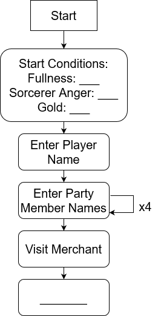

#### **CSCI 1300 CSC1: Starting Computing**
#### **Godley/Hoefer - Spring 2023**
#### **Recitation 11 - Week of April 10th, 2023**

# Table of contents
1. [Project 3 Phase Flowcharts](#projectphases)
2. [Dungeon Exploration Walkthrough](#walkthrough)
   1. [Phase 1: Entering the Dungeon](#phase1)
   2. [Phase 2: Dungeon Exploration](#phase2)
   3. [Phase 3: Game Ending](#phase3)
3. [Create Your Own Walkthrough](#CYO)
3. [Deliverables](#deliverables)

# Project 3 Phase Flowcharts 
This week in recitation we'll be working on creating flowchart(s) for Project 3. Flowcharts are intended to outline higher-level interactions between system components, with the goal of informing the design and implementation of code. Flowcharts are especially useful for mapping out sequences of decisions (say, selecting options from a menu).

The deliverable for this recitation is one (or more) flowcharts that outline the general "flow" of your game. Below, we include a [walkthrough](#walkthrough) of making flowcharts for the Dungeon project. If you plan to work on the Dungeon project, you may optionally follow this walkthrough to make your flowcharts. Regardless of your planned project, you may find it useful to follow the general approach we take.

  

# Dungeon Walkthrough 

Here, we'll walk through an example of building flowcharts for each of the three phases of the given Dungeon Exploration project. If you plan to work on the Dungeon Exploration project, you may choose to use these skeletons to structure your flowchart(s) or you may make your own from scratch. If you plan to choose your own project, consider applying the process we take in this walkthrough to your own game.

In the flowcharts below, you'll notice that Phase 1 leads into the Phase 2 flowchart and Phase 2 leads into the Phase 3 flowchart. For each phase, we've listed the key points that you'll need to incorporate into your solution which can act as a guide for how to fill in the boxes.

### 1. **Phase 1: Entering the Dungeon** 

This is the starting point of the game where we'll set everything up! Here we'll grab some input from the user. The required input include: the character's name, shopping for supply, and team recruiting! 

Phase 1 key points:
1. Ask the user to enter the name of the character they'll be playing with, and the names of their four traveling companions. 
2. Begin the game with the start conditions speficied in the write-up.
2. Visit the Merchant and allow the player to purchase supplies with their 100 gold pieces.
    * We won't include a flowchart for the purchasing steps/procedure here but feel free to make your own and come talk to us about it during office hours!
3. Enter the dungeon and start your adventure!
    * What message are we displaying here? 

-----------------------------

**Let's fill in the flowchart of the solution for Phase 1** 

-----------------------------

  

-----------------------------

### 2. **Phase 2: Dungeon Exploration** 
Now that we've initialized the player and the game, we can move into the dungeon exploration phase where the real work will be done! Here we'll be handling dungeon exploration possibilities, manage our inventory and kill monsters in the hidden rooms. Remember that these options lead back to the main game menu!

Phase 2 key points:
1. Before we can begin our dungeon exploration, we need to show the user their options!
    1. Move:
        * The party moves in a single space in any of the cardinal direction. After moving, each party's fullness has a chance of dropping by 20%.
    2. Investigate:
        * Unexplored spaces can be investigated. When a space space is investigated, there's a: 
        *  10% chance the player finds a key; a 20% chance the player finds a tresure; 
        * a 20% chance that the player fights a monster; and a 50% chance the players' fullness drop by one point.
    3. Pick a fight:
        * This will prompt a fight with a monster randomly picked.
        * A 10% chance of a key dropping after fighting the monster.
        * A 50% chance that the memeber party's fullness drops by one point.
    4. Cook and eat:
        * Players can choose what they want to cook, depending on what they have.
        * The portion sizes are incremental by 5kg.
        * Each 5kg portion increases the players' fullness by one point.
    5. Give up:
        * Game ends

-----------------------------

**Create your own flowchart for Phase 2** 

-----------------------------

 
 
 
 
 
 

-----------------------------

### 3. **Phase 3: Game Ending**  
The final phase of the project will revolve around handling how the game can end! The few possibilities are listed below:

Phase 3 key points:
1. The player's party dies:
    * All of the player's companions have died.
    * In what ways can the player's companions die?
    * What message do we print in this case?
2. The player dies.
    * In what ways can the player die?
    * What message do we print in this case?
2. The user decides to quit the game. 
    * What message do we print in this case?
3. The Sorcerer's Anger Level reached 100.
    * What message do we print in this case?
3. The player explored all 5 rooms and killed all the monsters. 
    * What message do we print in these case?

-----------------------------

**Create your own flowchart for Phase 3** 

-----------------------------

 
 
 
 
 
 

-----------------------------

# Create Your Own Flowcharts 

If you are doing a create-your-own (CYO) game, you will need to make your own flowcharts based on the mechanics of your game. While you are creating your flowcharts, be sure to [reference the CYO writeup on Github](https://github.com/CSCI1300-StartingComputing/CSCI1300-Spring2023/blob/main/project/project3/project3CYO.md#requirements-) to make sure your creation meets all of the necessary requirements. You should make at least three flowcharts today, one for your game start, middle, and end. 

# Deliverables 
Complete the Recitation 11 assignment on [Canvas](https://canvas.colorado.edu/courses/89853/quizzes/308726).
