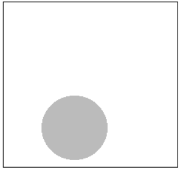

#### **CSCI 1300 CSC1: Starting Computing**
#### **Godley/Hoefer - Spring 2023**
#### **Recitation 12 - Week of April 17th, 2023**

# Table of contents

1. [Question 1 -Probability](#prob)
2. [Question 2 -Recursion ](#recursion)
3. [Deliverables](#deliverables)

## 1. Probability 

You’re playing darts with an oddly-shaped dart board. The board is in the shape of a square, with a shaded circle somewhere inside it. The size of the circle is randomly generated, but you know its radius will be smaller than ½ the length of one side of the square.

Every time you throw a dart, assume that you are guaranteed to land inside the square, but you have an equal chance of landing anywhere inside it.

Write a function that accepts a single parameter, `double side_length`. This will be the length of one side of the square. Then, your function should randomly generate a radius for the circle, which must be less than (side_length/2). Print this radius: "The radius of the circle is: ." Finally, calculate the probability of landing in the circle if you throw one dart (which is equally likely to hit anywhere in the square). Print this value as a double between 0 and 1. "The probability of landing in the circle is: "

You should also write a main function which prompts the user to input a value for the side length of the square. Make sure that this value is appropriate (i.e. a positive number), and then pass the value to your newly-written function. 

**Formulas**:<pre><code>Area of a square: side_length²
Area of a circle: π * radius²
Use 3.14 as the value of pi
</code></pre>

Example output (**bold** is user input):
<pre><code>Enter side length: <b>10</b>
The radius of the circle is: 3.21
The probability of landing in the circle is: 0.323548
</code></pre>

**1a**. Write an algorithm in pseudocode for the program above.

-----------------------------
  

-----------------------------

**1b**. Imagine what a sample run of your program would look like.

*Sample run:*

-----------------------------
  

-----------------------------
**1c**. Identify the values that you must test for. We call these values “boundary conditions”.

-----------------------------
  

-----------------------------
**1d**.  Implement your solution in C++ using VS  Code. Revise your solution, save, compile and run it again. Are you getting the expected result and output? Keep revising until you do. Make you sure you test for the values used in your sample runs, and for the boundary conditions.

## 2. Recursion 

This section aims to test your understanding of recursion. Write a function that reverses strings. That is, for the input “Teach”, the output will be “hcaeT”. You should only solve this problem using recursion. Your solution should not use loops or anything similar.

**2a.** Identify the **base case(s)** for this recursive problem, that is, the smallest possible version(s) of this problem.

-----------------------------
  

----------------------------- 

**2b**. Write an algorithm in pseudocode for the program above.

-----------------------------
  

-----------------------------

**2c**. Imagine what a sample run of your program would look like.

*Sample run:*

-----------------------------
  

-----------------------------

**2d**. Identify the values that you must test for. We call these values “boundary conditions”.

-----------------------------
  

-----------------------------

**2e**.  Implement your solution in C++ using VS  Code. Revise your solution, save, compile and run it again. Are you getting the expected result and output? Keep revising until you do. Make you sure you test for the values used in your sample runs, and for the boundary conditions.

# Deliverables 
Complete the Recitation 12 assignment on [Canvas](https://canvas.colorado.edu/courses/89853/quizzes/308713/take?preview=1)
