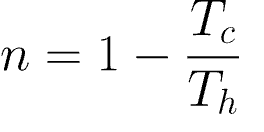

#### **CSCI 1300 CS1: Starting Computing**
#### **Godley/Hoefer - Spring 2023**
#### **Recitation 2 -  the week of January 30th, 2023**


# Variables, Arithmetic, cin, cout

Last week in lecture we learned about **variables** and their **data types**. We asked the user to enter input and we displayed both text (strings) and the values of variables.


# Coderunner

Let's work through some exercises interactively via [CodeRunner](https://canvas.colorado.edu/courses/89853/assignments/1609368)

**Always remember:**
1. Develop your solution in VS Code. Save and test your program in VS Code with multiple input values.
2. When you are ready, copy the solution from your cpp file in VS Code, and paste it in the Answer box in Coderunner
3. Press the Check button. You should see how your solution works with some tests we developed.
4. If your solution does not pass one test, look at what is expected versus what your solution produced. Make modifications and press the Check button.
5. When you are done with one problem, move on to the next.
6. Don’t forget to Submit everything at the end.

# Exercises

## 1. Carnot efficiency

In thermodynamics, the Carnot efficiency is the maximum possible efficiency of a heat engine operating between two reservoirs at different temperatures. The Carnot efficiency is given as


           
where T<sub>c</sub> and T<sub>h</sub> are the absolute temperatures at the cold and hot reservoirs, respectively. Write a program that takes temperatures at the cold reservoir and hot reservoir as integer values, and computes η the Carnot efficiency. **Note that the input temperature for the equation must be in Kelvin** in order to do the above calculation. Assume that the input temperature is in Fahrenheit, you can convert it to Kelvin using this formula:

<pre><code>K = (X°F − 32) × 5/9 + 273.15 </code></pre>

 
Example output (**bold** is user input, it’s initially in Fahrenheit):
<pre><code>Enter cold reservoir temperature:
<b>10</b>
Enter hot reservoir temperature:
<b>80</b>
Carnot efficiency: 0.129
</code></pre>


a. Write pseudocode for the program above. 
**(Remember giving meaningful names to variables that accurately describe their purpose)**

### Pseudocode:

<br/><br/>
<br/><br/>
<br/><br/>

-----------------------------
b. Imagine how a sample run of your program would look like. Think about at least two examples

*Sample Run 1:*

-----------------------------

<br/><br/>
<br/><br/>
<br/><br/>

-----------------------------

*Sample Run 2:*

-----------------------------

<br/><br/>
<br/><br/>
<br/><br/>

-----------------------------

*Sample Run 3:*

-----------------------------

<br/><br/>
<br/><br/>
<br/><br/>

-----------------------------
c. Write your C++ solution in VS Code. Save the file as carnot.cpp. Compile it and run it a few times, with the example values you used in Sample Run 1, 2 and 3. What  do you notice? Is your answer always an integer (1 or 0 maybe)? Write your best guess for why this is happening.

### Answer:
-----------------------------

<br/><br/>
<br/><br/>
<br/><br/>

-----------------------------
d. Revise your solution, save, compile and run it again. Are you getting the expected result and output? Keep revising until you do.


## 2. Spot the errors

There are some errors in the following programs. List each error and what you need to do to fix it. 
Remember, one error might trigger other errors. So fix errors one at a time, then save, compile, and run the program again. You should try running multiple times, with different values for x1 and x2.

a. The following program should ask the user to enter two numbers and then print the sum. The program is available on github as [recitation2_spot_error_a.cpp](https://github.com/CSCI1300-StartingComputing/CSCI1300-Spring2023/tree/main/recitation/recitation2/code_snippets) and also as a Coderunner question
```cpp
#include iostream

int main();
{
cout << "Please enter two numbers:"
cin << x, y;
cout << "The sum of << x << "and" << y
    << "is: " x + y << endl;
return;
}
```

*Errors:*

-----------------------------

<br/><br/>
<br/><br/>
<br/><br/>

-----------------------------

b. The following program should ask the user to enter two numbers, then it should compute and print the average. The program is available on github as [rec2_error_b.cpp](https://github.com/CSCI1300-StartingComputing/CSCI1300-Spring2023/tree/main/recitation/recitation2/code_snippets) and also as a Coderunner question.
```cpp    
#include <iostream>
using namespace std;

int main()
{
int total;
int x1;
cout << "Please enter a number: " << endl;
cin >> x1;
total = total + x1;
cout << "total: " << total << endl; // trace message
cout << "Please enter another number: " << endl;
int x2;
cin >> x2;
total = total + x1;
cout << "total: " << total << endl; // trace message
total = total / 2;
cout << "The average of the two numbers is " << total << "endl";    // trace message
return 0;
}
```
Note the **trace messages (marked as "//trace message")** are inserted to show the current contents of the "total" variable.

*Errors:*

-----------------------------

<br/><br/>
<br/><br/>
<br/><br/>

-----------------------------

## 3. Strings

Write a program that greets the user on logging in. The following are the rules for how to create the greeting:
<pre><code>
Take the first 2 letters of the first name
Take the first 2 letters of the last name
Take the length of the first name
Take the length of the last name
Create the name by joining them together in order
Print the greeting as : Hello <the name created from Step 5>! 
</code></pre>


For example:

<pre><code>First name: Alex
Last name: Cook

1. First two letters of the first name: Al
2. First two letters of the last name: Co
3. Length of first name: 4
4. Length of last name: 4
5. Name created: AlCo44
6. Greeting : Hello Alco44!
</code></pre>

Example output (**bold** is user input)


<pre><code>Enter the first name:
<b>Alex</b>
Enter the last name
<b>Cook</b>
Hello AlCo44!
</code></pre>

a. Write an algorithm in pseudocode for the program above.

### Pseudocode:

<br/><br/>
<br/><br/>
<br/><br/>

-----------------------------
b. Imagine how a sample run of your program would look like. Think about at least two examples

*Sample Run 1:*

-----------------------------

<br/><br/>
<br/><br/>
<br/><br/>

-----------------------------

*Sample Run 2:*

-----------------------------

<br/><br/>
<br/><br/>
<br/><br/>

-----------------------------

*Sample Run 3:*

-----------------------------

<br/><br/>
<br/><br/>
<br/><br/>

-----------------------------

c. Now, write your C++ solution. Save the file as greeting.cpp.

### Answer:
-----------------------------

<br/><br/>
<br/><br/>
<br/><br/>

-----------------------------

### Deliverables for Recitation

Complete the quiz on [Canvas](https://canvas.colorado.edu/courses/89853/quizzes/308707)
