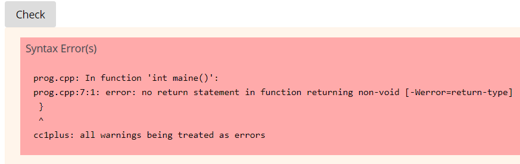
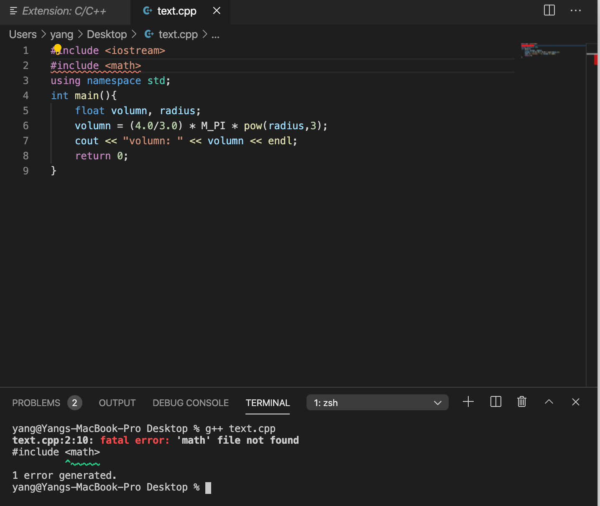
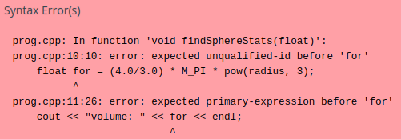

#### **CSCI 1300 CS1: Starting Computing**
#### **Naidu/Yeh - Spring 2022**
#### **Common Errors**


There are a number of very common programming mistakes which you are likely to encounter at some point during this course. Recognizing the symptoms of these errors and being able to interpret the messages provided by the compiler will help you solve problems quickly and efficiently. 

Here we have included screenshots of different errors that you might come across as you start writing your first programs, both in <b>VSCode</b> and on <b>Canvas CodeRunner</b>:
1. If you’re developing and testing your solution in VSCode, the error messages will show up as soon as you try to compile (or <b>Run</b>) your program.
2. If you’re on Canvas and you have pasted your solution into the Answer box, the errors will show up as soon as you press the button <b>Check</b>.

# Part 1: Hello, World!

## Anatomy of an Error in VSCode:
Error messages in VSCode, and those produced by most C++ compilers, provide three general pieces of information. First is the name of the file causing the error. This might be something like “/home/ubuntu/workspace/rec2/recitation2.cpp” for recitation 2.

Next, the approximate location of the error is given in the format 

```
    (line number):(column number)
```

So an error on the third line and eighth column would be represented as “3:8”. It is important to realize that this is where the compiler ran into trouble, not necessarily exactly where the error is. Frequently, the error itself will be above or before the line given.
Finally, the error itself is provided. Some error messages are very useful, others can be cryptic. If you encounter an unfamiliar error try Googling the main portions of the message excluding pieces which might be specific to your code like variable names. You can also post your error text message on Ed and we’ll let you know what it means.

## Example 1: Missing Angle Brackets: the #include statement doesn’t have  < > for iostream
  ### VSCode
  

  ### CodeRunner
   

Oftentimes a single error in a program will propagate and cause multiple error messages.
Here we forgot to include angle brackets (<b>“<”</b> and <b>">”</b>) around <b>‘iostream’</b> on the first line. The first error message makes it clear that the appropriate syntax is either “#include <iostream>” or “#include “iostream””.
## Example 2: Missing Semicolons:
Semicolons are ubiquitous in C++ programs. They appear after nearly every line which is not a control structure or function definition. Notice, however, that there is no semicolon after the include statement. Forgotten semicolons can be difficult to track down. The error usually indicates a line number after the line missing the semicolon.

  ### VSCode 
   
  ### CodeRunner 
   

Here we forgot a semicolon in two different places. In both cases the error message tells us <b>“expected ‘;’ before…”</b>. We don’t want to put a semicolon at the beginning of the indicated lines. Instead, we can look for a missing semicolon at the end of a preceding line.

  ### VSCode 
   
  ### CodeRunner 
  

## Example 3: Misspelled Reserved Word:
  Misspelling <b>reserved words (int, main, cout, endl)</b> can cause a variety of errors in C++. 
  
   ### VSCode
   

   ### CodeRunner 
   


   In this case we forgot the “l” in “endl”. A lot of output is produced in VSCode. Don’t let this scare you! Looking at the errors one at a time, it’s clear that there’s confusion around the “<<” operator and the “end”. Knowing nothing about exactly what “<<” is or how it works, we can carefully examine this region of our code and notice our spelling mistake.

The error produced in CodeRunner is slightly different. In particular, it tells us directly that we are trying to use some variable called “end” which has not been defined. This is a very common message when a variable name has been misspelled.
## Example 4: No main() Function:
  ### VSCode
  
  ### CodeRunner
 

This is another error that produces a lot of output in VSCode. The important part this time is near the bottom where it says <b>“undefined reference to ‘main’”</b>. When a C++ program is run, execution starts in the “main()” function. When you try to run a program without a main, this is the kind of error that you might get. Looking at line 4, where we thought main was defined, we see another typo. After fixing this problem, the program should run.

In Canvas, the error is slightly different. We have not discussed how to define functions in C++ yet. In this case we have tried to define a general function, called <b>“maine()”</b> and not “main()”, with return type “int” which does not return anything. Canvas notices this and throws an error. At this point, the important thing to notice is that something strange is going on with “int maine()”. Again, the given line number is not particularly useful in this case.
# Part 2: Compile-time errors

## Example 1: Missing Semicolons: 
In this example, the very last line of the main function (line 11) is missing a semicolon. The error that Canvas returns indicates that the compiler is expecting to see a ‘;’ before the function ends with a ‘}’.
  ### VSCode 
 
  ### CodeRunner 
  
 
## Example 2: Typo in variable name
In this example, I named my variable for volume “volume” on line 6. When I attempted to print it out on line 10, I misspelled it as “volumee”. Since volume and volumee are two different strings, C++ will not recognize the misspelling. Thus, I received a variable was not declared in this scope error. Note that in the last line, cout << “volume: “ << volumee << endl;, we have the string version of the word volume and the variable that represents the value of volume. Whenever something is written in quotations, that is not interpreted as anything other than a literal string, whereas if the word is not written in quotations, it will be interpreted as a variable.
  ### VSCode 
  

  ### CodeRunner
 

 
 ## Example 3: Misspelled Reserved Word
  In this example, we misspelled the reserved word <b>“cout”</b>, meaning character/console output.  C++ will see the misspelling <b>“cot”</b> and treat it as something user-defined as it is no longer one of the reserved words. Since we never defined <b>cot</b> as anything, it thus indicates that the word <b>cuot</b> was never declared.

 
 ## Example 4: Misspelled Include Statement
When coding in the Canvas quiz, you will not be required to include C++ libraries. For instance, in the function call <b>pow(radius, 3)</b> we use the <b>pow</b> function, which comes from the <b>math.h</b> library. When coding, we need to be sure to include any necessary libraries in order for the code to compile. So in order to use pow, we will place the line #include <math.h> at the top of our file. Now let’s assume we misspelled something in an include statement.

  In this first case, we misspelled include as <b>“incude”</b>:
    

  In the second case, we included a library called <b>math</b>, not <b>math.h</b>:
    

  As you can see, these are two similar mistakes, but they lead to different error messages from the compiler. Thus, it is very important to be able to understand what each error message is talking about.
## Example 5: Creating a variable before declaring the type
In this example, I attempted to define a surface area variable without first declaring its type. The very first thing we have to do when defining a variable is declare its data type - if we attempt to set a variable with no data type equal to a value, we get an error:
  ### VSCode
  

  ### CodeRunner 
  
    
 There are two ways to remedy this error: 
  The first is to write two lines of code; the first line declares the variable (<b>float volume</b>) and the second line sets the value of the variable (<b>volume = (4.0/3.0) * M_PI * pow(radius,3)</b>).
The second way is to write only one line of code including all the information: <b>float volume = (4.0/3.0) * M_PI * pow(radius,3)</b>; 
## Example 6: Not following the rules about naming variables

  a. According to c++ standards, variable names can only start with a <b>letter</b> or an <b>underscore (“_”)</b>, but <b>not</b> a number.
  
  ### VSCode
  
  ### CodeRunner
  

 Since all variable names must begin with either an uppercase/lowercase letter or an underscore, any variable names starting with numbers will cause an error. It is convention to write variable names in <b>lower camelcase</b> (ex: lowerCamelCase). If you want to have variable names with numbers in them, place them somewhere after the first character (ex: volume3)
No matter which way it is done, it is important to declare the variable as a specific type before use.
  
  b. Variable name cannot be one of the reserved C++ words (see lecture slides)
  
  ### VSCode
  

  ### CodeRunner
  

  Since variable names cannot be a reserved C++ word, if you named a variable <b>“for”</b> the compiler wouldn’t be able to differentiate between declaration of a for loop and your variable. Variable names can still start with or contain reserved C++ words as long as they differ somewhere (ex: forThisSphere). A hint to not making this mistake in VSCode is that the IDE will auto-color variable names differently than it will color reserved words.
## Example 7: Using comparison operators with strings

Generally, we encounter the below two errors when using comparison operator with strings.
  1. 	When using <b>[]</b> operator
  2. 	When using <b>substr()</b> 

### When using [] operator:
When we compare a character and a string, we get an error as shown below. The error message mentions that we are doing comparison between <b>int</b> (str[i]) and <b>const</b> char * (“c”). 
Here, const char * is a pointer type variable and it also refers to string, which is nothing but a sequence of characters terminated by <b>‘\0’</b>. str[i] returns a character type value. So we need to update our code with if(str[i] == ‘c’) in line 11 of the below code to fix this error. Note that the if condition has character type value on its right-hand side.
    


### When using substr():
  When we use <b>str.substr(pos, len)</b>, it returns a string value. In the below example, we are doing a comparison between character and string in line 11, which gives a compile-time error. To fix this, we need to update line 11  with <b>if(str.substr(i,1) == “c”)</b>. 
    
  

## Example 8: Copying Incorrect Unicode Quotes:
If you copy quotes from a PDF, they often will copy as strange unicode characters that are not recognized by the compiler. Be sure you replace the copied quotes with double quotes you type yourself. 


# Part 3: Runtime Errors

Runtime errors are errors that occur during the execution of a program. Unlike syntax errors and other compile-time errors, runtime errors could be caused by bad logic, running out of memory, infinite loops, etc. 

## Example 1: Using an uninitialized variable
### VSCode 
  

In VSCode, we don’t actually get an error here, but our program isn’t working how we’d like it to. Notice how there is no statement after line 7 taking in user input, so the variable fahrenheit never gets initialized. Uninitialized variables in C++ are not set to any default value - they are set to some garbage value (in this case, 6.95333e-310).
For the exact same program, we’ll get different output in Canvas’s Coderunner:

  ### CodeRunner 
 

The compiler that Coderunner uses has noticed that the program contains an uninitialized variable being used in a formula and has produced a <b>warning</b> (that’s different from an error!). Coderunner will not allow you to run any code with warnings - notice at the bottom of the error it says <b>“all warnings being treated as errors”</b>. So, in Coderunner, this program simply won’t run.

 ## Example 2: Dividing by 0

Dividing by 0 is undefined in mathematics, so what does C++ do when we attempt to divide by 0? Let’s find out:


    
First, the compiler gives us a warning that we’re dividing by zero on line 6, but since this isn’t Coderunner, we can still run the program to see what happens. When we run the program, notice that the program executes line 5, but then we get the runtime error Floating point exception (core dumped) when we divide by 0 on line 6. 

The exception to this rule is that if the numbers are doubles, it will not cause a runtime error. It will either be “inf” or “nan”. These stand for infinity and “not a number”. This is by design but it may cause issues later on in the execution of the program. So be sure to check that a number is greater than zero before dividing by it. This could be done with an if statement to check during the execution of the program or could be verified by debugging or using print statements.

 

## Example 3: Comparison between signed and unsigned int variables
When we compare signed and unsigned int variables, VSCode does not throw any error about this because it is just a warning in C++. However, Coderunner treats all warnings as errors and won’t allow us to run the code (See the images below for reference).  
Note that this can cause runtime error sometimes because the signed integer value will be converted to an unsigned integer. For instance, if a signed int variable has a negative value, it will be converted to a large unsigned positive number and then compared with the unsigned int value. This could result in unexpected behavior. But we do not need to worry about this in most cases.

 ### VSCode
 

  ### CodeRunner
    
 

In some places, we may need to do a comparison between signed and unsigned variables.
  In the above code, we are doing a comparison between <b>i</b> (signed int) and <b>str.length()</b> (unsigned int). <b>str.length()</b> returns the string length value, which is of type unsigned int. So to avoid this, we can use a new variable (say len) of type int, and assign the string length value to it. We will use this for the comparison in the loop condition. The resulting code would be as shown below. With this, we can run our code in Coderunner without any issues!


