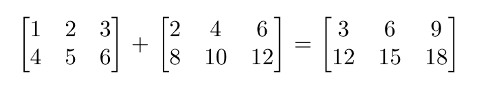

#### **CSCI 1300 CS1: Starting Computing**
#### **Godley/Hoefer - Spring 2023**
#### **Recitation 6 - Week of February 27, 2023**

# Table of contents
1. [Arrays](#arrays)
2. [Exercises](#exercises)
   1. [Reverse an array](#reverse)
   2. [Spot the errors](#spot)
   3. [Matrix Sum](#matrix)
3. [Deliverables for Recitation](#deliverables) 

# Arrays <a name="arrays"></a>
Last week in the lecture, we learned about the basics of arrays, their operations, and common algorithms. Today, let’s solve some problems related to arrays.

# Exercises <a name="exercises"></a>

## 1. Reverse an array! There are two subproblems here: <a name="reverse"></a>
&emsp; a) Write a function called ```swap()``` which takes three parameters: an array, startIndex, and endIndex. This function will swap the values present at the startIndex and endIndex in the given array.

&emsp; b) Write a function called ```reverseArray()``` which takes two parameters: an int array and the length of that array. The function should not return anything as arrays are passed by reference and the values will get changed in place.

&emsp; c)  In the main function, prompt the user to enter ten numbers. Create an array from the given input and reverse it using the '''reverseArray()''' function. Print the reversed array.

**RULE**: Do **NOT** use a temporary array. However, you can create just a temporary variable (The reversing operation should be done “in-place”).

Here is a function prototype for ```reverseArray```:
```cpp
// this function is to reverse all the elements of an array
void reverseArray (int myArray[], int myArrayLength);
```

Here is a function prototype for ```swap```:
```cpp
// this function is to swap two elements in an array
void swap(int myArray[], int startIndex, int endIndex);
```

Example output (**bold** is user input)
<pre><code>Please enter ten numbers for the array:
<b>1 2 3 4 5 6 7 8 9 10</b>
The reversed array is:
10 9 8 7 6 5 4 3 2 1
</code></pre>

**1a.** Write an algorithm in pseudocode for the program above. 

-----------------------------
**Pseudocode:**
<br/><br/>
<br/><br/>
<br/><br/>
<br/><br/>

**1b.** Let’s draw a flowchart of the solution.

-----------------------------
**Flowchart:**
<br/><br/>
<br/><br/>
<br/><br/>
<br/><br/>

**1c.** Imagine how a sample run of your program would look like. Think about at least two examples.

-----------------------------
**Sample Run 1:**
<br/><br/>
<br/><br/>

-----------------------------
**Sample Run 2:**
<br/><br/>
<br/><br/>

-----------------------------
**Sample Run 3:**
<br/><br/>
<br/><br/>

**1d.** Identify the values that you must test for. We call these values “boundary conditions”.

-----------------------------
**Answer:**
<br/><br/>
<br/><br/>

**1e.** Implement your solution in C++ using VS Code. Make sure to add at least 3 assertions for reverseArray(). Revise your solution, save, compile and run it again. Are you getting the expected result and output? Keep revising until you do. Make sure you test boundary conditions and the values from the sample runs.

<br>

## 2. Spot the errors <a name="spot"></a>
Let's try to spot some common errors and work through these exercises interactively via the Recitation 6 Coderunner on [Canvas](https://canvas.colorado.edu/courses/89853/assignments/1609375).

**a)**
```cpp
#include <iostream>
#include <string>
using namespace std;
int main()
{
    double scores[5] = {85.4, 90.3, 100, 89, 74.5, 95};
    double sum = 0;
    for(int i = 0; i < 5; i++){
        sum += scores[i];
    }
    double avg = sum / 5.0;
    cout << "Average = " << avg << endl;
    return 0; 
}
```

**b)**
```cpp
#include <iostream>
using namespace std;

int main()
{
    int temps[N] = {50, 53, 49};
    cout << "The most recently recorded temperature of the day is " << temps[3] << " degrees Fahrenheit." << endl;
    return 0;
}
```
**c)**
```cpp
#include <iostream>
using namespace std;

int main()
{
    int N = 5;
    int colors[] = {"red", "blue", "yellow", "green"};

    //printing all the colors
    for (int i = 0; i < N i++){
        cout << "My favorite color is " << colors[N] << endl
    }
    return 0;
}
```
**d)**
```cpp
#include <iostream>
using namespace std;

int main()
{
    numbers[] = {};
    for(i = 0; i < 10; i++){
        i[numbers] = i + 1;
        Numbers[i] = i + 1
        cout << numbers << endl;
    }

    return 0;
}

```


## 3. Matrix Sum <a name="matrix"></a>




The sum of two matrices is found by adding together corresponding entries in each matrix, as shown above. (For example, the numbers at (row 1, column 1) of each matrix are added together to get the (row 1, column 1) number of the sum matrix.)

<br>
Create a function that takes as parameters two 2 x 3 int arrays, and prints their sum matrix (displayed in 2 rows).

<br>

Example header:
```cpp
void matrixSum(int a[2][3], int b[2][3])
```

Then, create a main() function that asks the user to input the values for each matrix one row at a time. Store these in two arrays, and pass them to matrixSum.

Example output (**bold** is user input)
<pre><code>Enter values for matrix 1, one row at a time:
<b>1 2 3
4 5 6</b>
Enter values for matrix 2, one row at a time:
<b>2 4 6
8 10 12</b>
The sum is:
3 6 9
12 15 18
</code></pre>

**3a.** Write an algorithm in pseudocode for the program above. 

-----------------------------
**Pseudocode:**
<br/><br/>
<br/><br/>
<br/><br/>
<br/><br/>

**3b.** Let’s draw a flowchart of the solution.

-----------------------------
**Flowchart:**
<br/><br/>
<br/><br/>
<br/><br/>
<br/><br/>

**3c.** Imagine how a sample run of your program would look like. Think about at least two examples.

-----------------------------
**Sample Run 1:**
<br/><br/>
<br/><br/>

-----------------------------
**Sample Run 2:**
<br/><br/>
<br/><br/>

-----------------------------
**Sample Run 3:**
<br/><br/>
<br/><br/>

**3d.** Identify the values that you must test for. We call these values **“boundary conditions”**.

-----------------------------
**Answer:**
<br/><br/>
<br/><br/>

**3e.** Implement your solution in C++ using VS Code. Revise your solution, save, compile and run it again. Are you getting the expected result and output? Keep revising until you do. Make sure you test for the values used in your sample runs, and for the boundary conditions.
<br>

# Deliverables for Recitation <a name="deliverables"></a>
Complete the Recitation 6 assignment on [Canvas](https://canvas.colorado.edu/courses/89853/quizzes/308705).
